```{css, echo=FALSE} 
@media print { # print out incremental slides; see https://stackoverflow.com/questions/56373198/get-xaringan-incremental-animations-to-print-to-pdf/56374619#56374619
  .has-continuation {
    display: block !important;
  }
}
```

```{r setup, include=FALSE}
# figures formatting setup
options(htmltools.dir.version = FALSE)
library(knitr)
opts_chunk$set(
  prompt = T,
  fig.align="center", #fig.width=6, fig.height=4.5, 
  # out.width="748px", #out.length="520.75px",
  dpi=300, #fig.path='Figs/',
  cache=T, #echo=F, warning=F, message=F
  engine.opts = list(bash = "-l")
  )

## Next hook based on this SO answer: https://stackoverflow.com/a/39025054
knit_hooks$set(
  prompt = function(before, options, envir) {
    options(
      prompt = if (options$engine %in% c('sh','bash')) '$ ' else 'R> ',
      continue = if (options$engine %in% c('sh','bash')) '$ ' else '+ '
      )
})

library(tidyverse)
library(hrbrthemes)
library(fontawesome)
```


# Überblick

</br></br>

1. [Willkommen!](#welcome)

2. [Was ist Data Science?](#whatisdatascience)

3. [(Data) Science für Public Policy](#science)

3. [Data Science als Beruf](#job)

4. [Ziele für dieses Modul](#goals)


---
class: inverse, center, middle
name: welcome

# Herzlich Willkommen!
<html><div style='float:left'></div><hr color='#EB811B' size=1px style="width:1000px; margin:auto;"/></html>


---
# Vorstellungsrunde

<br>

### Über mich

`r fa('address-book')` Ich bin [Simon Munzert](https://simonmunzert.github.io/) [si’mən munsɜrt], oder Simon [saɪmən].

`r fa('envelope')` [munzert@hertie-school.org](mailto:munzert@hertie-school.org)

`r fa('graduation-cap')` Professor für Data Science und Public Policy | Director, Data Science Lab

<br>

--

### Über Sie

Wie heißen Sie und aus welchem behördlichen Umfeld kommen Sie?

Welche Erfahrungen haben Sie mit Daten, Data Science und KI gemacht?

Woran denken Sie zuerst, wenn sie "Daten" und "Data Science" hören?


---
# Onboarding Survey

<div align="center">
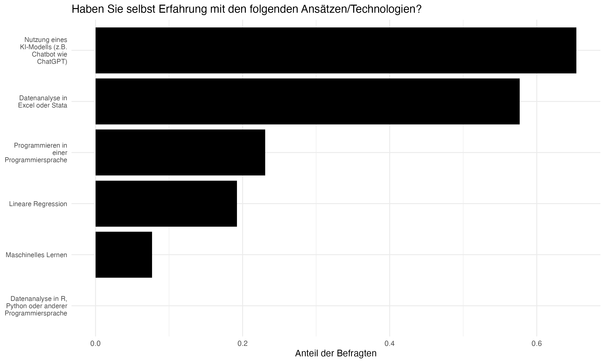
</div>

---
# Onboarding Survey

<div align="center">
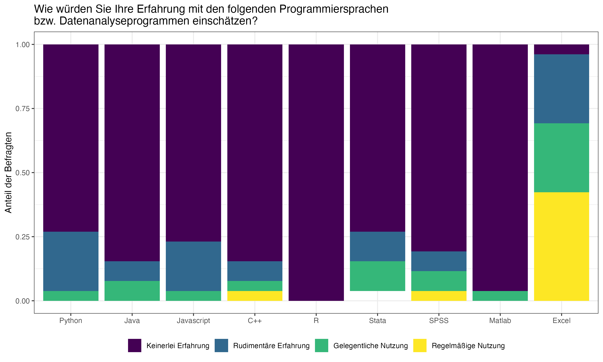
</div>

---
# Onboarding Survey

<div align="center">
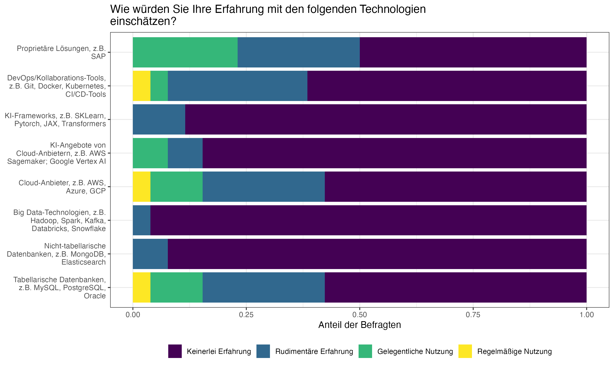
</div>

---
# Onboarding Survey

<div align="center">
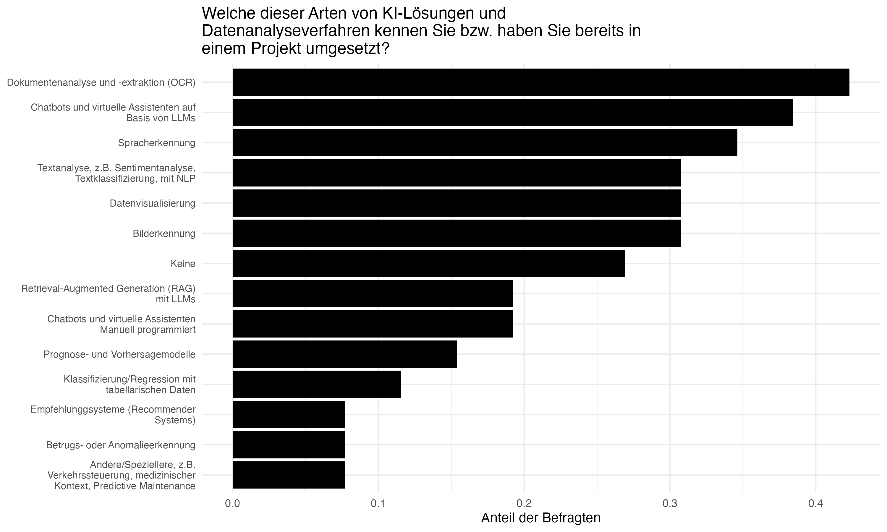
</div>


---
# Workshop-Etikette

.pull-left-wide[

- Wir haben viele Themen vor uns. Dazu habe ich einiges an Material mitgebracht. Aber:  letztlich müssen Sie **signalisieren, wo Ihre Interessen und Bedürfnisse liegen**. Ich bin gerne bereit, Themen zu vertiefen, abzuschweifen oder die Aufmerksamkeit auf andere Themen und Beispiele zu lenken (solange ich dazu sprechfähig bing).

- Selbstverständlich bin ich alles andere als ein Experte für Ihre individuelle Behörde oder Ihre aktuellen Themen. Für eine fundierte, evidenzbasierte Argumentation zu Data Science und AI im öffentlichen Sektor ist Fach- und Hintergrundwissen der Schlüssel und ist explizit Teil vieler der datenbasierten Werkzeuge und Methoden, die wir diskutieren werden. Bitte **bringen Sie Ihr eigenes Wissen und Ihre Erfahrung mit**.

- Bitte nutzen Sie die Gelegenheit, **jederzeit Fragen zu stellen** oder Input zu geben, der für die Gruppe interessant sein könnte. Es gibt keine schlechten Fragen, also stellen Sie sie bitte!


]

.pull-right-small-center[
<div align="center">
<br><br>

</div>
]


---
class: inverse, center, middle
name: whatisdatascience

# Was ist Data Science?
<html><div style='float:left'></div><hr color='#EB811B' size=1px style="width:1000px; margin:auto;"/></html>

---
# Was ist Data Science?

.pull-left[
## Was ist Data Science?

> "Der interdisziplinäre Forschungszweig Data Science befasst sich mit dem Management und der Analyse von Daten." - [Daniel Keim, Kai-Uwe Sattler](https://www.plattform-lernende-systeme.de/files/Downloads/Publikationen/AG1_Whitepaper_Von_Daten_zu_KI.pdf)

> "Data Science ist ein interdisziplinäres Wissenschaftsfeld, welches wissenschaftlich fundierte Methoden, Prozesse, Algorithmen und Systeme zur Extraktion von Erkenntnissen, Mustern und Schlüssen sowohl aus strukturierten als auch unstrukturierten Daten ermöglicht." - [Wikipedia](https://de.wikipedia.org/wiki/Data_Science)

> "Data Science ist ein Konzept, das Statistik, Datenanalyse, Informatik und die damit verbundenen Methoden vereint, um aktuelle Phänomene anhand von Daten zu verstehen und zu analysieren." - [Chikio Hayashi](https://www.springer.com/book/9784431702085)

️✎ **Kein Konsens**, sondern **Buzzword**.
]

.pull-right[
## Eine Arbeitsdefinition

<div align="center"><br>

</div>

`Quelle` [Drew Conway, 2010](https://drewconway.com/zia/2013/3/26/the-data-science-venn-diagram) (angepasst)
]


---
# Arten datengestützter Anwendungen

.pull-left-small2[
## 1. Beschreibung
- Wie ist der Zustand der Welt?
- Wie entwickeln sich Trends?
- Wie gestalten sich Gruppenunterschiede?

## Der Wert für die Politikgestaltung
- Im Zentrum des **Monitorings**
- „Wie viele Menschen konsumieren Fehlinformationen im Internet?“
- „Wie entwickelt sich die Arbeitslosigkeit in Bezirken?“
- „Wie viele Radunfälle gab es pro Straßenabschnitt?“
]

--

.pull-left-small2[
## 2. Erklärung
- Welche Wirkung hat eine Maßnahme?
- Ist sie über Gruppen heterogen?
- Was sind Wirkungsmechanismen?

## Der Wert für die Politikgestaltung
- Im Mittelpunkt der **Evaluation**
- „Hat die Digitalisierungsmaßnahme zu Zeitersparnis geführt?“
- „Bei wem wirkte die Anti-Fake-News-Kampagne?“
- „Warum hat die Intervention nicht zu den erwarteten Ergebnissen geführt?“
]

--

.pull-left-small2[
## 3. Vorhersage
- Wie wird Person X sich verhalten?
- (Wann) wird Ereignis X eintreten?
- Zu welchem Typ gehört eine Beobachtung?


## Der Wert für die Politikgestaltung
- Steht im Mittelpunkt der **Vorhersage**, aber auch der **Zielsetzung** und **Messung**.
- „Wird die Person rückfällig werden?“
- „Enthält dieser Post Hate Speech?“
- „Wie stark wird die Wasserverschmutzung an einem bestimmten Tag sein?“
]


---
# Was Data Science mit KI zu tun hat

.pull-left[

## Künstliche Intelligenz (KI)

- Teilbereich von (u.a.) Data Science, der sich mit der Automatisierung von intelligentem Verhalten befasst.
- Praktisch alle KI-Modelle sind ohne Daten nutzlos.
- Das "I" in KI bezieht sich in der Regel darauf, dass die Modelle **lernen** können, d.h. auf variablen Input angemessen reagieren.


]

.pull-right[
## Data Science 

- Überbegriff für Methoden und Technologien, die auch KI mit einschließen.
- Aber auch Methoden zur Datenerhebung, -verarbeitung, -modellierung, -visualisierung, -kommunikation, -archivierung.
- Damit bereitet Data Science die essentielle Grundlage für KI-Anwendungen.
]

<div align="center">
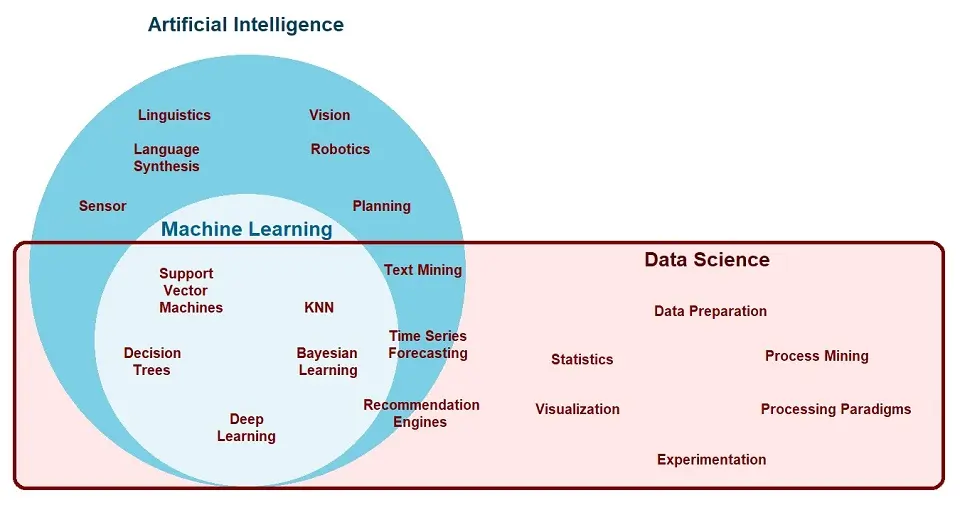
<a href="https://www.ejable.com/tech-corner/ai-machine-learning-and-deep-learning/data-science-artificial-intelligence-and-machine-learning/">Ekta Shah, EJable</a>
</div>


---
background-image: url("../pics/vintage-pipeline.jpeg")
background-size: contain
background-color: #000000

# Die Data-Science-Pipeline


---
# Die Data-Science-Pipeline

.pull-left[

**Vorbereitung**

- **Problemstellung** Vorhersage, Inferenz, Beschreibung
- **Design** Konzept erstellen, Datenerfassung aufsetzen
- **Datenerhebung** rekrutieren, sammeln, überwachen
]

---
# Die Data-Science-Pipeline

.pull-left[
**Vorbereitung**

- **Problemstellung** Vorhersage, Inferenz, Beschreibung
- **Design** Konzept erstellen, Datenerfassung aufsetzen
- **Datenerhebung** rekrutieren, sammeln, überwachen

**Datenverarbeitung**
]

.pull-right-center[
<br><br><br>
<div align="center">

</div>

`Quelle` [H. Wickham, M. Çetinkaya-Rundel, G. Gronemund: R for Data Science](https://r4ds.hadley.nz/)
]

---
# Die Data-Science-Pipeline

.pull-left[
**Vorbereitung**

- **Problemstellung** Vorhersage, Inferenz, Beschreibung
- **Design** Konzept erstellen, Datenerfassung aufsetzen
- **Datenerhebung** rekrutieren, sammeln, überwachen

**Datenverarbeitung**

   - **Aufbereiten**: importieren, bereinigen, anreichern
]

.pull-right-center[
<br><br><br>
<div align="center">

</div>

`Quelle` [H. Wickham, M. Çetinkaya-Rundel, G. Gronemund: R for Data Science](https://r4ds.hadley.nz/)
]


---
# Die Data-Science-Pipeline

.pull-left[
**Vorbereitung**

- **Problemstellung** Vorhersage, Inferenz, Beschreibung
- **Design** Konzept erstellen, Datenerfassung aufsetzen
- **Datenerhebung** rekrutieren, sammeln, überwachen

**Datenverarbeitung**

   - **Aufbereiten**: importieren, bereinigen, anreichern
   - **Explorieren**: visualisieren, beschreiben, entdecken
]

.pull-right-center[
<br><br><br>
<div align="center">

</div>

`Quelle` [H. Wickham, M. Çetinkaya-Rundel, G. Gronemund: R for Data Science](https://r4ds.hadley.nz/)
]


---
# Die Data-Science-Pipeline

.pull-left[
**Vorbereitung**

- **Problemstellung** Vorhersage, Inferenz, Beschreibung
- **Design** Konzept erstellen, Datenerfassung aufsetzen
- **Datenerhebung** rekrutieren, sammeln, überwachen

**Datenverarbeitung**

   - **Aufbereiten**: importieren, bereinigen, anreichern
   - **Explorieren**: visualisieren, beschreiben, entdecken
   - **Modellieren**: testen, inferieren, vorhersagen
]

.pull-right-center[
<br><br><br>
<div align="center">

</div>

`Quelle` [H. Wickham, M. Çetinkaya-Rundel, G. Gronemund: R for Data Science](https://r4ds.hadley.nz/)
]


---
# Die Data-Science-Pipeline

.pull-left[
**Vorbereitung**

- **Problemstellung** Vorhersage, Inferenz, Beschreibung
- **Design** Konzept erstellen, Datenerfassung aufsetzen
- **Datenerhebung** rekrutieren, sammeln, überwachen

**Datenverarbeitung**

   - **Aufbereiten**: importieren, bereinigen, anreichern
   - **Explorieren**: visualisieren, beschreiben, entdecken
   - **Modellieren**: testen, inferieren, vorhersagen

**Verbreitung**

  - **Kommunikation**: Öffentlichkeit, Entscheidungsträger
  - **Veröffentlichen**: Zeitschriften, Software, Berichte
  - **Produktivieren**: nutzbar, robust, skalierbar machen
]

.pull-right-center[
<br><br><br>
<div align="center">

</div>

`Quelle` [H. Wickham, M. Çetinkaya-Rundel, G. Gronemund: R for Data Science](https://r4ds.hadley.nz/)
]


---
# Die Data-Science-Pipeline

.pull-left[
**Vorbereitung**

- **Problemstellung** Vorhersage, Inferenz, Beschreibung
- **Design** Konzept erstellen, Datenerfassung aufsetzen
- **Datenerhebung** rekrutieren, sammeln, überwachen

**Datenverarbeitung**

   - **Aufbereiten**: importieren, bereinigen, anreichern
   - **Explorieren**: visualisieren, beschreiben, entdecken
   - **Modellieren**: testen, inferieren, vorhersagen

**Verbreitung**

  - **Kommunikation**: Öffentlichkeit, Entscheidungsträger
  - **Veröffentlichen**: Zeitschriften, Software, Berichte
  - **Produktivieren**: nutzbar, robust, skalierbar machen

**Meta-Fähigkeit: Programmierung**
]

.pull-right-center[
<br><br><br>
<div align="center">

</div>

`Quelle` [H. Wickham, M. Çetinkaya-Rundel, G. Gronemund: R for Data Science](https://r4ds.hadley.nz/)
]


---
class: inverse, center, middle
name: science

# (Data) Science für Public Policy

<html><div style='float:left'></div><hr color='#EB811B' size=1px style="width:1000px; margin:auto;"/></html>


---
background-image: url("../pics/pioneer-railway.jpg")
background-size: contain
background-color: #000000

# (Data) Science für Public Policy


---
# Das Billion-Prices-Projekt (MIT)

.pull-left[
<div align="center">

</div>
]

.pull-right[
<div align="center">

</div>
]

<br>
**Siehe auch:** [https://thebillionpricesproject.com/](https://thebillionpricesproject.com/) und [https://www.pricestats.com/](https://www.pricestats.com/)

---
# Das Billion-Prices-Projekt (MIT)

.pull-left[
<div align="center">

</div>
]

.pull-right[
<div align="center">

</div>
]

<br>
**Siehe auch:** [https://thebillionpricesproject.com/](https://thebillionpricesproject.com/) und [https://www.pricestats.com/](https://www.pricestats.com/)


---
# Vorhersage der Rückfälligkeit von Straftätern

.pull-left[
## Hintergrund

- Correctional Offender Management Profiling for Alternative Sanctions (COMPAS) ist ein von Northpointe (jetzt Equivant) entwickeltes Entscheidungshilfeinstrument, das von US-Gerichten zur **Bewertung der Rückfallwahrscheinlichkeit** eingesetzt wird.
- Erstellt mehrere Skalen (Risiko der vorzeitigen Entlassung, allgemeine Rückfälligkeit, gewalttätige Rückfälligkeit) auf der Grundlage von Faktoren wie Alter, Vorstrafen und Drogenmissbrauch
- Der Algorithmus ist urheberrechtlich geschützt und seine inneren Abläufe sind nicht öffentlich.

<br><br>

`Quelle` [Leitfaden für Praktiker zum COMPAS Core](https://s3.documentcloud.org/documents/2840784/Practitioner-s-Guide-to-COMPAS-Core.pdf)
]

.pull-right[
<div align="center">


</div>
]


---
# Vorhersage der Rückfälligkeit von Straftätern

.pull-left[
## Die ProPublica und andere Untersuchungen

- Im Jahr 2016 veröffentlichte ProPublica eine Untersuchung, die zeigte, dass COMPAS **voreingenommen gegenüber Afroamerikanern** war
- **Bias:** Der Algorithmus sagte bei Afroamerikanern mit höherer Wahrscheinlichkeit falsch voraus, dass Angeklagte wieder straffällig werden würden.
- **Mangelnde Präzision:** Nur 20 % der Personen, denen Gewaltverbrechen vorhergesagt wurden, wurden tatsächlich straffällig (in einer späteren Studie wurde der Wert auf 65 % geschätzt - schlechter als eine Gruppe von Nicht-Experten)

<br><br><br>
`Quelle` [ProPublica 2016](https://www.propublica.org/article/how-we-analyzed-the-compas-recidivism-algorithm)
]

.pull-right[
<div align="center">

</div>
]


---
# Vorhersage der Rückfälligkeit von Straftätern

.pull-left[
## Die ProPublica und andere Untersuchungen

- Im Jahr 2016 veröffentlichte ProPublica eine Untersuchung, die zeigte, dass COMPAS **voreingenommen gegenüber Afroamerikanern** war
- **Bias:** Der Algorithmus sagte bei Afroamerikanern mit höherer Wahrscheinlichkeit falsch voraus, dass Angeklagte wieder straffällig werden würden.
- **Mangelnde Präzision:** Nur 20 % der Personen, denen Gewaltverbrechen vorhergesagt wurden, wurden tatsächlich straffällig (in einer späteren Studie wurde der Wert auf 65 % geschätzt - schlechter als eine Gruppe von Nicht-Experten)

<br><br>

`Quelle` [Dressel and Fair, 2018, Science Advances](https://www.science.org/doi/epdf/10.1126/sciadv.aao5580)
]

.pull-right[
<div align="center">

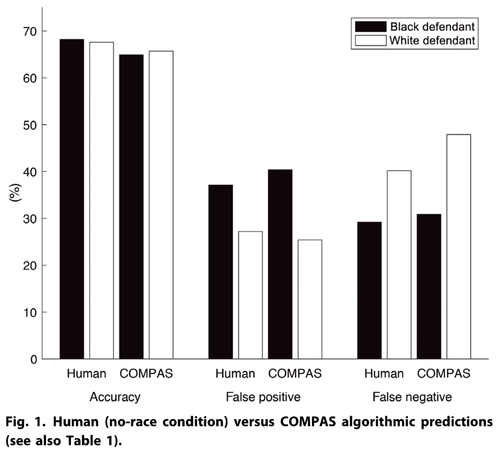
</div>
]


---
# Vertrauen in Wissenschaft

.pull-center[
<div align="center">
<br>


</div>
`Quelle` [Pew 2020](https://www.pewresearch.org/science/2020/09/29/science-and-scientists-held-in-high-esteem-across-global-publics/)
]


---
# Vertrauen in Data Science

.pull-left[
<div align="center">
<br>
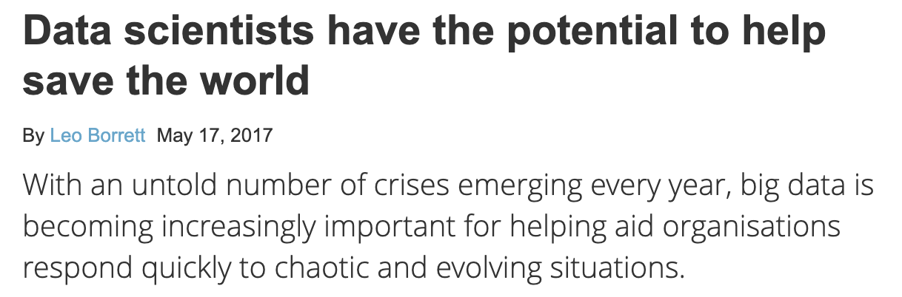


</div>
]

.pull-left[
<div align="center">
<br>

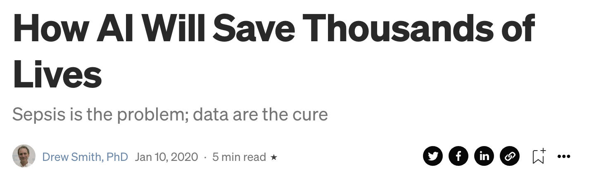

</div>
]

---
# Vertrauen in Data Science?

.pull-left[
<div align="center">
<br><br><br>
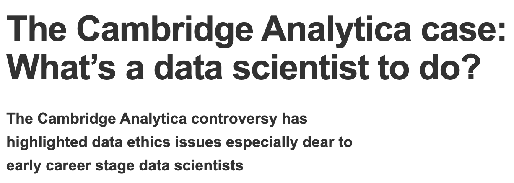
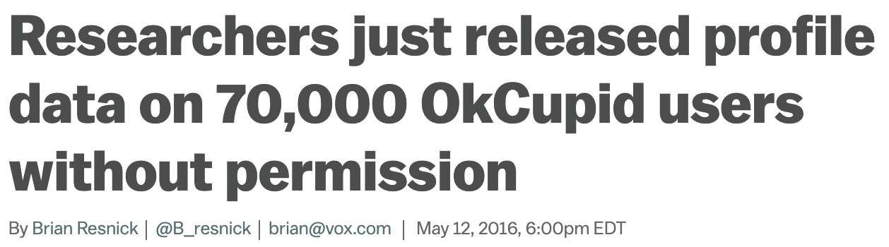
</div>
]

.pull-left[
<div align="center">
<br><br><br>
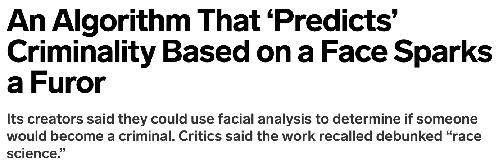

</div>
]


---
class: exercise, center, middle

# Übung

.content-box-white[
Was kann AI tun, was nicht?

Whiteboard | AI-Anwendungen | Performanz | Schädlichkeit
]


---
# Was kann AI tun, was nicht?

<div align="center">
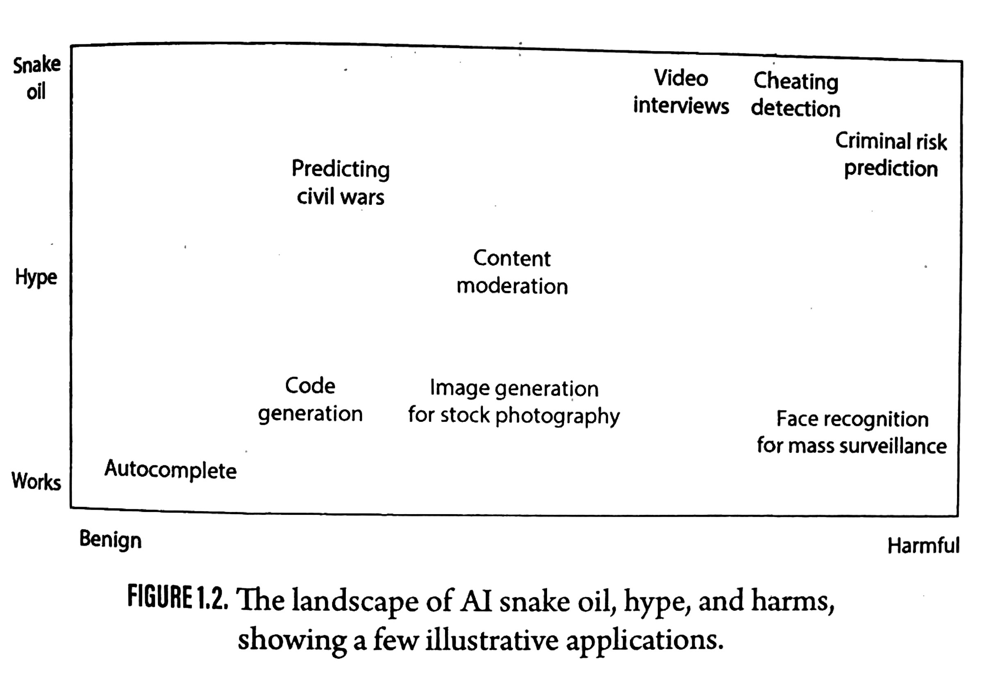
</div>

`Quelle` [Narayanan/Kapoor, AI Snake Oil, S.29](https://press.princeton.edu/books/hardcover/9780691249131/ai-snake-oil)


---
class: inverse, center, middle
name: job

# Data Science als Beruf
<html><div style='float:left'></div><hr color='#EB811B' size=1px style="width:1000px; margin:auto;"/></html>


---
# Berufs- und Lernfeld Data Science

.pull-left[
## Berufsbilder im Bereich Data Science sind vielfältig

Data Scientist, Data Analyst, Data Engineer, Machine Learning Engineer, AI Researcher, Business Intelligence Analyst, Data Governance Specialist, Data Privacy Specialist, Data Visualization Specialist

## Ausbildung

- Immer mehr strukturierte Data-Science-Programme; Quereinstieg aus technischen Programmen
- Autodidaktische Lernwege zunehmend unrealistisch; Online-Kurse i.d.R. nicht ausreichend
- **Das Einhorn** "Umfassend ausgebildeter Data Scientist" (siehe rechts) **ist eine Illusion**
]

.pull-right-center[
<div align="center">

</div>
]


---
# Anforderungen in der Industrie

<div align="center">

</div>

`Quelle` Eigene Darstellung; Daten: doi.org/10.34740/kaggle/dsv/8217982; scraped „Data Scientist“ job postings from LinkedIn; n=4,342; countries: US, UK, CA, AU

---
# Anforderungen in der Industrie II

<div align="center">
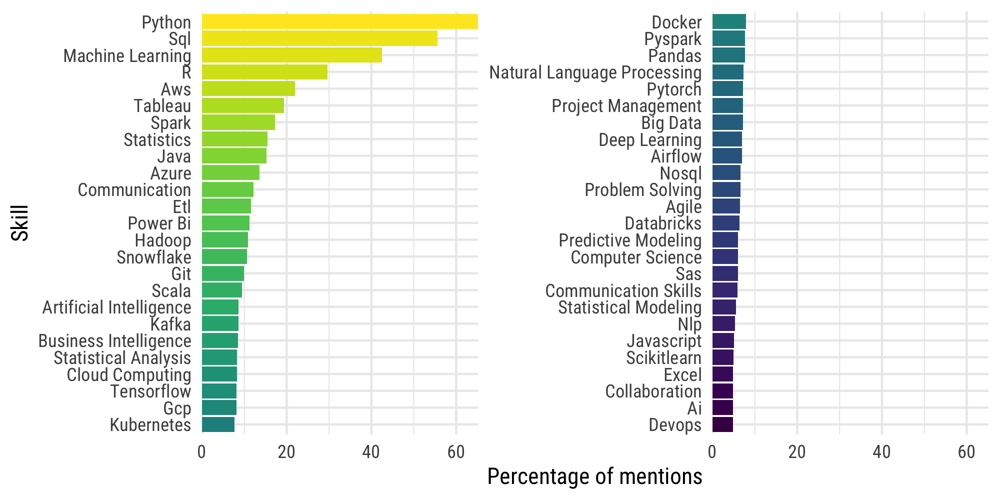
</div>

`Quelle` Eigene Darstellung; Daten: doi.org/10.34740/kaggle/dsv/8217982; scraped „Data Scientist“ job postings from LinkedIn; n=4,342; countries: US, UK, CA, AU


---
# Schwerpunkte in der Ausbildung

<div align="center">

</div>

`Quelle` Eigene Datenerhebung (April 2024), CSS-Master-Programme in Europa und USA


---
class: inverse, center, middle
name: goals

# Ziele für dieses Modul
<html><div style='float:left'></div><hr color='#EB811B' size=1px style="width:1000px; margin:auto;"/></html>


---
# Modulüberblick

<div align="center">
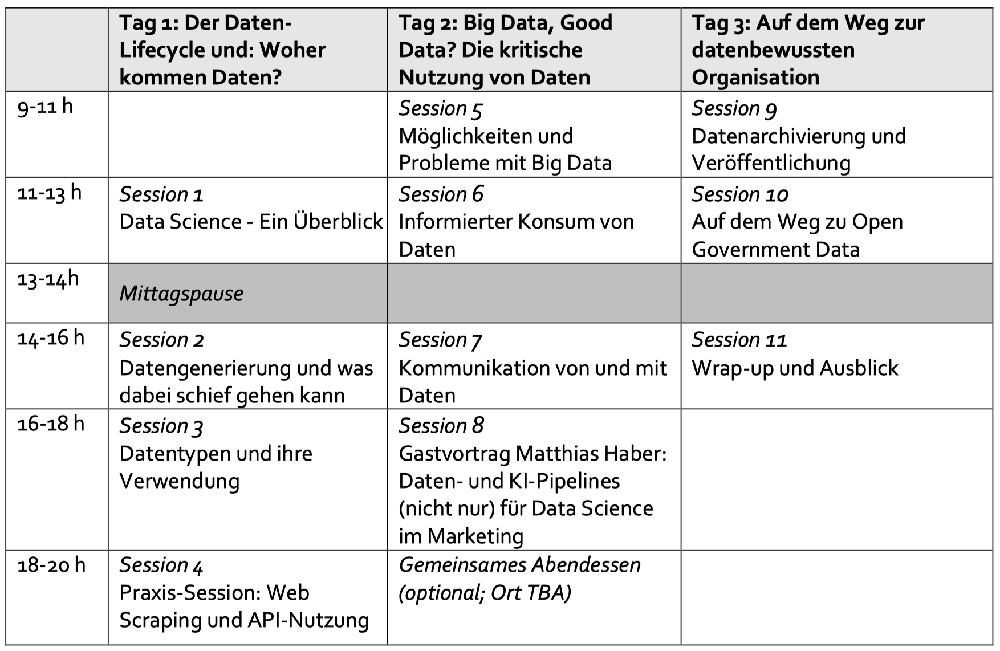
</div>


---
# Datenqualität - die Spreu vom Weizen trennen

.pull-left-small[

<br><br><br>

- Selektionsprobleme
- Messprobleme
- Sich von Big Data nicht täuschen lassen
- Garbage in, garbage out

]

.pull-right-wide[
<br>
<div align="center">
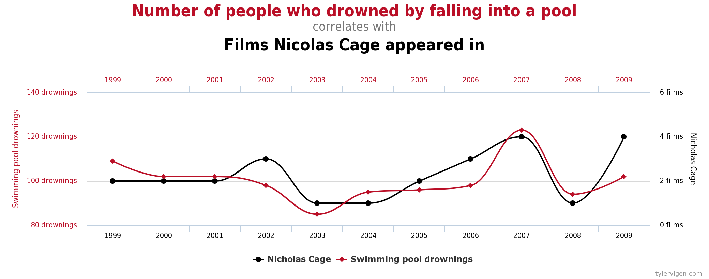 

</br>
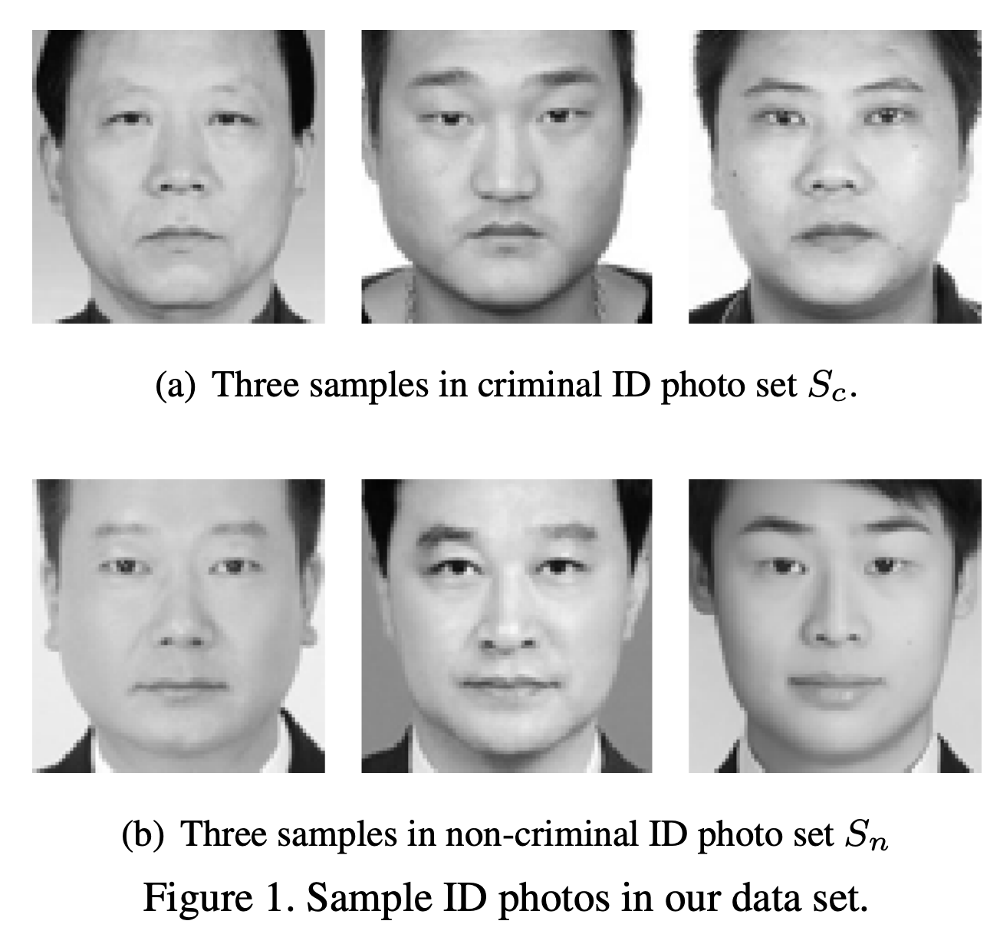
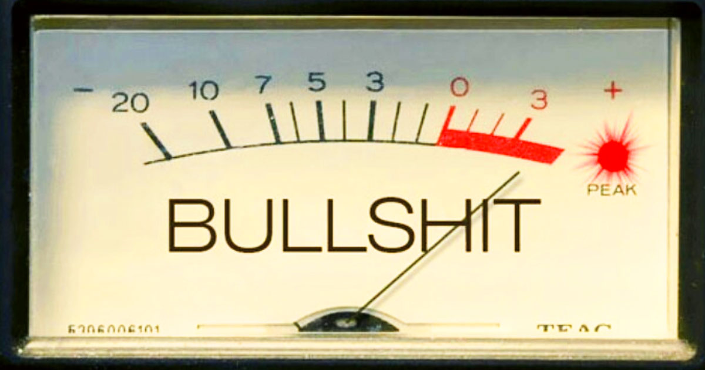

</br>


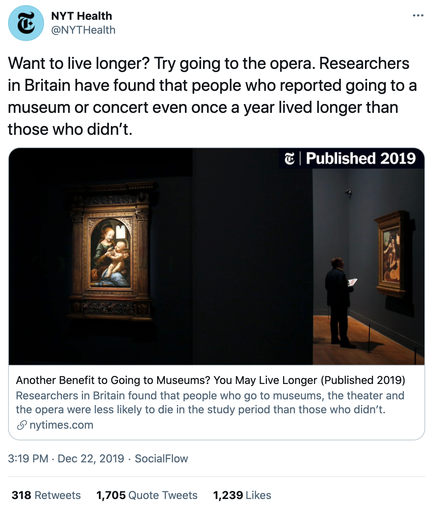
</div>
]

---
# Schlechte Evidenz erkennen

.pull-left-small[

<br><br><br>

- "Schrott-Modelle"
- statistische Signifikanz
- interne vs. externe Validität
- unplausible Effektgrößen / Performanzwerte
- hochpräzise Vorhersagen
- überangepasste Modelle (eng.: "overfitted")

]

.pull-right-wide[
<br>
<div align="center">
 

</br>


</br>


</div>
]


---
# Einblicke ins Handwerkszeug von Data Scientists

.pull-left-small[

<br><br><br>

- Datenerhebung
- Datenmanagement
- Datenverwaltung
- Datenanalyse
- Datenvisualisierung
- Datenkommunikation

]

.pull-right-wide[
<div align="center">
<br><br>

</div>
]


---
# Was wir nicht behandeln werden

.pull-left-small2[
## Programmierung
- Kenntnisse in Python, R, SQL usw. sind für die Datenwissenschaft unerlässlich
- Die Lernkurve ist steil und erfordert viel Übung
- Wir werfen einen (kleinen) Blick hinter die Kulissen
<br><br><br>

<div align="center">
 
</div>
]

.pull-left-small2[
## Aktive Modellierung
- Seriöse AI-Modellierung erfordert mehr theoretisches und praktisches Wissen, als wir in diesem Workshop abdecken können.
- Die Konzentration auf die Grundsätze statistischer Argumentation sollte ausreichen, um Daten und Modelle kritisch zu beurteilen.
<br>

<div align="center">
 
</div>
]

.pull-right-small2[
## Fortgeschrittenes Maschinelles Lernen, NLP
- ML, DL, NLP sind Technologien, die viele der spannendsten Anwendungen der Datenwissenschaft vorantreiben.
- Modul 3 wird hier anschließen; wir werden uns auf die Datengrundlagen konzentrieren.

<br>

<div align="center">
 
</div>
]


---
# Weiterführende Literatur

<div align="center">


<br>


</div>


---
# Weiterführende Podcasts

<div align="center">
<br><br><br>


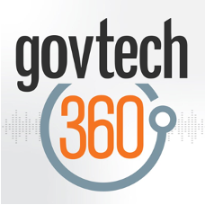


<br>


</div>


