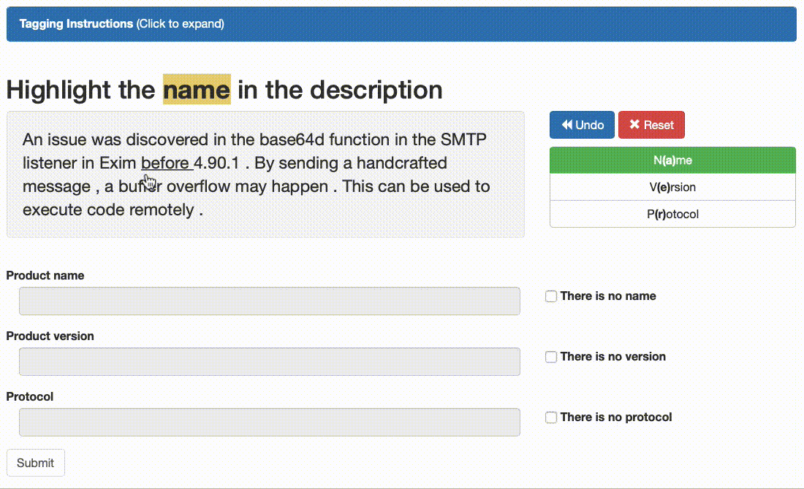

```{css, echo=FALSE} 
@media print { # print out incremental slides; see https://stackoverflow.com/questions/56373198/get-xaringan-incremental-animations-to-print-to-pdf/56374619#56374619
  .has-continuation {
    display: block !important;
  }
}
```

```{r setup, include=FALSE}
# figures formatting setup
options(htmltools.dir.version = FALSE)
library(knitr)
opts_chunk$set(
  prompt = T,
  fig.align="center", #fig.width=6, fig.height=4.5, 
  # out.width="748px", #out.length="520.75px",
  dpi=300, #fig.path='Figs/',
  cache=T, #echo=F, warning=F, message=F
  engine.opts = list(bash = "-l")
  )

## Next hook based on this SO answer: https://stackoverflow.com/a/39025054
knit_hooks$set(
  prompt = function(before, options, envir) {
    options(
      prompt = if (options$engine %in% c('sh','bash')) '$ ' else 'R> ',
      continue = if (options$engine %in% c('sh','bash')) '$ ' else '+ '
      )
})

library(tidyverse)
library(hrbrthemes)
library(fontawesome)
```


# Überblick

<br><br>

1. [Woher kommen die Daten?](#datageneration)

2. [Was bei der Datengenerierung schiefgehen kann](#dataflaws)

    2.1 [Das Problem mit der Repräsentativität](#sampling)

    2.2 [Problematische Messung](#measurement)
    
    2.3 [Ethische und rechtliche Fails](#ethicfails)


---
class: inverse, center, middle
name: datageneration

# Woher kommen die Daten?
<html><div style='float:left'></div><hr color='#EB811B' size=1px style="width:1000px; margin:auto;"/></html>


---
# AI-Produkte und ihre Datenbasis

| **AI-Tool/Anwendung**       | **Funktion**                                              | **(vermutete) Datenquellen**                                              |
|----------------------------|-----------------------------------------------------------|--------------------------------------------------------------|
| **ChatGPT (OpenAI)**        | Sprachmodell für Textgenerierung, Dialoge, Programmierung  | Trainingsdaten: Bücher, Websites, Foren, diverse Texte |
| **Stable Diffusion**        | Open-Source-Bildgenerator                                 | Laion-Datenbank, Bilder aus dem Internet                      |
| **Alexa (Amazon)**          | Sprachbasierter Assistent für Smart Home                  | Amazon-Datenbank, Web-Suchen, Nutzerinteraktionen             |
| **DeepMind AlphaFold**      | Proteinstrukturvorhersage                                 | Biochemische Datenbanken, Forschungspublikationen             |
| **Perspective API**      | Automatisierte Erkennung und Blockierung unerwünschter Inhalte | Nutzerdaten, Social-Media-Inhalte, Richtlinien für Inhalte      |
| **Patternizr**     | Vorhersage von Straftaten, Einsatzplanung der Polizei      | Polizeidaten, historische Kriminalitätsdaten, geografische Daten |


---
# AI-Anwendungen und ihre Datenbasis

| **AI-Tool/Anwendung**       | **Funktion**                                              | **(vermutete) Datenquellen**                                              |
|----------------------------|-----------------------------------------------------------|--------------------------------------------------------------|
| **Health Prediction**       | Vorhersage von Krankheitsverläufen, Prävention            | Elektronische Krankenakten, Genomdaten, Forschungsdaten         |
| **Opinion Mining**          | Analyse und Extraktion von Meinungen aus Texten (z. B. Social Media) | Social-Media-Beiträge, Kundenrezensionen, Blogs                 |
| **Übersetzungstools**       | Automatische Übersetzung von Texten und Sprache           | Trainingsdaten aus zweisprachigen Texten, Webseiten, Dokumenten |
| **Medizinische Diagnostik** | KI-gestützte Analyse von Patienteninformationen, Bilddaten (z. B. Röntgenbilder) | Krankenakten, medizinische Bilder, Forschungsliteratur          |
| **Autonomes Fahren**        | Selbststeuerung von Fahrzeugen unter realen Bedingungen    | Sensordaten (Kameras, Radar, Lidar), Verkehrsdaten, Karten      |


---
# Human in the loop

.pull-left[

## Menschlicher Input für KI-Modelle

- **Menschliche Expertise** ist oft unverzichtbar, um Daten zu generieren, zu annotieren und zu validieren.
- **Menschliche Expertise** ist auch unverzichtbar, um die Qualität von Daten zu beurteilen und zu verbessern.

## Beispiele

- **Crowdsourcing**: z. B. Amazon Mechanical Turk
- **Content Moderation**: z. B. Facebook, Twitter
- **CAPTCHA** ("Completely Automated Public Turing test to tell Computers and Humans Apart): z. B. Google reCAPTCHA 

]

.pull-right[
<div align="center">


</div>
]


---
# Clickworking und Crowdsourcing

.pull-left[

## Clickworking-Plattformen

- Plattformen designt für Mikrojobs, z. B. Texterstellung, Datenerfassung, Kategorisierung
- Beispiele: Amazon Mechanical Turk, Clickworker, Upwork, Prolific
- [Clickworker](https://www.clickworker.com/clickworker-crowd/): ca. 6 Mio. registrierte Clickworker weltweit
- [Amazon Mechanical Turk](https://en.wikipedia.org/wiki/Amazon_Mechanical_Turk): 100Tsde. registrierte Worker, nur ein Bruchteil aktiv

## Ethische Fragen

- **Fairness**: Bezahlung, Arbeitsbedingungen
- **Ausbeutung benachteiligter Gruppen**: z. B. Clickworker in Entwicklungsländern
- **Datenschutz**: Schutz sensibler Daten
- **Transparenz**: Offenlegung von Auftraggebern, Zweck der Datenerhebung
]

.pull-right[
<div align="center">



</div>
]


---
class: exercise, center, middle

# Übung

.content-box-white[
Wie sieht das Leben eines Clickworkers aus?

Zum Ausprobieren: 

[Amazon Mechanical Turk (Sandbox; benötigt Amazon-Account)](https://workersandbox.mturk.com/)
]


---
# Prozessproduzierte vs. aktiv generierte Daten

.pull-left[
## Prozessproduzierte Daten

- Daten, die als Nebenprodukt von Prozessen generiert werden
- Beispiele: Transaktionsdaten (z. B. E-Commerce), Log-Daten (z. B. Website-Clicks), Emails,  **Verwaltungsakten**
- Ein Großteil der Daten, die in KI-Anwendungen verwendet werden, sind prozessproduzierte Daten

<div align="center">

</div>
]

.pull-right[
## Aktiv generierte Daten

- Daten, zu einem bestimmten Zweck erhoben
- Beispiele: Umfragen, Experimente, Beobachtungen (z. B. manuelle Zählungen), Formulare
- Aktiv generierte Daten sind oft teurer und aufwendiger zu erheben, aber passgenauer für bestimmte Fragestellungen

<div align="center">

</div>
]


---
# Prozessproduzierte vs. aktiv generierte Daten

<table>
    <thead>
        <tr>
            <th>Datenart</th>
            <th>Vorteile</th>
            <th>Nachteile</th>
            <th>Nützlichkeit für KI-Anwendungen</th>
        </tr>
    </thead>
    <tbody>
        <tr>
            <td><b>Prozessproduzierte Daten</b></td>
            <td>
                <ul>
                    <li>Kontinuierlich und in großem Umfang verfügbar</li>
                    <li>Realistische, nicht-beeinflusste Daten</li>
                </ul>
            </td>
            <td>
                <ul>
                    <li>Daten oft unstrukturiert oder unvollständig</li>
                    <li>Keine Kontrolle über Erhebungsmethode</li>
                </ul>
            </td>
            <td>
                <ul>
                    <li>Gut für die Vorhersage von Verhaltensmustern (z. B. Nutzerverhalten)</li>
                    <li>Anfällig für systematische Verzerrungen, falls nicht repräsentativ</li>
                </ul>
            </td>
        </tr>
        <tr>
            <td><b>Aktiv erhobene Daten</b></td>
            <td>
                <ul>
                    <li>Präzise Daten, speziell für den Anwendungsfall</li>
                    <li>Gute Dokumentation der Erhebungsmethoden</li>
                </ul>
            </td>
            <td>
                <ul>
                    <li>Aufwand und Kosten der Datenerhebung hoch</li>
                    <li>Risiko von Verzerrungen durch Antwortverhalten (z. B. Bias)</li>
                </ul>
            </td>
            <td>
                <ul>
                    <li>Nützlich für gezielte Analysen oder Modellanpassungen</li>
                    <li>Verzerrungen durch menschliche Subjektivität möglich</li>
                </ul>
            </td>
        </tr>
    </tbody>
</table>


---
class: inverse, center, middle
name: dataflaws

# Was bei der Datengenerierung und Verarbeitung schiefgehen kann
<html><div style='float:left'></div><hr color='#EB811B' size=1px style="width:1000px; margin:auto;"/></html>


---
# Beispiele für Datengenerierungs-Fails

| **Kategorie**                          | **Probleme**                                                                                                                                                                       | **Beispiele**                                                                                                                                                    |
|----------------------------------------|-----------------------------------------------------------------------------------------------------------------------------------------------------------------------------------|-------------------------------------------------------------------------------------------------------------------------------------------------------------------------|
| **Unvollständige Daten**               | <ul><li>Fehlende Datenpunkte durch technische Ausfälle</li><li>Daten werden nur für bestimmte Zeiträume erhoben</li></ul>         | <ul><li>Sensoren fallen zeitweise aus, sodass Verkehrsdaten für einige Tage fehlen</li><li>Wichtige Umfragedaten werden nicht erhoben, weil bestimmte Fragen übersprungen wurden</li></ul> |
| **Selection Bias (Verzerrte Stichproben)** | <ul><li>Stichprobe nicht repräsentativ für die Zielpopulation</li><li>Ungeeignete Auswahlkriterien für Datenquellen</li></ul> | <ul><li>Online-Umfragen schließen ältere Menschen ohne Internetzugang aus</li><li>Ein KI-Modell wird nur mit Daten von Großstädten trainiert, was ländliche Regionen vernachlässigt</li></ul> |
| **Fehlerhafte Messung**                | <ul><li>Messgeräte liefern ungenaue Daten</li><li>Menschliche Fehler bei manueller Datenerfassung</li></ul>        | <ul><li>GPS-Tracking liefert falsche Standortdaten in Gebieten mit schlechtem Empfang</li><li>Manuelle Zählungen von Besuchern eines Events führen zu Doppelzählungen</li></ul> |


---
# Beispiele für Datengenerierungs-Fails

| **Kategorie**                          | **Probleme**                                                                                                                                                                       | **Beispiele**                                                                                                                                                    |
|----------------------------------------|-----------------------------------------------------------------------------------------------------------------------------------------------------------------------------------|-------------------------------------------------------------------------------------------------------------------------------------------------------------------------|
| **Probleme beim Datenimport**          | <ul><li>Inkompatible Formate erschweren den Import</li><li>Fehler bei der Zuordnung von Datenfeldern während des Imports</li></ul> | <ul><li>Daten aus verschiedenen Quellen sind unterschiedlich formatiert (z. B. unterschiedliche Datumsformate)</li><li>Digitalisierung von Papierakten erfolgt qualitativ unzureichend über OCR (auch Messproblem)</li></ul> |
| **Ethische und rechtliche Probleme**   | <ul><li>Daten werden ohne Einwilligung erhoben</li><li>Sensible Daten werden ohne angemessene Schutzmaßnahmen erfasst</li></ul> | <ul><li>Datensammlung in einer Smart City ohne Zustimmung der Bürger</li><li>Gesundheitsdaten werden ohne ausreichenden Schutz gesammelt, was zu Datenschutzverletzungen führen kann</li></ul> |


---
class: inverse, center, middle
name: sampling

# Das Problem mit der Repräsentativität
<html><div style='float:left'></div><hr color='#EB811B' size=1px style="width:1000px; margin:auto;"/></html>


---
# Zweifelhafte „Repräsentativität“

.pull-left[
<div align="center">

</div>

`Quelle` [Robin Andrews, IFLScience](https://www.iflscience.com/editors-blog/survey-finds-most-americans-think-that-they-have-above-average-intelligence/)

]

.pull-right[
<div align="center">

</div>

`Quelle` [Maxime Schlee, Politico](https://www.politico.eu/article/80-percent-of-eu-citizens-want-to-scrap-daylight-savings-report-summertime-directive/)
]


---
# Stichproben und Repräsentativität

.pull-left[
## Eine substantielle Definition von Repräsentativität

Eine Stichprobe (oder Daten im Allgemeinen) ist „repräsentativ“, wenn **die aus der Stichprobe gezogenen Schlüsse verallgemeinert werden können** auf die Grundgesamtheit von Interesse.
]

.pull-right[
## Eine formalere Definition

Eine Stichprobe ist repräsentativ, wenn sie so gezogen wird, dass sie **statistisch nicht von der interessierenden Grundgesamtheit** unterscheidbar ist.
]

<div align="center">

</div>


---
# Das Problem mit der „Repräsentativität“

## Warum „Repräsentativität“ ein problematischer Begriff ist

1. Ob eine Stichprobe repräsentativ ist, hängt von Ihrem Interesse ab.
2. Man kann eine Stichprobe nicht a priori als „repräsentativ“ bezeichnen. 
3. Die Beurteilung der Repräsentativität einer Stichprobe erfordert starke Annahmen über Ihr Wissen über die Grundgesamtheit und Ihre Messungen der Merkmale, die „repräsentativ“ sein sollten.

--

.pull-left[

<br>
## Ein Beispiel

- Sie führen eine Umfrage zur Wahlabsicht durch.
- Wen möchten Sie repräsentieren? Die Wahlbevölkerung oder die Gesamtbevölkerung?
- Wie erreichen Sie eine repräsentative Stichprobe? Zufallsauswahl? Gewichtung?

]

.pull-right[
<div align="center">
<br>

</div>
]

---
# "Total survey error"

.pull-left[
## Zwei grundsätzliche Fehlerquellen bei der Datensammlung

- **Messfehler**: was man misst, ist nicht das, was man messen will
- Fehler der **Repräsentation**: Die Gruppe, die Sie beobachten, ist nicht verallgemeinerbar auf die interessierende Population
]

.pull-right[
## Total survey error framework

<div align="center">
<br>

</div>

`Quelle` [Groves et al. 2009, Survey Methodology](https://books.google.de/books?hl=de&lr=&id=HXoSpXvo3s4C)
]


---
# Mess- und Stichprobenfehler in freier Wildbahn

.pull-left[
## Überrepräsentation und falsche Angaben in Wahlumfragen

- Umfragestatistiken überschätzen die Wahlbeteiligung oft erheblich. 
- Zwei unterschiedliche Phänomene sind für diese Diskrepanz verantwortlich:
    1. Überrepräsentation der tatsächlichen Wähler
    2. Falsche Angaben zur Wahlbeteiligung durch Nichtwähler unter den Umfrageteilnehmern. 
- Studien zur Validierung der Wahlbeteiligung helfen, das Problem auf individueller Ebene zu identifizieren.
- Eine Verzerrung der Wahlbeteiligung kann sich auch auf Analysen nachgelagerter Variablen (z.B. Wahlverhalten) auswirken.
]

.pull-right[
<div align="center">
<br>

</div>

`Quelle` [Selb and Munzert 2013, Electoral Studies](https://kops.uni-konstanz.de/server/api/core/bitstreams/e755783d-acee-4592-a666-1562fc912906/content)
]

---
# Schlechte Stichproben: lessons learned


.pull-left[
## Was bedeutet das für Sie?

- Nehmen Sie die angegebene „Repräsentativität“ nicht für bare Münze.
- Der Stichprobenumfang allein garantiert keine Repräsentativität (siehe Big Data!).
- Lassen Sie sich nicht von „großen Datenmengen“ täuschen (nicht per se repräsentativ).
- Lassen Sie sich nicht von „Zufallsstichproben“ täuschen (nicht per se repräsentativ).
- Schlechte Stichproben sind nicht auf Erhebungen beschränkt (denken Sie z.B. an Daten aus sozialen Medien, die Auswahl von Fällen für eine medizinische Studie oder die Auswahl von Ländern für eine politische Studie).
]

.pull-right[
## Achten Sie stattdessen auf: 

1. **Transparenz** über das Auswahlverfahren.
2. **Validierung** der Stichprobe anhand externer Benchmarks.
4. **Ihren gesunden Menschenverstand**: Ist die Datengrundlage systematisch verzerrt, d.h. auf relevanten Kriterien unterschiedlich von der Grundgesamtheit?
]


---
class: inverse, center, middle
name: measurement

# Problematische Messung
<html><div style='float:left'></div><hr color='#EB811B' size=1px style="width:1000px; margin:auto;"/></html>


---
# Messung

Messung ist gleichzeitig Grundlage (Input) für als auch Output von AI-Anwendungen.

Beispiele

Menschliches Verhalten - und damit auch Daten - sind oft schwer zu messen.
Präferenzen schwierig zu messen, instabil
Manche Features sehr gut zu messen, stabiler als gedacht (z.B. Gesichtsgeometrie)
Messfehler können systematisch sein, z.B. durch soziale Erwünschtheit
Messfehler können zufällig sein, z.B. durch technische Probleme

Beispiele:
- Vorhersage von Life outcomes
- Vorhersage von politischen Präferenzen
- Vorhersage von Kaufverhalten
- Vorhersage von Krankheitsverläufen
- Vorhersage von Kriminalität
- Gesichtserkennung
- Spracherkennung
- OCR

Konkrete Beispiele aus Snakeoil

Reliabilität vs. Validität


---
# Regression vs. classification

.pull-left[
## Regression
- Predicts a continuous outcome
- Example: Predicting house prices, GDP growth, temperature

## Classification
- Predicts a categorical outcome
- Example: Predicting whether a person will default on a loan, whether an email is spam, whether a patient has a disease

]

--

.pull-right[
## Classifcation problems in the wild

Classification problems occur often, perhaps even more so than regression problems, e.g.:

1. A woman arrives at the emergency room with a set of symptoms. Which condition does she have?
2. An online banking service must be able to determine whether or not a transaction is fraudulent, on the basis of the user’s IP address, past transaction history, and so forth.
3. On the basis of DNA sequence data for a number of patients with and without a given disease, a biologist would like to figure out which DNA mutations are deleterious (disease-causing) and which are not.

Decision-making problems often are classification problems!
]

---
# Supervised and unsupervised learning

.pull-left-wide2[
## Supervised learning
- The algorithm learns from labeled data, i.e., data with known outcomes
- The algorithm is trained on a training dataset and evaluated on a test dataset
- The goal is to the predict unobserved outcomes

## Unsupervised learning
- The algorithm learns from unlabeled data
- There are inputs but no supervising output; we can still learn about relationships and structure from such data

## Analogies
- Supervised: Child in school learns math (with teacher’s input)
- Unsupervised: Child at home plays with toys (without teacher’s input)
]


.pull-right-small2[
<div align="center"><br><br>

</div>
]


---
# Overfitting in classification

<div align="center">

</div>


---
# Overfitting in classification

<div align="center">


</div>


---
class: inverse, center, middle
name: ethicfails

# Ethische und rechtliche Fails
<html><div style='float:left'></div><hr color='#EB811B' size=1px style="width:1000px; margin:auto;"/></html>    


