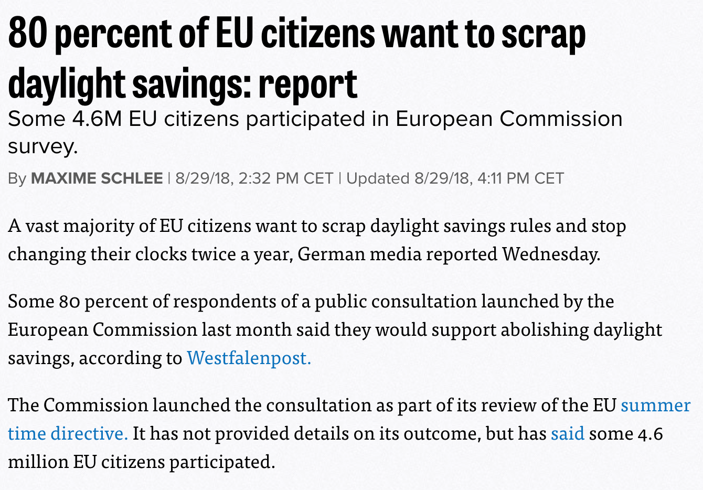
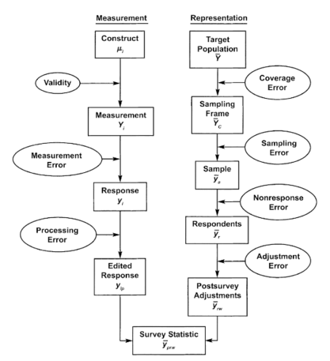
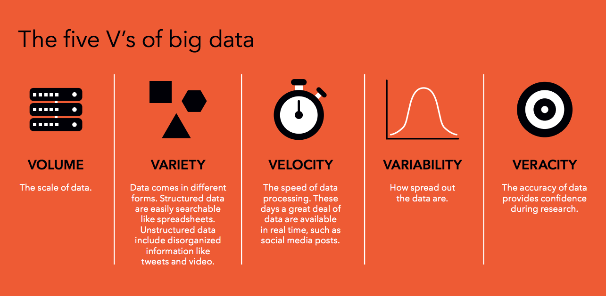
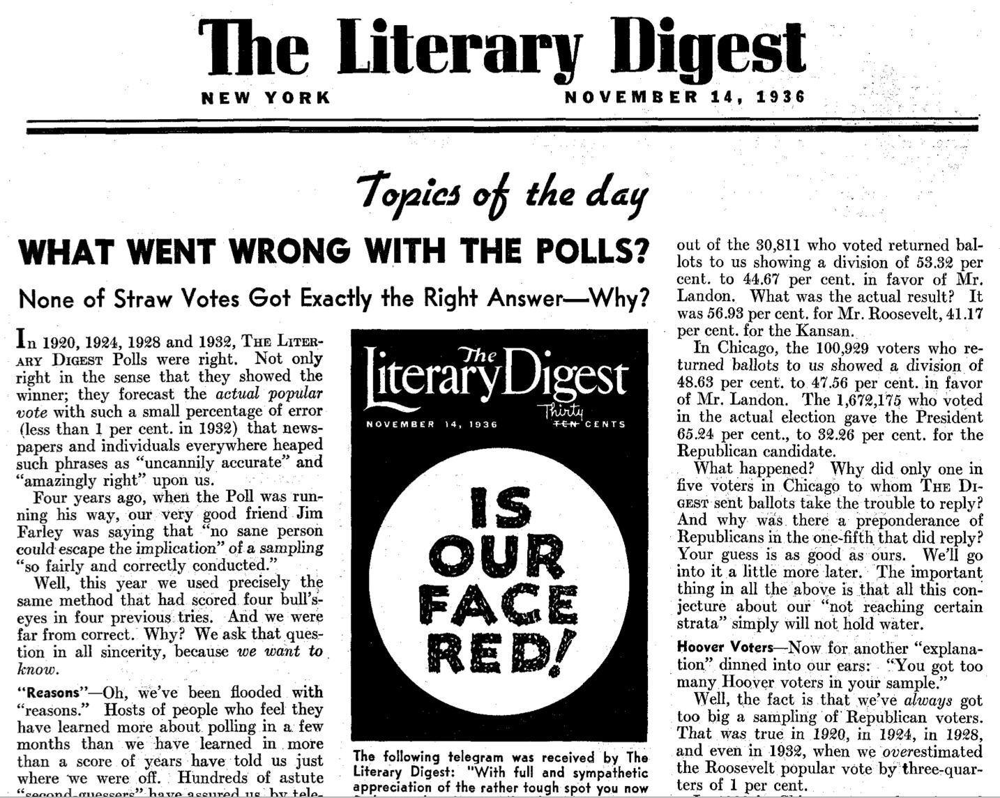
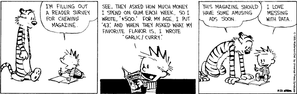
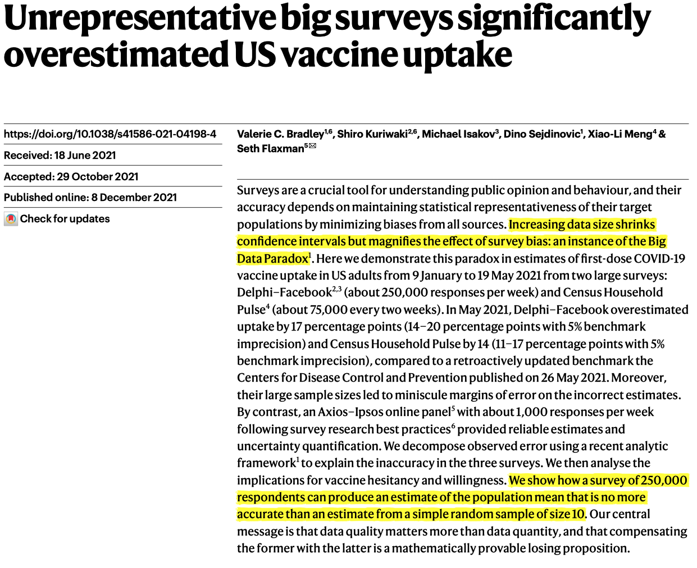
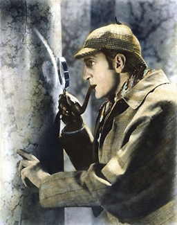

```{css, echo=FALSE} 
@media print { # print out incremental slides; see https://stackoverflow.com/questions/56373198/get-xaringan-incremental-animations-to-print-to-pdf/56374619#56374619
  .has-continuation {
    display: block !important;
  }
}
```

```{r setup, include=FALSE}
# figures formatting setup
options(htmltools.dir.version = FALSE)
library(knitr)
opts_chunk$set(
  prompt = T,
  fig.align="center", #fig.width=6, fig.height=4.5, 
  # out.width="748px", #out.length="520.75px",
  dpi=300, #fig.path='Figs/',
  cache=T, #echo=F, warning=F, message=F
  engine.opts = list(bash = "-l")
  )

## Next hook based on this SO answer: https://stackoverflow.com/a/39025054
knit_hooks$set(
  prompt = function(before, options, envir) {
    options(
      prompt = if (options$engine %in% c('sh','bash')) '$ ' else 'R> ',
      continue = if (options$engine %in% c('sh','bash')) '$ ' else '+ '
      )
})

library(tidyverse)
library(hrbrthemes)
library(fontawesome)
```


# Überblick

<br><br>

1. [Das Problem mit der Repräsentativität](#sampling)

2. [Das Big-Data-Paradoxon](#bigdataparadox)

3. [Garbage in, garbage out](#garbageingarbageout)

4. [Übung](#exercise)


---
class: inverse, center, middle
name: correlation

# Das Problem mit der Repräsentativität
<html><div style='float:left'></div><hr color='#EB811B' size=1px style="width:1000px; margin:auto;"/></html>


---
# Getäuscht durch „Repräsentativität“

.pull-left[
<div align="center">

</div>

`Quelle` [Robin Andrews, IFLScience](https://www.iflscience.com/editors-blog/survey-finds-most-americans-think-that-they-have-above-average-intelligence/)

]

.pull-right[
<div align="center">

</div>

`Quelle` [Maxime Schlee, Politico](https://www.politico.eu/article/80-percent-of-eu-citizens-want-to-scrap-daylight-savings-report-summertime-directive/)

]


---
# Stichproben und Repräsentativität

.pull-left[
## Eine substantielle Definition von Repräsentativität

Eine Stichprobe (oder Daten im Allgemeinen) ist „repräsentativ“, wenn **die aus der Stichprobe gezogenen Schlüsse verallgemeinert werden können** auf die Grundgesamtheit von Interesse.
]

.pull-right[
## Eine formalere Definition

Eine Stichprobe ist repräsentativ, wenn sie so gezogen wird, dass sie **statistisch nicht von der interessierenden Grundgesamtheit** unterscheidbar ist.
]

<div align="center">

</div>


---
# Das Problem mit der „Repräsentativität“

## Warum „Repräsentativität“ ein problematischer Begriff ist

1. Ob eine Stichprobe repräsentativ ist, hängt von Ihrem Interesse ab.
2. Man kann eine Stichprobe nicht a priori als „repräsentativ“ bezeichnen. 
3. Die Beurteilung der Repräsentativität einer Stichprobe erfordert starke Annahmen über Ihr Wissen über die Grundgesamtheit und Ihre Messungen der Merkmale, die „repräsentativ“ sein sollten.

--

.pull-left[

<br>
## Ein Beispiel

- Sie führen eine Umfrage zur Wahlabsicht durch.
- Wen möchten Sie repräsentieren? Die Wahlbevölkerung oder die Gesamtbevölkerung?
- Wie erreichen Sie eine repräsentative Stichprobe? Zufallsauswahl? Gewichtung?

]

.pull-right[
<div align="center">
<br>

</div>
]

---
# "Total survey error"

.pull-left[
## Zwei grundsätzliche Fehlerquellen bei der Datensammlung

- **Messfehler**: was man misst, ist nicht das, was man messen will
- Fehler der **Repräsentation**: Die Gruppe, die Sie beobachten, ist nicht verallgemeinerbar auf die interessierende Population
]

.pull-right[
## Total survey error framework

<div align="center">
<br>

</div>

`Quelle` [Groves et al. 2009, Survey Methodology](https://books.google.de/books?hl=de&lr=&id=HXoSpXvo3s4C)
]


---
# Mess- und Stichprobenfehler in freier Wildbahn

.pull-left[
## Überrepräsentation und falsche Angaben in Wahlumfragen

- Umfragestatistiken überschätzen die Wahlbeteiligung oft erheblich. 
- Zwei unterschiedliche Phänomene sind für diese Diskrepanz verantwortlich:
    1. Überrepräsentation der tatsächlichen Wähler
    2. Falsche Angaben zur Wahlbeteiligung durch Nichtwähler unter den Umfrageteilnehmern. 
- Studien zur Validierung der Wahlbeteiligung helfen, das Problem auf individueller Ebene zu identifizieren.
- Eine Verzerrung der Wahlbeteiligung kann sich auch auf Analysen nachgelagerter Variablen (z.B. Wahlverhalten) auswirken.
]

.pull-right[
<div align="center">
<br>

</div>

`Quelle` [Selb and Munzert 2013, Electoral Studies](https://kops.uni-konstanz.de/server/api/core/bitstreams/e755783d-acee-4592-a666-1562fc912906/content)
]

---
# Schlechte Stichproben: gelernte Lektionen


.pull-left[
## Was bedeutet das für Sie?

- Nehmen Sie die angegebene „Repräsentativität“ nicht für bare Münze.
- Der Stichprobenumfang allein garantiert keine Repräsentativität (siehe Big Data!).
- Lassen Sie sich nicht von „großen Datenmengen“ täuschen (nicht per se repräsentativ).
- Lassen Sie sich nicht von „Zufallsstichproben“ täuschen (nicht per se repräsentativ).
- Schlechte Stichproben sind nicht auf Erhebungen beschränkt (denken Sie z.B. an Daten aus sozialen Medien, die Auswahl von Fällen für eine medizinische Studie oder die Auswahl von Ländern für eine politische Studie).
]

.pull-right[
## Achten Sie stattdessen auf: 

1. **Transparenz** über das Auswahlverfahren.
2. **Validierung** der Stichprobe anhand externer Benchmarks.
4. **Ihren gesunden Menschenverstand**: Ist die Datengrundlage systematisch verzerrt, d.h. auf relevanten Kriterien unterschiedlich von der Grundgesamtheit?
]


---
class: inverse, center, middle
name: bigdataparadox

# Das Big-Data-Paradoxon
<html><div style='float:left'></div><hr color='#EB811B' size=1px style="width:1000px; margin:auto;"/></html>


---
# Was ist Big Data?

<div align="center">

</div>


---
# Umgeben von massiven Datenmengen<sup>1</sup>

.pull-left-wide2[
<div align="center">

</div>

`Quelle` Reinsel et al., 2017, ["Data Age 2025"](https://www.seagate.com/files/www-content/our-story/trends/files/Seagate-WP-DataAge2025-March-2017.pdf)

.footnote[<div class="font80"><sup>1</sup>Die Zahlen sind mit Vorsicht zu genießen. SIe sind fundamental schwer zu messen; deshalb weichen veröffentlichte Daten teilweise um ein Vielfaches voneinander ab.</div>]
]

.pull-right-small2[

<div align="center">

</div>

`Quelle` [eDiscoveryToday, LTMG](https://ediscoverytoday.com/2023/04/20/2023-internet-minute-infographic-by-ediscovery-today-and-ltmg-ediscovery-trends/
)
]


---
# Das Zeitalter von Big Data - Große Trends

<br><br>

1. Massive erzeugung von **vom Menschen erzeugten Daten** insbesondere im digitalen Bereich

2. Verwendung von **neuen Datentypen**: Text, Video, digitale Spuren

3.  **Rechen- und Speicherkosten** sind drastisch gesunken

4.  Mainstreaming von **maschinellem Lernen** und **KI**-Technologien

5. (begrenzte) **Demokratisierung des Zugangs** zu großen Datenbeständen

6.  **Verlagerung der Forschungsavantgarde** von der akademischen Welt zur Industrie


---
# Ein frühes Big-Data-Disaster

<div align="center">

</div>

---
# Wahlumfrage 1936 der Zeitschrift Literary Digest 

.pull-left[
## Hintergrund

- Die Wochenzeitschrift *Literary Digest* hatte die Ergebnisse aller Präsidentschaftswahlen zwischen 1920 und 1932 anhand von Umfragen korrekt vorhergesagt.
- Die Umfrage von 1936 unter 10 Millionen Wählerinnen und Wählern ergab einen deutlichen Sieg des republikanischen Kandidaten Alfred Landon

## Nachwehen

- Landon verlor erdrutschartig gegen Franklin D. Roosevelt, der 46 von 48 Bundesstaaten für sich entschied und 60,8% der Wählerstimmen erhielt.
- Das Ergebnis wurde von George Gallup mit einem Sample von 50.000 Personen richtig vorhergesagt.
- Die Zeitschrift ging 1938 in Konkurs.
]

.pull-right[
<br>
<div align="center">

</div>
]


---
# Wahlumfrage 1936 der Zeitschrift Literary Digest

<div align="center">

</div>

---
# Wahlumfrage 1936 der Zeitschrift Literary Digest

.pull-left[
## Anatomie eines Debakels

1. **Stichprobenrahmen**: (1) eigene Leser, (2) registrierte Autobesitzer, (3) registrierte Telefonnutzer
2. **Datenerhebung**: Jeder bekam einen Musterstimmzettel zugeschickt und wurde gebeten, den markierten Stimmzettel zurückzugeben
3. **Rücklaufquote**: 2,4 Mio. von 10 Mio.

**Stichprobenverzerrung** als Folge von **coverage error** und **non-reponse**: Überrepräsentation von wohlhabenderen Personen mit einer Präferenz für Landon

<br><br><br><br><br>
`Quelle` [Peverill Squire, 1988, Public Opinion Quarterly](https://www.jstor.org/stable/2749114)
]

.pull-right[
<div align="center">


</div>
]

---
# Umfrage-basierte Evidenz ist mit Vorsicht zu genießen

<div align="center">
<br><br><br><br>

</div>


---
# Ein modernes Big-Data-Umfrage-Desaster
 
.pull-left[
<div align="center">

</div>
]

.pull-right[
<div align="center"><br><br>

</div>
]


---
# Ein modernes Big Data Umfrage-Desaster

.pull-left-wide[
<div align="center"><br><br><br>

</div>
]

.pull-right-small[
<div align="center"><br><br>

</div>
]


---
# Das Big-Data-Paradoxon

.pull-left[
> „Wenn verzerrte Stichproben groß sind, sind sie doppelt irreführend: Sie erzeugen Konfidenzintervalle mit falschen Mitteln und erheblich unterschätzter Unsicherheit. Dies ist das **Big-Data-Paradoxon**: Je umfangreicher die Daten sind, desto sicherer täuschen wir uns selbst, wenn wir die Verzerrungen bei der Datenerhebung nicht berücksichtigen.“

<div align="right">Bradley et al. (2021), <i>Nature</i></div>

> „Die 'Größe' solcher Big Data (für Rückschlüsse auf die Population) sollte an der relativen Größe f = n/N der Stichprobe zur Population gemessen werden, nicht an der absoluten Größe n der Stichprobe.

<div align="right">Xiao-Li Meng (2018), <i>The Annals of Applied Statistics</i></div>

]

--

.pull-right[
## Korrektur endlicher Grundgesamtheiten zur Rettung?

- Die Intuition sagt uns, dass die Wahrscheinlichkeit eines Fehlers geringer sein sollte, wenn der Stichprobenumfang im Verhältnis zum Umfang der Grundgesamtheit groß ist.
- Das stimmt auch, aber der Zugewinn ist relativ langsam.
- Der endliche Populationskorrekturfaktor für den Standardfehler einer interessierenden Größe ist zum Beispiel gegeben durch $\sqrt{\frac{N-n}{N-1}}$. 

## Beispiel

- Wir führen eine Umfrage bei 100k Personen in einer Bevölkerung von 3,7 Mio. durch.
- Für $N=3.7m$ und $n=100k$ ist dies $\sqrt{0.973}$.
]


---
class: inverse, center, middle
name: garbageingarbageout

# Garbage in, Garbage out
<html><div style='float:left'></div><hr color='#EB811B' size=1px style="width:1000px; margin:auto;"/></html>


---
# Garbage in, Garbage out

.pull-left[
## Das GIGO Prinzip
- Die Qualität der Informationen, die ein Modell produziert (z.B. Vorhersagen), kann nicht besser sein als die Qualität der Informationen, die in das Modell eingespeist werden.
- Dieser Grundsatz ist wird umso relevanter in Big-Data-Kontexten, wenn Daten unzureichend validiert oder Datenqualität schlicht nicht gegeben ist.
- Das Problem verschärft sich potentiell in ML-Anwendungen, wenn Modelle komplex und intransparent sind.
]

.pull-right[
<div align="center"><br><br>

</div>
]


---
# Beispiel: Google Flu Trends

<div align="center">

</div>

`Quelle` Ginsberg et al., 2009, [Nature](https://www.nature.com/articles/nature07634)

---
# Beispiel: Google Flu Trends

<div align="center">
<br>

</div>


---
# Beispiel: Google Flu Trends


.pull-left-wide2[
<div align="center">

</div>

`Quelle` Lazer et al., 2014, [Science](https://science.sciencemag.org/content/343/6176/1203)

]

.pull-right-small2[
<div align="center"><br>

</div>
]


---
# Beispiel: Erkennen von Straftätern durch Gesichtsdaten

<div align="center">

</div>


---
# Beispiel: Erkennen von Straftätern durch Gesichtsdaten

<div align="center">

</div>


---
# Beispiel: Erkennen von Straftätern durch Gesichtsdaten

<div align="center"><br>


</div>


---
# Garbage in, Garbage out: Lessons learned

.pull-left[
1. **Messung-** und **Selektions-Fragen** sind bei der Big-Data-Analyse nach wie vor entscheidend.

2. Trauen Sie **Messungen** nicht, die nicht **richtig validiert** wurden.

3. Achten Sie darauf, was in ein Modell einfließt (der **Input**: Fälle, Variablen/Merkmale).

4. Achten Sie auf eine angemessene **Out-of-Sample-Validierung** von Modellen.

5. Vorsicht bei **unkritischer Nutzung von Online-/Sozialen Medien** als Datenquelle.
]

.pull-right-center[
<div align="center">

</div>
`Quelle` XKCD, [2295](https://xkcd.com/2295/), ([hier erklärt](https://www.explainxkcd.com/wiki/index.php/2295:_Garbage_Math))
]


---
class: inverse, center, middle
name: exercise

# Übung
<html><div style='float:left'></div><hr color='#EB811B' size=1px style="width:1000px; margin:auto;"/></html>


---
# Umgang mit Evidenz als Detektivarbeit

.pull-left-wide[
## Der Ansatz

- Auswertung von Daten ist wie Detektivarbeit
- Wir müssen die **Evidenz genau unter die Lupe nehmen**, um herauszufinden, ob der Verdächtige - der vermutete Zusammenhang, der deskriptive Befund - tatsächlich hält, was er verspricht
- Dazu müssen wir versuchen **Alternativerklärungen auszuschließen**

## Die Ausstattung

- **Unsere Toolbox:** Kritisches Denken, Beobachtung (Datenerhebung), Wahrnehmung (Messung), externes Wissen, statistische Methoden
- Ohne qualitative Beurteilung sind die quantitativen Werkzeuge häufig ohne Wert
]


.pull-right-small[
<div align="center">
<br>

</div>
]

---
# Ein paar einfache Fälle

<br>

.pull-left[
## Drückende Schuhe (?)

> Umfrageergebnisse zeigen, dass Menschen, die mit Schuhen schlafen, viel häufiger mit Kopfschmerzen aufwachen.

## Gezuckerte Getränke führen zu Fettleibigkeit (?)

> Personen, die regelmäßig zuckerhaltige Getränke konsumieren, haben einen 30% höheren BMI.

]

.pull-right[


## Lock-downs haben COVID-19-bedingte Tode herbeigeführt (?)

> Europäische Länder, die strengere und längere Lock-downs hatten, hatten höhere COVID-19-Todesraten.


## UN-Friedensmissionen schützen die Zivilbevölkerung nicht (?)

> UN-Friedensmissionen in Bürgerkriegsszenarien sind stark positiv mit höheren Todesraten unter Zivilisten korreliert

]


---
# Daten-Tatort: Sind bestimmte Musikgenres tödlicher als andere?

.pull-left[
<div align="center">

</div>

`Quelle` [The Conversation](https://theconversation.com/music-to-die-for-how-genre-affects-popular-musicians-life-expectancy-36660), `Hintergrund (mit Autoren-Replik)` [Calling Bullshit](https://callingbullshit.org/case_studies/case_study_musician_mortality.html)
]

.pull-right[
> [Study author Dianna Kenny] found that musicians from older genres – including blues, jazz, country and gospel – have similar lifespans to American people their own age. The life expectancy for R&B musicians is slightly lower, while the life expectancy for newer genres like rock, techno, punk, metal, rap and hip hop is significantly shorter."

<div align="right">Ana Swanson, <a href="https://www.washingtonpost.com/news/wonk/wp/2015/04/15/the-causes-of-musicians-deaths-by-genre/">Washington Post</a></div>

> "It's a cautionary tale to some degree," Kenny told the Washington Post. "People who go into rap music or hip hop or punk, they're in a much more occupational hazard profession compared to war. We don't lose half our army in a battle."

<div align="right">Dianna Kenny, <a href="https://www.washingtonpost.com/news/morning-mix/wp/2015/03/25/over-half-of-dead-hip-hop-artists-were-murdered-study-finds/">quoted by Washington Post</a></div>
]


---
# Weitere Evidenz

.pull-left[
<div align="center">

</div>
]

--

.pull-right[
## Some issues

1. **Sanity check:** Sind manche Genres wirklich so tödlich? Sterben z. B. Rap-Musiker wirklich mit einem Durchschnittsalter von ~30 Jahren?
2. **Datenzensierung:** Einige Genres sind jünger als andere, und die Auswertung setzt voraus, dass die Musiker bereits gestorben sind. Die meisten Rap- und Hip-Hop-Stars sind heute noch am Leben - Lebensdauer unbekannt!
3. **Bedingte Wahrscheinlichkeiten:** Die Wahrscheinlichkeiten der einzelnen Todesursachen hängen davon ab, dass der Tod zum Zeitpunkt der Untersuchung bereits eingetreten ist.
4) (Kleineres Problem) Liniendiagramm für kategoriale Daten?  [Keine gute Idee.](https://www.jmp.com/en_gb/statistics-knowledge-portal/exploratory-data-analysis/line-graph.html#:~:text=Line%20graphs%20do%20not%20make,might%20have%20a%20defined%20order.)
]


---
# Lösung des Falles

.pull-left[

|                       	| Evidenz und Schlüsse                           	|
|-----------------------	|----------------------------------------------------	|
| **Der Tatort**   	| Musikgenre korreliert mit Todesalter                 	|
| **Die Verdächtigen**    	| Lifestyle (z.B. Drogenkonsum), Alter des Genres, unvollständige Datenerhebung |
| **Die Tatwaffe** 	| Konfundierung durch Daten-Zensur                              	|

> "In other words, it's not that rap stars will likely die young; it's that the rap stars who have died certainly died young because rap hasn't been around long enough for it to be otherwise." <div align="right">Carl Bergstrom and Jevin West, <a href="https://callingbullshit.org/case_studies/case_study_musician_mortality.html">Calling Bullshit</a><sup>1</sup></div>

<div class="font50"><br><br><sup>1</sup>Note that (1) the author, Dianna Kenny, has provided a nice and plausible response and that (2) a <a href="http://dx.doi.org/10.21091/mppa.2016.1007">more rigorous study</a> seems to provide evidence consistent with the original patterns.</div>
]

.pull-right-center[
<div align="center">
<br>
<b>Inspector Lestrade:</b><br>

<br>
<b>Sherlock:</b><br>

</div>
]


