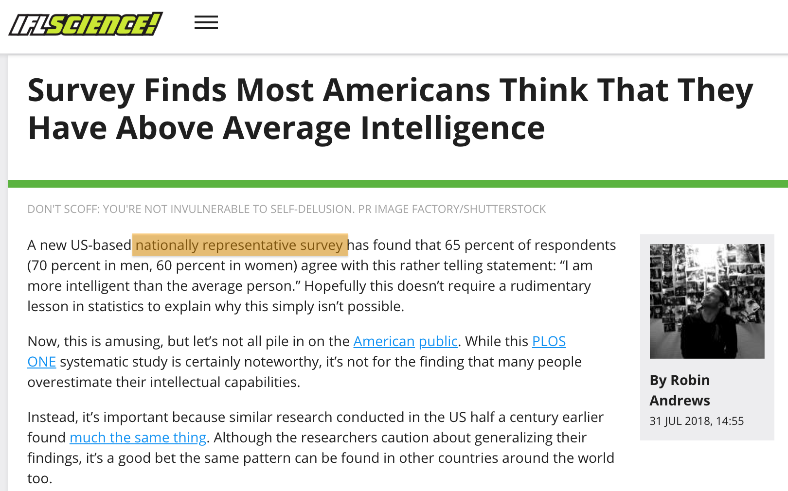

```{css, echo=FALSE} 
@media print { # print out incremental slides; see https://stackoverflow.com/questions/56373198/get-xaringan-incremental-animations-to-print-to-pdf/56374619#56374619
  .has-continuation {
    display: block !important;
  }
}
```

```{r setup, include=FALSE}
# figures formatting setup
options(htmltools.dir.version = FALSE)
library(knitr)
opts_chunk$set(
  prompt = T,
  fig.align="center", #fig.width=6, fig.height=4.5, 
  # out.width="748px", #out.length="520.75px",
  dpi=300, #fig.path='Figs/',
  cache=T, #echo=F, warning=F, message=F
  engine.opts = list(bash = "-l")
  )

## Next hook based on this SO answer: https://stackoverflow.com/a/39025054
knit_hooks$set(
  prompt = function(before, options, envir) {
    options(
      prompt = if (options$engine %in% c('sh','bash')) '$ ' else 'R> ',
      continue = if (options$engine %in% c('sh','bash')) '$ ' else '+ '
      )
})

library(tidyverse)
library(hrbrthemes)
library(fontawesome)
```


# Überblick

<br><br>

1. [Das Problem mit der Repräsentativität](#sampling)

2. [Das Big-Data-Paradoxon](#bigdataparadox)

3. [Garbage in, garbage out](#garbageingarbageout)

4. [Übung](#exercise)


---
class: inverse, center, middle
name: correlation

# Das Problem mit der Repräsentativität
<html><div style='float:left'></div><hr color='#EB811B' size=1px style="width:1000px; margin:auto;"/></html>


---
# Getäuscht durch „Repräsentativität“

.pull-left[
<div align="center">

</div>

`Quelle` [Robin Andrews, IFLScience](https://www.iflscience.com/editors-blog/survey-finds-most-americans-think-that-they-have-above-average-intelligence/)

]

.pull-right[
<div align="center">

</div>

`Quelle` [Maxime Schlee, Politico](https://www.politico.eu/article/80-percent-of-eu-citizens-want-to-scrap-daylight-savings-report-summertime-directive/)

]


