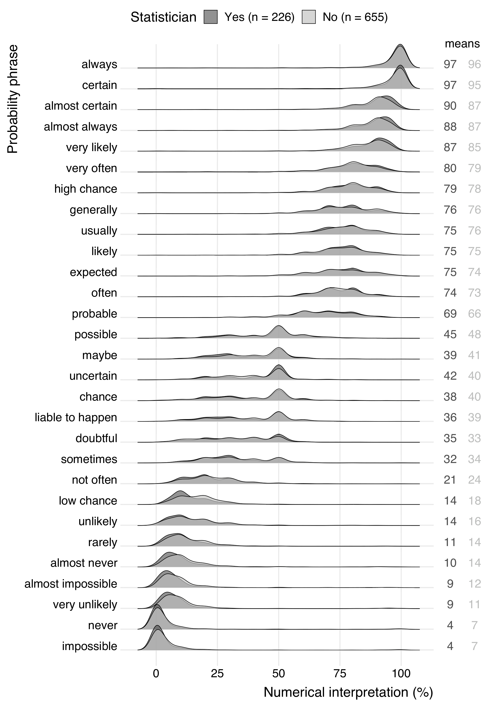

```{css, echo=FALSE} 
@media print { # print out incremental slides; see https://stackoverflow.com/questions/56373198/get-xaringan-incremental-animations-to-print-to-pdf/56374619#56374619
  .has-continuation {
    display: block !important;
  }
}
```

```{r setup, include=FALSE}
# figures formatting setup
options(htmltools.dir.version = FALSE)
library(knitr)
opts_chunk$set(
  prompt = T,
  fig.align="center", #fig.width=6, fig.height=4.5, 
  # out.width="748px", #out.length="520.75px",
  dpi=300, #fig.path='Figs/',
  cache=T, #echo=F, warning=F, message=F
  engine.opts = list(bash = "-l")
  )

## Next hook based on this SO answer: https://stackoverflow.com/a/39025054
knit_hooks$set(
  prompt = function(before, options, envir) {
    options(
      prompt = if (options$engine %in% c('sh','bash')) '$ ' else 'R> ',
      continue = if (options$engine %in% c('sh','bash')) '$ ' else '+ '
      )
})

library(tidyverse)
library(hrbrthemes)
library(fontawesome)
```


# Inhaltsverzeichnis

<br><br>

1. [Deskriptive Statistik verstehen](#descriptives)

2. [Wahrscheinlichkeit verstehen](#probability)

3. [Statistische Effekte verstehen](#effects)

4. [Statistische Signifikanz verstehen](#significance)

---
class: inverse, center, middle
name: descriptives

# Deskriptive Statistik verstehen
<html><div style='float:left'></div><hr color='#EB811B' size=1px style="width:1000px; margin:auto;"/></html>


---
# Deskriptive vs. Inferenzstatistik

.pull-left[
## Deskriptive Statistik
- Zusammenfassen und Beschreiben von Merkmalen einer Stichprobe oder Population
- Kann numerisch und visuell kommuniziert werden
- Unterschiedliche Skalen (Messniveaus) erfordern unterschiedliche deskriptive Statistiken
- Eine gute Beschreibung kann schwierig sein, wenn die Datenerfassung oder Messung komplex ist.
]

.pull-right[
## Inferenzstatistik
- Schlussfolgerungen über eine Grundgesamtheit auf der Grundlage einer Stichprobe
- Es können Rückschlüsse auf Mittelwerte, Proportionen, Beziehungen usw. gezogen werden
- Kann numerisch und visuell kommuniziert werden
- Gute Beschreibung ist die Grundlage für gute Schlussfolgerungen
]

---
# Deskriptive vs. Inferenzstatistik

<div align="center">

</div>


---
# Maße für zentrale Tendenz


.pull-left[
## Drei populäre Maße für zentrale Tendenz

- **(Arithmetischer) Mittelwert**: Der **Durchschnitt** aller Werte in einem Datensatz
- **Median**: Der **mittlere** Wert eines Datensatzes
- **Modus**: Der **häufigste** Wert in einem Datensatz

Warum „zentrale Tendenz“? Beschreibt die Tendenz von quantitativen Daten, sich um einen zentralen Wert zu gruppieren.

## Probieren Sie es aus

Ermitteln Sie den Modus, den Median und den Mittelwert der folgenden Werte:

8, 2, 4, 2, 18, 6, 2
]

--

.pull-right[
## Welches Maß ist zu verwenden?

- **Mittelwert**: Empfindlich gegenüber Ausreißern, aber intuitiv
- **Median**: Robust gegenüber Ausreißern, etwas weniger intuitiv
- **Modus**: Nützlich für kategoriale Daten, kann aber bei kontinuierlichen Daten irreführend sein

## Verzerrte Verteilungen

<div align="center">

</div>
]

---
# Maße für zentrale Tendenz: Beispiele

.pull-left-center[
<div align="center">

</div>

`Quelle` [David Spiegelhalter, The Art of Statistics](https://www.penguin.co.uk/books/294857/the-art-of-statistics-by-spiegelhalter-david/9780241258767)
]

.pull-right-center[
<div align="center">

</div>

`Quelle` [Lisa Muth, Datawrapper](https://blog.datawrapper.de/weekly-chart-income/)
]


---
# Streuungsmaß

.pull-left[
## Warum brauchen wir Streuungsmaße?
- Die zentrale Tendenz allein ist nicht aussagekräftig für die Verteilung
- „Wie weit streuen unsere Daten?“

## Drei gängige Streuungsmaße

- **Spannweite**: Die Differenz zwischen dem höchsten und dem niedrigsten Wert in einem Datensatz
- **Varianz**: Der Durchschnitt der quadrierten Differenzen vom Mittelwert
- **Standardabweichung**: Die Quadratwurzel aus der Varianz

Formel zur Berechnung der Varianz: $\frac{\sum_{i=1}^{n} (x_i - \bar{x})^2}{n-1}$

Siehe [hier](https://seeing-theory.brown.edu/basic-probability/index.html#section3) für interaktive Intuition.
]

.pull-right[
## Warum ist das wichtig?

- Die meisten Menschen sind in der Tat nicht „durchschnittlich“. Variation kann eine Quelle für Einblicke in die zugrunde liegenden Prozesse sein
- Schlüsselmaß für nachgelagerte Statistiken, z.B. der Standardfehler als Schätzung der Unsicherheit einer Schätzung

<div align="center">

</div>
]


---
# Puzzle 1

.pull-left[
## Wie können alle der folgenden Punkte wahr sein?<sup>1</sup>

1. 80% der 100 prominentesten deutschen TikToker sind männlich.
2. Weibliche TikToker haben im Durchschnitt 500 Follower, männliche nur 300. 
3. Es gibt ungefähr gleich viele männliche und weibliche deutsche TikToker.
]

.pull-right[
<div align="center">

</div>
]

.footnote[<sup>1</sup>„Wahr“ im Sinne von ‚theoretisch wahr‘. Die Zahlen sind alle erfunden.]


---
# Puzzle 2

.pull-left-small[
## Wie können alle der folgenden Punkte wahr sein?<sup>1</sup>

1. An einer Universität ist die Zulassungsquote in jedem der vier Fachbereiche für Frauen höher als für Männer.
2. Über alle Fachbereiche hinweg ist die Zulassungsquote bei den Männern höher.
]

.pull-right-wide[
<br>
<div align="center">

</div>
]


---
# Simpsons Paradoxon

.pull-left[
## Paradoxon erklärt

- Einige Fachbereiche (C+D) waren umkämpfter als andere, und dort bewarben sich mehr Frauen.
- Die allgemeinen Zulassungsquoten und die Zulassungsquoten innerhalb eines Fachbereichs unterscheiden sich!
- Wenn wir die gruppierende Variable anpassen/kontrollieren, ändert sich die Beziehung zwischen den Variablen.

## Das Phänomen, verallgemeinert

- Ein Trend erscheint in verschiedenen Datengruppen, verschwindet aber oder kehrt sich um, wenn diese Gruppen kombiniert werden.
- Auch bei Korrelationen möglich (positive vs. negative Korrelation innerhalb vs. zwischen Gruppen).
]

.pull-right[
## Relevanz im Policy-Kontext

- Analyse von Mustern auf verschiedenen Ebenen (z.B. Region vs. Bund, Schulen vs. Schulbezirke)
- Wenn gruppeninterne Muster nicht berücksichtigt werden, könnten die politischen Schlussfolgerungen irreführend sein.

<div align="center">

</div>

`Quelle` [Wikipedia, "Simpson's paradox"](https://en.wikipedia.org/wiki/Simpson%27s_paradox)
]


---
class: inverse, center, middle
name: probability

# Wahrscheinlichkeit verstehen
<html><div style='float:left'></div><hr color='#EB811B' size=1px style="width:1000px; margin:auto;"/></html>


---
# Wahrscheinlichkeiten

.pull-left-wide[
## Was sind Wahrscheinlichkeiten?<sup>1</sup>

- Wahrscheinlichkeiten quantifizieren die Möglichkeit eines Ereignisses
- Wahrscheinlichkeiten liegen zwischen 0 und 1 (oder 0 und 100%)
- Wahrscheinlichkeiten können verbal oder numerisch kommuniziert werden

## Relevanz von Wahrscheinlichkeiten für politische Entscheidungen

Wahrscheinlichkeiten sind ...
- ... das Kernstück der Risikobewertung und Entscheidungsfindung
- ... werden zur Quantifizierung von Unsicherheit verwendet
- ... zur Bewertung der Wirksamkeit von Maßnahmen
- ... eine Kernmetrik für AI-basierte Entscheidungssysteme

.footnote[<sup>1</sup>[Hier](https://bookdown.org/kevin_davisross/probsim-book) eine gute Einführung in die Wahrscheinlichkeitsrechnung und Simulation.]
]

--

.pull-right-small[
<div align="center">
<br><br>
<br><br>

</div>
]


---
# Marginale, bedingte und gemeinsame Wahrscheinlichkeiten

.pull-left[
## Randwahrscheinlichkeit
- Die Wahrscheinlichkeit des Eintretens eines Ereignisses: $p(A)$
- Unbedingte Wahrscheinlichkeit ist nicht von einem anderen Ereignis abhängig
- 🎲 Beispiel: $p(\text{Würfeln einer 5}) = 1/6$

## Bedingte Wahrscheinlichkeit
- Die Wahrscheinlichkeit, dass das Ereignis A eintritt, wenn das Ereignis B eintritt: $p(A|B)$
- Wichtig: Die Randwahrscheinlichkeit von B spielt hier keine Rolle!
- 🎲 Beispiel: $p(\text{Würfeln einer 5|Würfeln ungerader Zahl}) = 1/3$
]

.pull-right[
## Gemeinsame Wahrscheinlichkeit
- Die Wahrscheinlichkeit, dass Ereignis A und Ereignis B eintreten: $p(\text{A und B}) = p(A ∩ B)$
- 🎲 Beispiel: $p(\text{Würfeln einer 5 und einer geraden Zahl}) = 0$

<div align="center">

</div>
]


---
# Bedingte Wahrscheinlichkeiten


<div align="center">

</div>

`Quelle` [Victor Powell, setosa.io](https://setosa.io/conditional/) (Siehe zur interaktiven Simulation)


---
# Puzzle 3

.pull-left[
## Wie können alle der folgenden Punkte wahr sein?

1. Ein Impfstoff ist hochwirksam beim Schutz gegen eine Krankheit.
2. Die meisten Menschen, die die Krankheit bekommen, sind geimpft worden.
]

.pull-right[
<br>
<div align="center">

</div>
`Quelle` [Hakan Nural, Unsplash](https://www.fiercehealthcare.com/payers/health-plans-prepare-cover-covid-19-vaccine-tests)
]

---
# Puzzle 3

.pull-left[
## Wie können alle der folgenden Punkte wahr sein?

1. Ein Impfstoff ist hochwirksam beim Schutz gegen eine Krankheit.
2. Die meisten Menschen, die die Krankheit bekommen, sind geimpft worden.

## Base Rate Fallacy ("Prävalenzfehler")

- Dies ist ein klassischer Fall des „Base Rate Fallacy“ oder „Prosecutor's Fallacy“.
- Wenn die Impfrate $P(geimpft)$ in der Bevölkerung hoch ist, besteht für geimpfte Personen eine viel größere Chance, ins Krankenhaus zu kommen, als für ungeimpfte Personen.
]

.pull-right[
<br>
<div align="center">

</div>
`Quelle` [Hakan Nural, Unsplash](https://www.fiercehealthcare.com/payers/health-plans-prepare-cover-covid-19-vaccine-tests)
]

---
# "Base rate fallacy", illustriert

<div align="center">

</div>
`Quelle` [Marc Rumilly](https://twitter.com/MarcRummy/status/1464178903224889345) 


---
# Relevanz für AI-basierte Entscheidungssysteme


.pull-left[
## Politik für seltene Ereignisse

- Diverse Politikmaßnahmen sind darauf ausgerichtet, seltene und gleichzeitig extrem kostspielige Ereignisse zu verhindern.
- Beispiele: Terroranschläge, Krieg, Naturkatastrophen
- Die Vorhersage solcher Ereignisse ist von Natur aus schwierig.
- KI-gestützte Erkennungssysteme versprechen hohe Erkennungsraten. Aber selbst bei einer sehr hohen Genauigkeit kann die Anzahl der falsch-positiven Meldungen inakzeptabel hoch sein.

## Leitfaden

- Berücksichtigen Sie bei der Evaluation von solchen Tools immer die **Basiswahrscheinlichkeit**.
- Wählen Sie geeignete Performanzmetriken (FPR, FNR, etc. - mehr dazu später).
]

--

.pull-right[
## Beispiel: [Terrorismuserkennung](https://en.wikipedia.org/wiki/Base_rate_fallacy)
- In einer Stadt mit 1 Mio. Einwohnern gibt es 100 Terroristen und 999.900 Nicht-Terroristen: $p(\text{Terrorist}) = 0,0001$
- Überwachung mit Gesichtserkennungssoftware mit zwei Fehlerquoten von 1%:
  1. Falsch-negativ-Rate (FNR): $p(\text{kein Alarm}|\text{Terrorist}) = 0,01$
  2. Falsch-positiv-Rate (FPR): $p(\text{Alarm}|\text{kein Terrorist}) = 0.01$

**Was bedeutet das, wenn wir einen Alarm erhalten?**<sup>1</sup>
  $p(\text{Terrorist}|\text{Alarm})=\frac{p(\text{Alarm}|\text{Terrorist})p(\text{Terrorist})}{p(\text{Alarm})}$ $=\frac{0.99 * 0.0001}{0.01} = 0.01$

.footnote[<div class="font50"><br><sup>1</sup>$p(\text{Alarm}) = p(\text{Alarm}|\text{Terrorist})*p(\text{Terrorist})$ $+ p(\text{Alarm}|\text{Nicht-Terrorist})*p(\text{Nicht-Terrorist})$ $=$
  $p(\text{Terrorist}|\text{Alarm})$ $= 0.99*0.0001 + 0.01*0.9999 = 0.01$</div>]
]


---
#  Kommunikation von Wahrscheinlichkeiten mit verbalen Ausdrücken

.pull-left-wide2[
<div align="center">
<br>

</div>
`Quelle` [Willems et al. 2020](https://doi.org/10.22323/2.19020203)
]

.pull-right-small2[
<div align="center">

</div>
]

---
# Was bedeutet die Wahrscheinlichkeit für verschiedene Berufe?

.pull-left[
<div align="center">
<br>


</div>
]

.pull-right[
<div align="center">


</div>
]

`Quelle` [Ben Orlin](https://mathwithbaddrawings.com/2015/09/23/what-does-probability-mean-in-your-profession/)


---
class: inverse, center, middle
name: significance

# Statistische Signifikanz verstehen
<html><div style='float:left'></div><hr color='#EB811B' size=1px style="width:1000px; margin:auto;"/></html>

---
# "Statistische Signifikanz" überall

.pull-left-vwide[
<div align="center">

</div>
]

.pull-right-vsmall[
<div align="center">

</div>

<br><br><br><br><br><br><br>

`Quelle` [Wansink et al.](https://pubmed.ncbi.nlm.nih.gov/22846502/), [Retraction Watch](https://retractionwatch.com/2018/09/20/beleaguered-food-marketing-researcher-brian-wansink-announces-his-retirement-from-cornell/)
]


---
# "Statistische Signifikanz" überall

<div align="center">


</div>


---
# Statistische Fehlertypen

.pull-left-wide[
## Beispiel

Sie sind Rettungssanitäter und nähern sich dem Ort eines Autounfalls. Ein Opfer liegt regungslos auf der Straße und Sie müssen einschätzen, ob das Opfer tot oder lebendig ist, und das Opfer entsprechend behandeln. Ausgehend von diesen Informationen, **welcher Fehler ist schwerwiegender?**

## Hypothesen

- **Nullhypothese**: Das Opfer ist am Leben.
- **Alternative Hypothese**: Das Opfer ist nicht am Leben.

<br><br><br><br>
`Quelle` [jeffalltogether, StackExchange.com](https://stats.stackexchange.com/questions/211736/type-i-error-and-type-ii-error-trade-off)
]

.pull-right-small[
<br>
<div align="center">

</div>
]


---
# Statistische Fehlertypen

## Hypothesen

- **Nullhypothese**: Das Opfer ist am Leben.
- **Alternative Hypothese**: Das Opfer ist nicht am Leben.

--

## Fehlertypen

- **Typ-I-Fehler**: Sie verwerfen die Null(hypothese), obwohl sie tatsächlich wahr ist („falsch positiv“).
- **Typ II-Fehler**: Sie verwerfen die Null nicht, obwohl sie tatsächlich falsch ist. („falsch negativ“)

--

## Kosten

- **Typ I-Fehler**: Sie erklären das Opfer für tot, obwohl es in Wirklichkeit noch lebt. Das Opfer wird nicht zur möglicherweise lebensrettenden medizinischen Behandlung ins Krankenhaus gebracht $\rightarrow$ **Extrem kostspieliger Fehler**
- **Typ II-Fehler**: Sie erklären das Opfer für lebendig, obwohl es in Wirklichkeit tot ist. Sie schicken eine tote Person fälschlicherweise mit einem Krankenwagen ins Krankenhaus $\rightarrow$ **Nicht so kostspieliger Fehler**

---
# Fehlertypen illustriert

<div align="center">

</div>

---
# Fehlertypen im Hypothesentesten

<div align="center">

</div>

---
# Fehlertypen im Hypothesentesten

<div align="center">

</div>


---
# Bewertung der statistischen Signifikanz

.pull-left[
## Statistische Signifikanz vs. praktische Signifikanz
- Sie sind nicht dasselbe.
- Bei der **statistischen Signifikanz** geht es um die Wahrscheinlichkeit der Beobachtung der Daten unter Berücksichtigung der Nullhypothese. 
- Bei der **praktischen Signifikanz** geht es um die Bedeutung des Ergebnisses in der realen Welt.

## Vom Hypothesentest zur statistischen Signifikanz

**Der dreistufige Ansatz:**
1. Formulierung von Null- und Alternativhypothesen.
2. Berechnen Sie eine Teststatistik, zum Beispiel die Effektgröße in einer Regression geteilt durch den Standardfehler.
3. Vergleichen Sie die Teststatistik mit einem kritischen Wert; berechnen Sie einen p-Wert.
]

--

.pull-right[
## Der p-Wert

- Der p-Wert ist die Wahrscheinlichkeit, dass ein Ergebnis beobachtet wird, das mindestens so extrem ist wie das beobachtete Ergebnis, wenn die Nullhypothese wahr wäre.
- Der p-Wert wird mit einem Schwellenwert (z.B. 0.05) verglichen, um zu entscheiden, ob die Nullhypothese verworfen werden soll.
- Wichtig: Der p-Wert gibt nicht die Wahrscheinlichkeit an, dass die Nullhypothese wahr oder falsch ist!

<div align="center">

</div>
]


---
# Statistische Signifikanz im Auge behalten

.pull-left[
<div align="center">

</div>
]

.pull-right[
<div align="center">

</div>
]

---
# Statistische Signifikanz im Auge behalten

<div align="center">

</div>


---
# Kontroversen um statistische Signifikanz<sup>1</sup>

.footnote[<sup>1</sup>See also [here](https://bookdown.org/kevin_davisross/probsim-book) for a nice primer to this controversy.]

.pull-left[
<div align="center">

</div>

## Sechs Prinzipien

<div class=font80>
<ol>
<li>p-Werte können angeben, wie unvereinbar die Daten mit einem bestimmten statistischen Modell sind.</li>
<li>p-Werte messen nicht die Wahrscheinlichkeit, dass die untersuchte Hypothese wahr ist, oder die Wahrscheinlichkeit, dass die Daten allein durch Zufall entstanden sind.</li>
<li><b>Wissenschaftliche Schlussfolgerungen und geschäftliche oder politische Entscheidungen sollten nicht nur darauf beruhen, ob ein p-Wert einen bestimmten Schwellenwert überschreitet.</b></li>
<li>Eine korrekte Schlussfolgerung erfordert eine vollständige Berichterstattung und Transparenz.</li>
<li>Ein p-Wert sagt nichts über die Größe eines Effekts oder die Bedeutung eines Ergebnisses aus.</li>
<li>Ein p-Wert an sich ist kein guter Maßstab für die Evidenz eines Modells oder einer Hypothese.</li>
</ol>
</div>
]

.pull-right[
<div align="center">

</div>
]


---
# Statistiken verwenden: lessons learned

.pull-left[
## Lies, damned lies and statistics

- Politische Debatten drehen sich fast zwangsläufig auch um Statistiken
- Strategischer Anreiz, Beweise zu seinen Gunsten zu beeinflussen
- Statistische Fallstricke: Nicht alles, was logisch klingt, ist statistisch fundiert 
- Ein grundlegendes Verständnis der grundlegenden Konzepte der Statistik ist der Schlüssel zu kritischem Konsum von Daten und Statistiken
- Einige populäre Irrtümer und Fehler treten immer wieder auf - man kann trainieren, sie zu erkennen!
]

.pull-right[
<div align="center">
<br>


</div>
]


---
# Übung: OptiClassify

.pull-left-wide[

## "OptiClassify: Effiziente Aktenkategorisierung – Präzision, die Sie brauchen!"

Mit OptiClassify bieten wir eine KI-basierte Lösung, die **Verwaltungsakten automatisch in 5 spezifische Kategorien** einteilt. Unsere Technologie erreicht eine **statistisch signifikante Trefferquote (Accuracy) von 95%**, unterstützt durch modernste Machine-Learning-Algorithmen.

Die **Falsch-Negative-Rate liegt bei 5%**, was bedeutet, dass nur wenige Dokumente in die falsche Kategorie eingeordnet werden. Dank der **hohen Signifikanz von p < 0.01** können Sie sich auf die Zuverlässigkeit unserer Lösung verlassen, insbesondere bei großen Datenmengen.

In **Tests mit über 100.000 realen Verwaltungsakten** haben wir bewiesen, dass OptiClassify selbst in komplexen Szenarien konsistent arbeitet und den manuell erzeugten **Kategorisierungsaufwand um 75% reduziert**.

Entdecken Sie die Zukunft der Verwaltung mit OptiClassify – sparen Sie Zeit, Kosten und Ressourcen, indem Sie unsere praxiserprobte Lösung einsetzen!
]

.pull-right-small[
<div align="center">
<br>

</div>
]

---
# Übung: OptiClassify

## Mögliche Fragen

1. Auf Basis welcher Daten wurde das Tool trainiert?

    ✎ Die Qualität und Passung der Trainingsdaten ist entscheidend für die Leistung des Tools im konkreten Kontext.

2. Wie wird die Accuracy von 95% berechnet, und wie verteilt sich diese auf die einzelnen Kategorien?

    ✎ Die Accuracy könnte in einigen Kategorien viel niedriger sein.

3. Wie wirkt sich die False-Negative-Rate von 5% auf kritische Akten aus?

    ✎ Es ist wichtig zu wissen, ob Dokumente, die zwingend in eine bestimmte Kategorie gehören, zuverlässig erkannt werden.

    ✎ Bei einer großen Anzahl von Dokumenten könnten niedrige Fehlerraten zu vielen manuellen Nacharbeiten führen.
    
4. Wie wurde die statistische Signifikanz (p < 0.01) berechnet?

    ✎ Welche Hypothese liegt hier zugrunde?         
]


