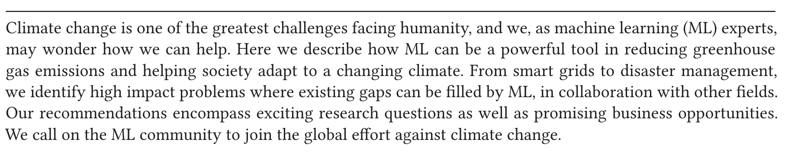
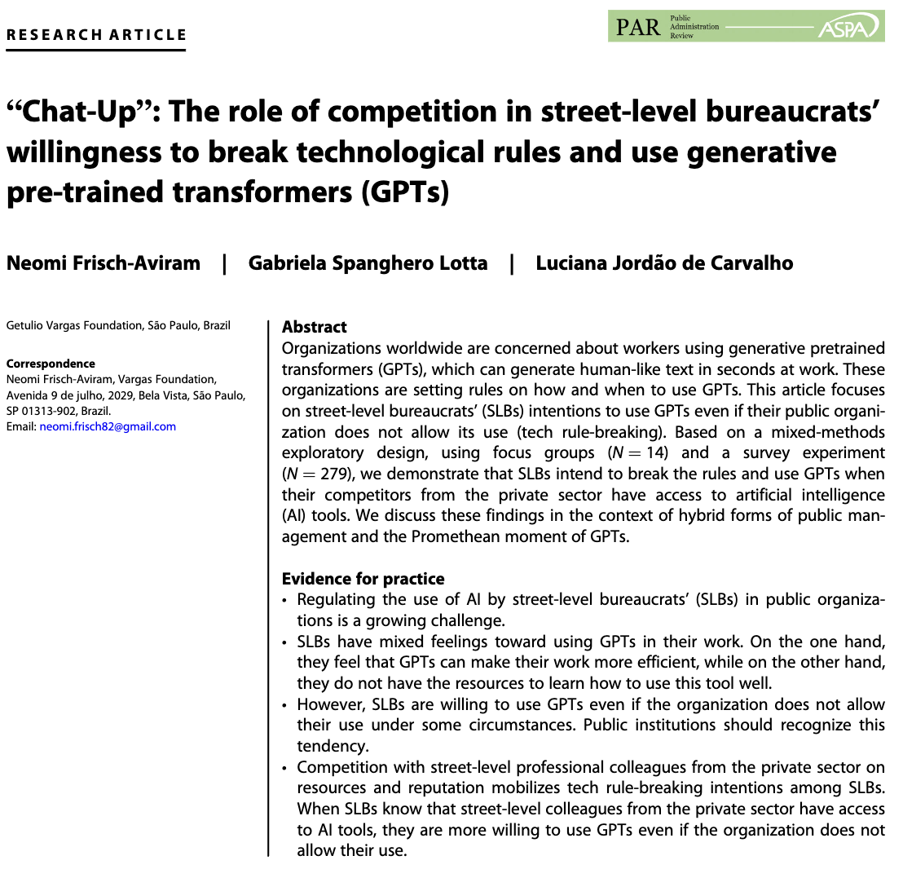
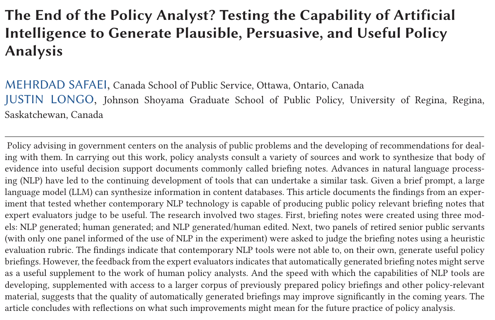

```{css, echo=FALSE} 
@media print { # print out incremental slides; see https://stackoverflow.com/questions/56373198/get-xaringan-incremental-animations-to-print-to-pdf/56374619#56374619
  .has-continuation {
    display: block !important;
  }
}
```

```{r setup, include=FALSE}
# figures formatting setup
options(htmltools.dir.version = FALSE)
library(knitr)
opts_chunk$set(
  prompt = T,
  fig.align="center", #fig.width=6, fig.height=4.5, 
  # out.width="748px", #out.length="520.75px",
  dpi=300, #fig.path='Figs/',
  cache=T, #echo=F, warning=F, message=F
  engine.opts = list(bash = "-l")
  )

## Next hook based on this SO answer: https://stackoverflow.com/a/39025054
knit_hooks$set(
  prompt = function(before, options, envir) {
    options(
      prompt = if (options$engine %in% c('sh','bash')) '$ ' else 'R> ',
      continue = if (options$engine %in% c('sh','bash')) '$ ' else '+ '
      )
})

library(tidyverse)
library(hrbrthemes)
library(fontawesome)
```


# Inhaltsverzeichnis

<br><br>
1. [Was ist Big Data?](#whatisbigdata)

2. [Das Big-Data-Paradoxon](#bigdataparadox)

3. [Garbage in, garbage out](#garbageingarbageout)

4. [Chancen von Big Data für das Gemeinwohl](#opportunities)


---
class: inverse, center, middle
name: opportunities

# Chancen von Big Data für das Gemeinwohl
<html><div style='float:left'></div><hr color='#EB811B' size=1px style="width:1000px; margin:auto;"/></html>


---
# Das Zeitalter von Big Data - das Zeitalter der Dystopie?

.pull-left[
<div align="center"><br><br>


</div>
]

.pull-right[
<div align="center">


</div>
]


---
# KI für eine individualisierte Gesundheitsversorgung

<div align="center"><br><br>


</div>

`More information` [Google Deepmind](https://deepmind.google/discover/blog/we-are-very-excited-to-announce-the-launch-of-deepmind-health/), [Data breach](https://www.bbc.com/news/technology-58761324)

---
# KI für eine individualisierte Gesundheitsversorgung

<div align="center">

</div>


---
# Klimawandel KI

.pull-left-small-center[
<div align="center"><br><br><br><br><br>

</div>

`Source` [Climate Change AI](https://www.climatechange.ai/)
]

.pull-right-wide-center[
<div align="center"><br><br><br><br>


</div>
]


---
# Klimawandel KI
<div align="center">


</div>

`Source` [Geraedts et al., 2024](https://iopscience.iop.org/article/10.1088/2515-7620/ad11ab/pdf)


---
# LLMs für effizientere Verwaltung?

<div align="center">







</div>


