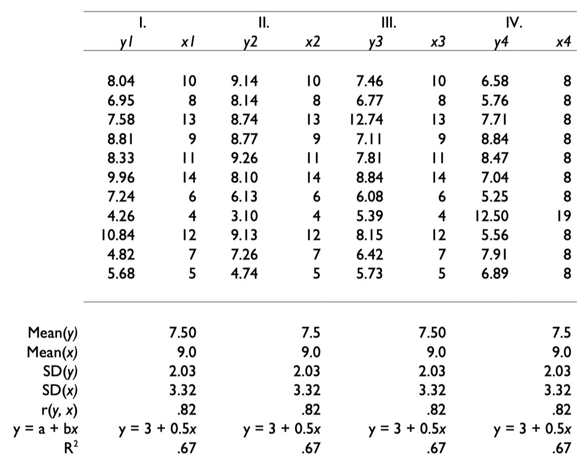
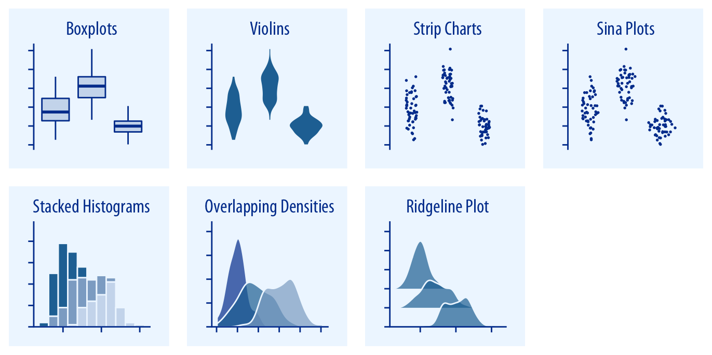
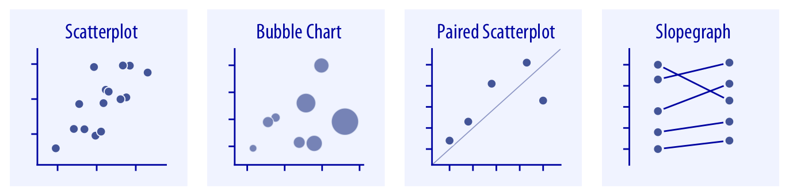
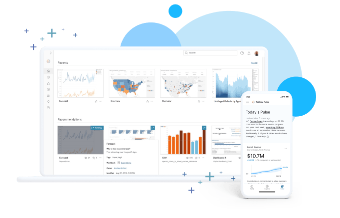
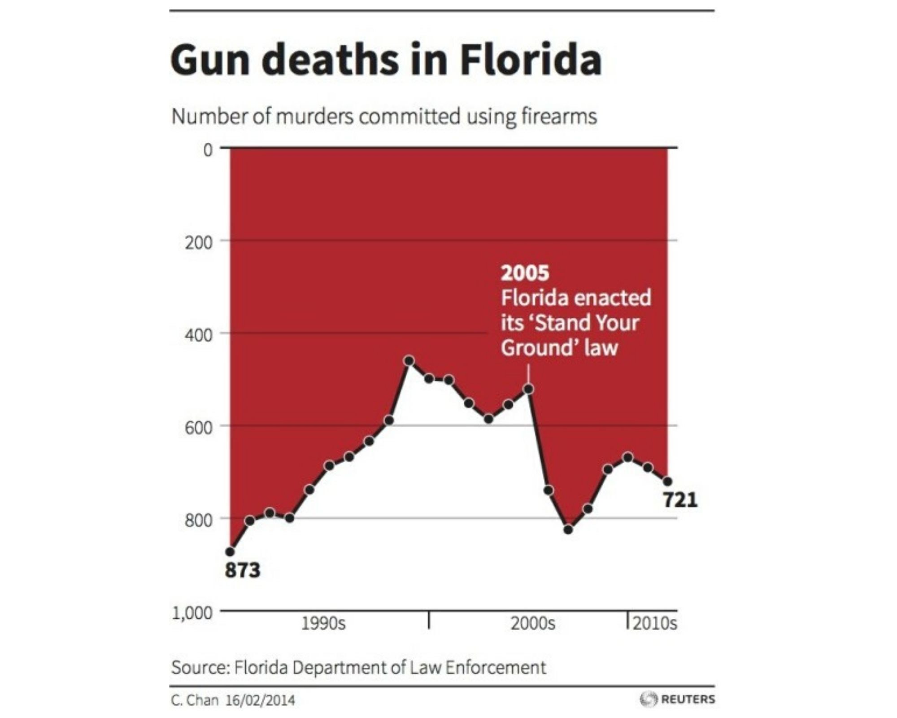

```{css, echo=FALSE} 
@media print { # print out incremental slides; see https://stackoverflow.com/questions/56373198/get-xaringan-incremental-animations-to-print-to-pdf/56374619#56374619
  .has-continuation {
    display: block !important;
  }
}
```

```{r setup, include=FALSE}
# figures formatting setup
options(htmltools.dir.version = FALSE)
library(knitr)
opts_chunk$set(
  prompt = T,
  fig.align="center", #fig.width=6, fig.height=4.5, 
  # out.width="748px", #out.length="520.75px",
  dpi=300, #fig.path='Figs/',
  cache=T, #echo=F, warning=F, message=F
  engine.opts = list(bash = "-l")
  )

## Next hook based on this SO answer: https://stackoverflow.com/a/39025054
knit_hooks$set(
  prompt = function(before, options, envir) {
    options(
      prompt = if (options$engine %in% c('sh','bash')) '$ ' else 'R> ',
      continue = if (options$engine %in% c('sh','bash')) '$ ' else '+ '
      )
})

library(tidyverse)
library(hrbrthemes)
library(fontawesome)
```


# Überblick

<br>


1. [Warum Datenvisualisierung?](#whyviz)

2. [Arten der Datenvisualisierung](#plottypes)

3. [Klick- und codebasierte Visualisierungstools](#clickvscode)

4. [Übung: Best (and worst) practices](#goodpractices)

---
background-image: url("../pics/berlin-strassenabschnitte-geojson.png")
background-size: contain
background-color: #000000

# Was sehen Sie hier?

<!-- Source: https://daten.odis-berlin.de/de/dataset/detailnetz_strassenabschnitte/ -->


---
background-image: url("../pics/berlin-strassenabschnitte-map.png")
background-size: contain
background-color: #000000

# So besser?


<!-- ############################################ -->
---
class: inverse, center, middle
name: whyviz

# Warum Datenvisualisierung?

<html><div style='float:left'></div><hr color='#EB811B' size=1px style="width:1000px; margin:auto;"/></html>


---
# Warum Datenvisualisierung?

.pull-left[

### Eine mächtige Methode in der Data-Science-Toolbox

- Datenvisualisierung ist eine Methode zur Exploration (und nicht nur Darstellung) von Daten.
- Dabei geht es um mehr als Datenvisualisierung im engeren Sinne, d.h. um die **Kodierung quantitativer Informationen** in visuellen Objekten.
- Entscheidungsträger sind meist an **Mustern** und **Regelmäßigkeiten** interessiert, nicht an einzelnen und genauen Werten.
- Zwei Möglichkeiten, quantitative Informationen sinnvoll zu nutzen:

<div align="center">

</div>
]

--

.pull-right[

### Das Argument für Visualisierung

- Visualisierung **liefert nützliche Zusammen-fassungen** für komplexe Datensätze - der Nutzen von Visualisierung steigt mit der Datenmenge.
- Visualisierung **lässt Sie Dinge sehen**, die sonst unsichtbar wären, insbesondere Beziehungen zwischen Daten (Muster, Trends, Ausreißer).
- Visualisierung setzt **wenig oder keine Annahmen** über die Natur der Daten voraus.
- Visualisierung erleichtert die Interaktion zwischen Entscheidungsträger und Daten - **sie ist ein Mittel zur Hypothesenbildung und Entscheidungsfindung**.

<i>"Die entscheidende Frage ist, wie man die Daten am besten in etwas umwandelt, das Menschen verstehen können, um optimale Entscheidungen zu treffen." </i>
[Colin Ware, 2013](https://books.google.de/books?id=qFmS95vf6H8C&pg=PA5)
]


---
# Broad Street Cholera-Ausbruch 1854 

.pull-left[
<div align="center">
<br>

</div>
]

--

.pull-right[
- Eine der berühmtesten Datenvisualisierungen: Die Cholera-Karte von [John Snow](https://en.wikipedia.org/wiki/John_Snow).
- Der [Choleraausbruch in der Broad Street](https://en.wikipedia.org/wiki/1854_Broad_Street_cholera_outbreak) in Soho, London, im Jahr 1854 wurde von dem Arzt John Snow untersucht, um dessen Ursachen zu erforschen (Hypothesen: keimverseuchtes Wasser vs. Übertragung durch die Luft).
- Die Keimtheorie war damals noch nicht etabliert, aber die Karte zeigte, dass sich die Fälle in der Nähe einer verunreinigten Pumpe häuften (allerdings nicht die einzige Quelle für verseuchtes Wasser).

<div align="center">

</div>
]


---
# Abbildungen vs. Tabellen

.pull-left[
- Die Tabelle auf der rechten Seite enthält die Datensätze I bis IV, die jeweils aus elf $(x,y)$-Punkten bestehen.
- .hlred[Studieren Sie die Tabelle sorgfältig]. Wie verhalten sich $x$ und $y$ sowie ihr Verhältnis zueinander in den verschiedenen Datensätzen?
]

.pull-right[
<br>
<div align="center">

</div>
]

---
# Abbildungen vs. Tabellen

.pull-left[
- Die Tabelle auf der rechten Seite enthält die Datensätze I bis IV, die jeweils aus elf $(x,y)$-Punkten bestehen.
- .hlred[Studieren Sie die Tabelle sorgfältig]. Wie verhalten sich $x$ und $y$ sowie ihr Verhältnis zueinander in den verschiedenen Datensätzen?
- Es zeigt sich, dass alle Datensätze nahezu identische einfache deskriptive Statistiken in Bezug auf Mittelwert, Standardabweichung, Korrelation und lineare Anpassung aufweisen!
]

.pull-right[
<br>
<div align="center">

</div>
]

---
# Abbildungen vs. Tabellen

.pull-left[
- Die Tabelle auf der rechten Seite enthält die Datensätze I bis IV, die jeweils aus elf $(x,y)$-Punkten bestehen.
- .hlred[Studieren Sie die Tabelle sorgfältig]. Wie verhalten sich $x$ und $y$ sowie ihr Verhältnis zueinander in den verschiedenen Datensätzen?
- Es zeigt sich, dass alle Datensätze nahezu identische einfache deskriptive Statistiken in Bezug auf Mittelwert, Standardabweichung, Korrelation und lineare Anpassung aufweisen!
- .hlred[Die grafische Darstellung der Daten zeigt sehr unterschiedliche Verteilungen] und widerspricht der Heuristik, dass "numerische Berechnungen genau sind, aber Grafiken grob sind". ([Anscombe 1973](https://www.tandfonline.com/doi/abs/10.1080/00031305.1973.10478966)).
]

.pull-right[
<br>
<div align="center">

</div>
]


---
# Das Kunsthandwerk der Visualisierung

.pull-left[
### Ein Werkzeug für den Vergleich

- "Der grundlegende analytische Akt in der statistischen Argumentation besteht in der Beantwortung der Frage 'Im Vergleich zu was'".
- Ob wir nun räumliche oder zeitliche Veränderungen bewerten, große Datenbanken durchsuchen, Variablen anpassen und kontrollieren, Experimente entwerfen, Mehrfachregressionen festlegen oder so ziemlich jede Art von evidenzbasierter Argumentation durchführen, der wesentliche Punkt ist, intelligente und angemessene Vergleiche anzustellen.
- Daher sollten visuelle Darstellungen, wenn sie das Denken unterstützen sollen, Vergleiche zeigen."

<div align="right">
Edward Tufte, <a href="http://atc.berkeley.edu/201/readings/Tufte_BE_2006.pdf">Beautiful Evidence</a>, p.127.
</div>
]

--

.pull-right[
### Visualisierung als iterativer Prozess

- Die Wahl des richtigen grafischen Formats hängt letztlich von der Aufgabe oder dem Problem ab, das gelöst werden soll.
- Lassen Sie sich immer verschiedene Darstellungen derselben Daten zeigen - sie können unterschiedliche Aspekte offenbaren.
- Die Erstellung von Visualisierungen ist fast immer ein **iterativer Prozess** - die erste Grafik ist selten auch die endgültige.

<div align="center">

</div>
]


---
# Visualisierung als iterativer Prozess

<div align="center">

</div>
`Quelle und Code` [Cedric Scherer](https://www.cedricscherer.com/2019/05/17/the-evolution-of-a-ggplot-ep.-1/)


---
# Visualisierung im Data-Science-Workflow

.pull-left[
Datenvisualisierung ist eine Schlüsselkompetenz für die Vermittlung von Erkenntnissen aus Daten. Sie ist in jedem Schritt des Workflows von Bedeutung.
]

.pull-right[

<div align="center">
<br>

</div>
]

---
# Visualisierung im Data-Science-Workflow

.pull-left[
Datenvisualisierung ist eine Schlüsselkompetenz für die Vermittlung von Erkenntnissen aus Daten. Sie ist in jedem Schritt des Workflows von Bedeutung.

**Datenaufbereitung**
- Sanity checks
- Identifizierung von Ausreißern
- Unterstützung von Data cleaning
]

.pull-right[

<div align="center">
<br>

</div>
]

---
# Visualisierung im Data-Science-Workflow

.pull-left[
Datenvisualisierung ist eine Schlüsselkompetenz für die Vermittlung von Erkenntnissen aus Daten. Sie ist in jedem Schritt des Workflows von Bedeutung.

**Datenaufbereitung**
- Sanity checks
- Identifizierung von Ausreißern
- Unterstützung von Data cleaning
]

.pull-right[

<div align="center">
<br>

</div>

<div align="center">
<br>

</div>
<div align="center" style="font-size:16px;">
Scatter plots to identify outliers in bivariate relationships.
</div>
]


---
# Visualisierung im Data-Science-Workflow

.pull-left[
Datenvisualisierung ist eine Schlüsselkompetenz für die Vermittlung von Erkenntnissen aus Daten. Sie ist in jedem Schritt des Workflows von Bedeutung.

**Datenaufbereitung**
- Sanity checks
- Identifizierung von Ausreißern
- Unterstützung von Data cleaning

**Datenexploration**
- Darstellung von Verteilungen
- Muster und Beziehungen entdecken
]

.pull-right[

<div align="center">
<br>

</div>

]


---
# Visualisierung im Data-Science-Workflow

.pull-left[
Datenvisualisierung ist eine Schlüsselkompetenz für die Vermittlung von Erkenntnissen aus Daten. Sie ist in jedem Schritt des Workflows von Bedeutung.

**Datenaufbereitung**
- Sanity checks
- Identifizierung von Ausreißern
- Unterstützung von Data cleaning

**Datenexploration**
- Darstellung von Verteilungen
- Muster und Beziehungen entdecken
]

.pull-right[

<div align="center">
<br>

</div>

<div align="center">
<br>

</div>
<div align="center" style="font-size:16px;">
Correlogram to visualize amount of association <br> between pairs of variables
</div>
]


---
# Visualisierung im Data-Science-Workflow

.pull-left[
Datenvisualisierung ist eine Schlüsselkompetenz für die Vermittlung von Erkenntnissen aus Daten. Sie ist in jedem Schritt des Workflows von Bedeutung.

**Modellieren**
- Hypothesen testen
- Zusammenfassen von (mehrfachen) Modellschätzungen
- Visualisierung der Unsicherheit
- Robustheits-/Sensitivitätsanalysen berichten
]

.pull-right[

<div align="center">
<br>

</div>

]

---
# Visualisierung im Data-Science-Workflow

.pull-left[
Datenvisualisierung ist eine Schlüsselkompetenz für die Vermittlung von Erkenntnissen aus Daten. Sie ist in jedem Schritt des Workflows von Bedeutung.

**Modellieren**
- Hypothesen testen
- Zusammenfassen von (mehrfachen) Modellschätzungen
- Visualisierung der Unsicherheit
- Robustheits-/Sensitivitätsanalysen berichten
]

.pull-right[

<div align="center">
<br>

</div>

<div align="center">
<br>

</div>
<div align="center" style="font-size:16px;">
Raw data and trend line with confidence bands<br>to visualize uncertainty of fit</div>
]

---
# Visualisierung im Data-Science-Workflow

.pull-left[
Datenvisualisierung ist eine Schlüsselkompetenz für die Vermittlung von Erkenntnissen aus Daten. Sie ist in jedem Schritt des Workflows von Bedeutung.

**Modellieren**
- Hypothesen testen
- Zusammenfassen von (mehrfachen) Modellschätzungen
- Visualisierung der Unsicherheit
- Robustheits-/Sensitivitätsanalysen berichten

**Kommunizieren**
- Präsentation von Rohdaten/aufbereiteten Daten
- Darstellung der Auswirkungen von Modellergebnissen
]

.pull-right[

<div align="center">
<br>

</div>

]


---
# Visualisierung im Data-Science-Workflow

.pull-left[
Datenvisualisierung ist eine Schlüsselkompetenz für die Vermittlung von Erkenntnissen aus Daten. Sie ist in jedem Schritt des Workflows von Bedeutung.

**Modellieren**
- Hypothesen testen
- Zusammenfassen von (mehrfachen) Modellschätzungen
- Visualisierung der Unsicherheit
- Robustheits-/Sensitivitätsanalysen berichten

**Kommunizieren**
- Präsentation von Rohdaten/aufbereiteten Daten
- Darstellung der Auswirkungen von Modellergebnissen
]

.pull-right[

<div align="center">
<br>

</div>

<div align="center">
<br>

</div>
<div align="center" style="font-size:16px;">
Choroplethenkarte mit der Lage der zivilen Flugplätze im Deutschen Reich, 1932. Die Verwaltungsbezirke sind entsprechend der Entfernung ihres Schwerpunkts zum nächstgelegenen Flugplatz schattiert</div>
]


---
class: exercise, center, middle

# Diskussion

.content-box-white[
**Warum Datenvisualisierung in der / durch die Verwaltung?**

1.    (Wie) kann die Visualisierung von Daten in Ihrem Arbeitskontext nützlich sein?
2.    Glauben Sie, dass Datenvisualisierung die Kommunikation zwischen verschiedenen Abteilungen und mit der Öffentlichkeit verbessern kann?
]


<!-- ############################################ -->
---
class: inverse, center, middle
name: plottypes

# Arten der Datenvisualisierung

<html><div style='float:left'></div><hr color='#EB811B' size=1px style="width:1000px; margin:auto;"/></html>


---
# Verschiedene Visualisierungen für verschiedene Zwecke

Ein häufiger Fehler bei der Visualisierung ist, dass .hlred[Plot-Typen für Zwecke verwendet werden, für die sie nicht gedacht sind]. Bevor Sie mit dem Abbildungen erstellen, fragen Sie sich selbst:

--

.pull-left-vsmall[
#### 1. Was genau möchte ich visualisieren?

- Zahlen und Mengen
- Verteilungen
- Proportionen
- Assoziationen
- Strukturen
- Trends
- Schötzungen
- Vorhersagen
- Unsicherheit
]

--

.pull-right-vwide[
#### 2. Welche Frage möchte ich beantworten?

- "Ist die *Verteilung* normal (oder gleichmäßig oder...)?" → **Histogramm, Dichteplot**
- "Sind *Verteilungen* zwischen Gruppen unterschiedlich?" → **Boxplots, Ridgelines**
- "Wie unterscheiden sich die *Zahlen* zwischen den Gruppen?" → **Balkenplot, Dotplot**
- "Wie ist die *Beziehung* zwischen x und y?" → **Scatterplot, Konturplot**
- Wie *korrelieren* in einer Reihe von Variablen?" → **Korrelogramm, small multiples**
- "Wie hat sich ein *Trend* im Laufe der Zeit entwickelt?" → **Liniendiagramm**
- "Sind die Daten nach Untergruppen *geclustert*?" → **Scatterplot mit Farbe**
- "Gibt es ein *räumliches Muster*?" → **Choropleth, Kartogramm-Heatmap**
- "Wie groß sind die relativen und absoluten *Effekte*? → **Koeffizienten-Plot**
- Wie unsicher sind die *Schätzungen*? → **Fehlerbalken, Vertrauensbereiche**
]


---
# Ein Verzeichnis von Visualisierungen

.pull-left[
### Visualisierung von Mengen

<div align="center">
<br>

</div>

<div align="center">

</div>
]

--

.pull-right[

### Visualisierung von Verteilungen
<div align="center">
<br>

</div>

<div align="center">

</div>
]


---
# Ein Verzeichnis von Visualisierungen

.pull-left[
### Visualisierung von Proportionen

<div align="center">
<br>

</div>

<div align="center">

</div>

<div align="center">

</div>
]


--

.pull-right[

### Visualisierung von x-y-Beziehungen
<div align="center">
<br>

</div>

<div align="center">

</div>

<div align="center">

</div>
]


---
# Ein Verzeichnis von Visualisierungen

.pull-left[
### Visualisierung von Unsicherheit

<div align="center">
<br>

</div>

<div align="center">

</div>

<div align="center">

</div>
]


--

.pull-right[

### Visualisierung räumlicher Daten
<div align="center">
<br>

</div>
]


---
# Small multiples

.pull-left[
- Eine mächtige, unterschätzte Visualisierungsstrategie ist die Verwendung von [Multi-Panel-Abbildungen](https://clauswilke.com/dataviz/multi-panel-figures.html).
- Oft wollen wir Beziehungen oder Trends zwischen Gruppen vergleichen. Bei vielen Gruppen sind das zu viele Informationen für ein einzelnes Panel.
- Es gibt verschiedene Bezeichnungen für mehrteilige Abbildungen, darunter "small multiples" (Tufte 1990), "trellis plot" (Cleveland 1993) und "faceting" (Wickham 2016).
- In Programmiersprachen wie R ist das recht einfach zu implementieren (z.B. mit `ggplot`'s `facet_grid()` (oder `facet_wrap()`).
- Wenn Sie small multiples verwenden, nutzen Sie am besten:
  - konsistente Diagrammgröße
  - konsistente Achsenskalen
  - sinnvolle Ausrichtung und Reihenfolge der Panels
]


.pull-right[
<div align="center">
<br>

</div>
]


---
# Small multiples

.pull-left[
- Rechts ein gutes Beispiel (auch [hier](https://statmodeling.stat.columbia.edu/2014/04/10/small-multiples-lineplots-maps-ok-always-yes-case/) und [hier](https://junkcharts.typepad.com/junk_charts/2014/02/small-multiples-with-simple-axes.html) besprochen)
- Was gut umgesetzt wurde (von Kaiser Fung):
  - Daten nicht auf einer Karte dargestellt
  - Länder wurden nicht alphabetisch, sondern nach dem jüngsten Datenpunkt geordnet
  - Skalenbeschriftungen sind nur am äußeren Rand des Diagramms zu finden
  - Es wurden nur drei Beschriftungen für die 11 Jahre verwendet.
  - Auch die vertikale Skala wurde nicht übertrieben gelabelt.
  - Ausreißer Südkorea: Die XL-Skala zerstört das Prinzip der Konsistenz, lenkt aber die Aufmerksamkeit auf die interessante Ecke.
]

.pull-right[
<div align="center">
<br>

</div>
]


---
# Small multiples (cont.)

.pull-left[
- Rechts ein gutes Beispiel (auch [hier](https://statmodeling.stat.columbia.edu/2014/04/10/small-multiples-lineplots-maps-ok-always-yes-case/) und [hier](https://junkcharts.typepad.com/junk_charts/2014/02/small-multiples-with-simple-axes.html) besprochen)
- Was gut umgesetzt wurde (von Kaiser Fung):
  - Daten nicht auf einer Karte dargestellt
  - Länder wurden nicht alphabetisch, sondern nach dem jüngsten Datenpunkt geordnet
  - Skalenbeschriftungen sind nur am äußeren Rand des Diagramms zu finden
  - Es wurden nur drei Beschriftungen für die 11 Jahre verwendet.
  - Auch die vertikale Skala wurde nicht übertrieben gelabelt.
  - Ausreißer Südkorea: Die XL-Skala zerstört das Prinzip der Konsistenz, lenkt aber die Aufmerksamkeit auf die interessante Ecke.
- Manchmal sind Karten keine gute Alternative.
]

.pull-right[
<div align="center">
<br>


</div>
]


<!-- ############################################ -->
---
class: inverse, center, middle
name: clickvscode

# Klick- und codebasierte Visualisierungstools

<html><div style='float:left'></div><hr color='#EB811B' size=1px style="width:1000px; margin:auto;"/></html>

---
 
# Klick- und codebasierte Visualisierungstools

.pull-left[<br>
<div align="center">

</div>

## Klick-basierte Tools

Diese Tools sind **benutzerfreundliche Anwendungen**, für die man keine Programmierkenntnisse braucht. Sie *klicken einfach auf Schaltflächen*, *ziehen Elemente* und *wählen Optionen aus, um Visualisierungen zu erstellen*. Diese Anwendungen sind ideal, wenn Sie schnell Diagramme und Grafiken erstellen möchten, ohne sich in die Feinheiten der Programmierung einarbeiten zu müssen. "Malen-nach-Zahlen"-Tools.
]

.pull-right[<br>
<div align="center">

</div>

## Code-basierte Tools
Tools für **Künstler, die lieber von Grund auf malen.** Anstatt auf Schaltflächen zu klicken, skripten Sie Grafiken *in einer Programmiersprache* wie `Python` oder `R`, um Ihre Visualisierungen zu erstellen. Das bedeutet große **Flexibilität** und **Kontrolle** über jedes Detail. Steile Programmierlernkurve - eher nur für Profis.
]

---
class: midtext

# Klick-basierte Tools

.pull-left[
## Vorteile

1. **Benutzerfreundlichkeit:** Klick-basierte Tools wie Tableau oder Power BI bieten .hlred[intuitive Oberflächen], die es den Benutzern leicht machen, Visualisierungen ohne Programmierkenntnisse zu erstellen.

2. **Rapid Prototyping:** Benutzer können mit .hlred[schnell Prototypen erstellen] und Visualisierungen mit klickbasierten Tools überarbeiten, was eine schnellere Erkundung von Daten und Erkenntnissen ermöglicht.

3. **Interaktive Funktionen:** Klickbasierte Tools verfügen oft über .hlred[integrierte interaktive Funktionen], die es den Benutzern ermöglichen, Daten dynamisch zu erforschen, z. B. durch Filtern, Aufschlüsseln oder Zoomen auf bestimmte Datenpunkte.

4. **Vorgefertigte Vorlagen:** Klickbasierte Tools bieten oft eine Vielzahl von .hlred[vorgefertigten Vorlagen] und Visualisierungen, die den Benutzern Zeit und Mühe bei der Gestaltung und Formatierung ersparen.

]

.pull-right[
## Nachteile

1. **Eingeschränkte Anpassungsmöglichkeiten:** Klickbasierte Tools können im Vergleich zu codebasierten Tools Einschränkungen bei der Anpassung aufweisen, was die Möglichkeiten der Benutzer zur Erstellung von hochgradig maßgeschneiderten Visualisierungen einschränkt.

2. **Skalierbarkeitsprobleme:** Klick-basierte Tools können .hlred[Schwierigkeiten mit großen Datensätzen] oder komplexen Visualisierungen haben, was zu Leistungsproblemen oder Einschränkungen in der Funktionalität führt.

3. **Anbieterabhängigkeit:** Benutzer können von bestimmten klickbasierten Tools abhängig werden, was zu einer Anbieterabhängigkeit und potenziellen .hlred[Einschränkungen bei der Flexibilität oder Kompatibilität] mit anderen Tools führt.

4. **Kosten:** Klickbasierte Tools sind oft mit .hlred[Lizenzgebühren oder Abonnementkosten] verbunden, was für Einzelpersonen oder Organisationen mit begrenztem Budget unerschwinglich sein kann.

]

---
class: midtext

# Codebasierte Tools

.pull-left[
## Vorteile

1. **Flexibilität:** Mit codebasierten Werkzeugen wie "ggplot2" haben die Benutzer die volle Kontrolle über die Anpassung, so dass sie hochgradig individuelle und komplizierte Visualisierungen erstellen können.

2. **Reproduzierbarkeit:** Code-basierte Tools erleichtern die Reproduzierbarkeit, da der Code leicht weitergegeben und wiederverwendet werden kann, was .hlred[konsistente Ergebnisse in verschiedenen Umgebungen] gewährleistet.

3. **Skalierbarkeit:** Diese Tools eignen sich oft besser für den Umgang mit .hlred[großen Datensätzen und komplexen Visualisierungen], da sie fortgeschrittenere Programmiermöglichkeiten bieten.

4. **Integration:** Codebasierte Tools können nahtlos in Datenanalyse-Workflows integriert werden, was eine direkte Manipulation von Daten und die Integration in statistische Analysen ermöglicht.
]

.pull-right[
## Nachteile

1. **Lernkurve:** Für Benutzer ohne Programmiererfahrung kann es schwierig sein, die Syntax und die Konzepte zu erlernen, die erforderlich sind, um codebasierte Visualisierungswerkzeuge effektiv zu nutzen.

2. **Zeitaufwendig:** Visualisierungen von Grund auf mit Code zu erstellen, kann .hlred[zeitaufwendig] sein, besonders für Benutzer, die nicht über Programmierkenntnisse verfügen.

3. **Komplexität bei der Fehlersuche:** Die Fehlersuche bei codebasierten Visualisierungen kann im Vergleich zu klickbasierten Tools komplexer sein, insbesondere wenn es um komplizierte Darstellungen oder Fehler im Code geht.

4. **Wartung:** Codebasierte Visualisierungen können im Laufe der Zeit mehr .hlred[Wartung und Updates] erfordern, insbesondere wenn sich Bibliotheken oder Abhängigkeiten ändern.
]

---

# Einige Hinweise für die richtige Visualisierung

.pull-left[
1. **Immer zuerst einen Plan entwickeln**.

2. Bevorzugen Sie programmatische Lösungen, um reproduzierbar zu bleiben (d.h. <code>R/Python</code> vor Excel).

3. Für konzeptionelle Diagramme (nicht: Datenvisualisierung!) können andere Werkzeuge gut geeignet sein (z.B. Powerpoint oder sogar handgezeichnete Figuren).

4. Lassen Sie sich nicht von interaktiven Elementen ablenken (wie sie z. B. von highcharts.com, Tableau und anderen angeboten werden).

5. Eine gute Visualisierung braucht Zeit, selbst wenn man erfahren ist. 
]

.pull-right[
<div align="center">

<br><br>

</div>
]


<!-- ############################################ -->
---
class: inverse, center, middle
name: goodpractices

# Übung: Best (and worst) practices

<html><div style='float:left'></div><hr color='#EB811B' size=1px style="width:1000px; margin:auto;"/></html>

---

# Was ist hier los?

<div align="center">

</div>

---

# Was ist hier los?

<div align="center">

</div>

---

# Was ist hier los?

<div align="center">

</div>

---

# Was ist hier los?

<div align="center">

</div>


---

# Todsünde der Datenvisualisierung: Achsentrunkierung

<div align="center">
<br>
<b>Misleading</b>
</div>


---
# Besser

<div align="center">
<br>
.t-good[**Better**]
</div>

---

# Todsünde der Datenvisualisierung: Doppelte Achsen

<div align="center">
<br>
<b>Misleading</b>
</div>

---
# Besser

<div align="center">
<br>
.t-good[**Better**]
</div>


---
# Auch besser

<div align="center">
<br>
.t-good[**Better**]
</div>


---
# Todsünde der Datenvisualisierung: sinnlose 3D-Elemente

<div align="center">
<br>
<b>Misleading</b>
</div>

---
# Besser

<div align="center">
<br>
.t-good[**Better**]
</div>


---
class: smalltext

# Eine kurze Liste von Dos und Don'ts

1. [Follow the principle of proportional ink.](https://clauswilke.com/dataviz/proportional-ink.html)
2. [Maximize the data–ink ratio, within reason.](https://clauswilke.com/dataviz/balance-data-context.html)
3. [Avoid invisible overplotting.](https://clauswilke.com/dataviz/overlapping-points.html)
4. [Drop all the unimportant stuff.](https://clauswilke.com/dataviz/balance-data-context.html)
5. [Don't overload graphs. Instead, use several.](https://clauswilke.com/dataviz/multi-panel-figures.html)
6. [Use color scales that match the logic of the data scale.](https://clauswilke.com/dataviz/color-pitfalls.html)
7. [Use color-vision deficient-friendly colors.](https://clauswilke.com/dataviz/color-pitfalls.html#not-designing-for-color-vision-deficiency)
8. [Only use a legend when you need one.](https://clauswilke.com/dataviz/redundant-coding.html#designing-figures-without-legends)
9. [Pay attention to legend order.](https://clauswilke.com/dataviz/figure-titles-captions.html#axis-and-legend-titles)
10. [Label axes properly (but avoid trivial information).](https://clauswilke.com/dataviz/figure-titles-captions.html#figure-titles-and-captions)
11. [Use grids and helper lines, within reason.](https://clauswilke.com/dataviz/balance-data-context.html#background-grids)
12. [Don't order alphabetically ("Alabama first"). Use natural orders instead.](https://datajournalism.com/read/longreads/the-unspoken-rules-of-visualisation)
13. [Bar chart axes should include zero.](https://datajournalism.com/read/longreads/the-unspoken-rules-of-visualisation)
14. [Put the explanatory variable on the x axis, the outcome on the y axis.](https://datajournalism.com/read/longreads/the-unspoken-rules-of-visualisation)
15. [Axes have canonical directions. Larger values are placed above/right of smaller values.](https://datajournalism.com/read/longreads/the-unspoken-rules-of-visualisation)
16. [Avoid multiple y axes at all cost.](https://blog.datawrapper.de/dualaxis/)
17. [Don't do pie charts. (Or maybe do?)](https://clauswilke.com/dataviz/visualizing-proportions.html)
18. [Don't go 3D.](https://clauswilke.com/dataviz/no-3d.html)
19. [Use readable fonts and font sizes.](https://clauswilke.com/dataviz/small-axis-labels.html)
20. [Sometimes a table is just enough.](https://clauswilke.com/dataviz/figure-titles-captions.html#figure-titles-and-captions)


---
# Diskussion in Gruppen

.pull-left[
<br>
<span style="font-weight:bold;text-align:center;color:#2b7282;">Let's take a couple of minutes in pairs:</span> 


- **Was ist Ihrer Meinung nach das Ziel der Visualisierung?**

    - Was wollte der Designer vermitteln?
    - Gelingt es ihm/ihr, die Botschaft zu vermitteln?


- **Finden Sie irgendwelche grundlegenden Probleme mit der Visualisierung?**

    - Ist dies die beste Art der Darstellung?
    - Gibt es irgendwelche Merkmale, die den Betrachter in die Irre führen könnten?
    

- **Können Sie sich vorstellen, wie man die Visualisierung verbessern könnte?**

]

.pull-right[
<div align="center">
<br>

</div>
]
    


