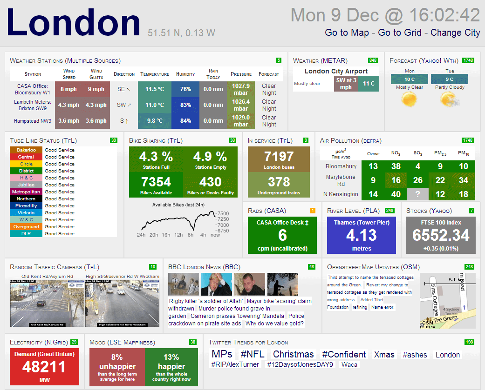
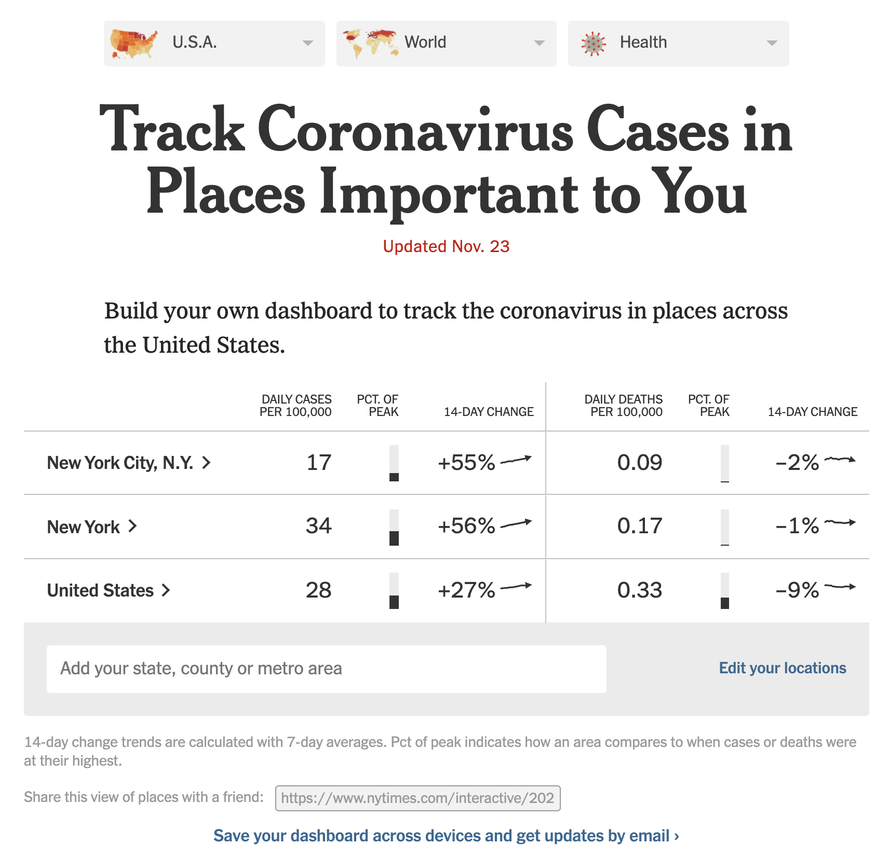

```{css, echo=FALSE} 
@media print { # print out incremental slides; see https://stackoverflow.com/questions/56373198/get-xaringan-incremental-animations-to-print-to-pdf/56374619#56374619
.has-continuation {
display: block !important;
}
}
```

```{r setup, include=FALSE}
# figures formatting setup
options(htmltools.dir.version = FALSE)
library(knitr)
opts_chunk$set(
  prompt = T,
  fig.align="center", #fig.width=6, fig.height=4.5, 
  # out.width="748px", #out.length="520.75px",
  dpi=300, #fig.path='Figs/',
  cache=T, #echo=F, warning=F, message=F
  engine.opts = list(bash = "-l")
)

## Next hook based on this SO answer: https://stackoverflow.com/a/39025054
knit_hooks$set(
  prompt = function(before, options, envir) {
    options(
      prompt = if (options$engine %in% c('sh','bash')) '$ ' else 'R> ',
      continue = if (options$engine %in% c('sh','bash')) '$ ' else '+ '
    )
  })

library(tidyverse)
library(hrbrthemes)
library(fontawesome)
library(RefManageR)

RefManageR::BibOptions(
  check.entries = FALSE,  
  bib.style = "authoryear", 
  cite.style = "authoryear", 
  style = "markdown",
  hyperlink = TRUE, 
  dashed = TRUE)

bib <-  RefManageR::ReadBib("grateful-refs.bib")


```

---


# Überblick

<br>


1. [Interaktive Kommunikation mit Dashboards](#dashboards)

2. [Data Science als Beruf](#job)

3. [Open Government](#opengovernment)


<!-- ############################################ -->
---
class: inverse, center, middle
name: dashboards

# Interaktive Kommunikation mit Dashboards
<html><div style='float:left'></div><hr color='#EB811B' size=1px style="width:1000px; margin:auto;"/></html>


---
# Was sind Dashboards?

.pull-left-wide[
## Überblick

- Ein (Unternehmens- oder Daten-) [Dashboard](https://en.wikipedia.org/wiki/Dashboard_(Unternehmen) ist eine grafische Benutzeroberfläche, die einen Überblick über Leistungsindikatoren oder andere Größen von Interesse bietet.
- Es ist ein **Monitoring-** (und weniger ein Analyse-) **Werkzeug**.
- **Verknüpfung von Datenvisualisierung und Bericht**.
- Beliebt, um **Informationen** aus operativen Einheiten (für strategische und analytische Zwecke) zu synthetisieren.
- Der Datenjournalismus hat begonnen, Dashboards im Zusammenhang mit [Wahlen](https://edition.cnn.com/election/2020/results/president), der [COVID-19-Pandemie](https://covid19.who.int/) und [Sport](https://projects.fivethirtyeight.com/2022-world-cup-predictions/) zu nutzen.
- **Gemeinsame Merkmale** sind:
  - Zugänglichkeit über Webbrowser
  - Ausstattung mit interaktiven Elementen
  - Starker Fokus auf vergleichende Visualisierung
  - Bereitstellung von Trends zu wichtigen Leistungsindikatoren (KPIs)
]

.pull-right-small-center[
<div align="center">
<br>

</div>
`Credit` [Tim Green](https://commons.wikimedia.org/wiki/File:MG_interior_%2829094966463%29.jpg)

<div align="center">
<br>

</div>
`Credit` [HelicalInsight OpenSourceBI](https://commons.wikimedia.org/wiki/File:Marketing_dashboard.png)
]


---
# Warum gibt es Dashboards?

.pull-left[
### Warum gibt es sie?

- Es gibt eine zunehmende **Fülle von Daten** (oft prozessbedingt), die nicht für sich selbst sprechen können.
- Bei kluger Nutzung können diese Daten einen **wichtigen Teil der Business Intelligence** und eine Grundlage für eine [evidenzbasierte Entscheidungsfindung](https://stephanieevergreen.com/dashboard-conversation/) auf hohem Niveau bieten .
- Kontinuierliche Quantifizierung von Indikatoren von Interesse (→ **Monitoring**).
- **Verringerung des Informationsgefälles** zwischen Analysten und Beteiligten.
- Außerdem kann die **Messung der Gesundheit von Organisationen** dazu beitragen, die Kontrolle zu behalten (wenn auch nur als performativer Akt) und das Bedürfnis der Manager nach Mikromanagement zu befriedigen.
]

.pull-right-center[
<div align="center">
<br><br><br>

</div>
`Credit` [towardsdatascience.com](https://towardsdatascience.com/5-most-popular-business-intelligence-bi-tools-in-2019-4e060b98039a)
]


---
# Dashboards in freier Wildbahn

.pull-center[
<div align="center">
<br>

</div>
`Credit` [geckoboard.com](https://www.geckoboard.com/dashboard-examples/company/company-dashboard/)
]

---
# Dashboards in freier Wildbahn

.pull-center[
<div align="center">
<br>

</div>
`Credit` [Stephen Few](http://perceptualedge.com/articles/Whitepapers/Dashboard_Design.pdf)
]

---
# Dashboards in freier Wildbahn

.pull-center[
<div align="center">
<br>

</div>
`Credit` [idashboards.com](https://www.matillion.com/resources/blog/dashboard-examples-the-good-the-bad-and-the-ugly)
]


---
# Das Problem mit Dashboards

.pull-left[
## Gestalterische Herausforderungen

- **Sie sagen zu wenig**. Der Verlust von Informationen durch Reduktion auf wenige KPIs ist [fatal](https://stephanieevergreen.com/problem-with-dashboards/) für eine gute Entscheidungsfindung.
- **Sie sagen zu viel** (irrelevante Dinge).
- Dashboards scheitern oft nicht an der Technologie, sondern an der Kommunikation (zurückzuführen auf schlechtes Design): 
- "Dashboards sind nicht zur Show gedacht. Keine noch so niedliche technische Raffinesse kann eine klare Kommunikation ersetzen." [Stephen Few](http://blogs.ischool.berkeley.edu/i247s12/files/2012/01/Dashboard-Design-Overview-Presentation.pdf), [Perceptual Edge](https://perceptualedge.com)
- Es **alle Regeln für gute/schlechte Visualisierung**. [Hier](https://stephanieevergreen.com/dashboard-conversation/) eine schöne Fallstudie zur Verbesserung der Gestaltung eines Dashboards.
]

--

.pull-right[
## Analytische Herausforderungen

- Dashboards entsprechen dem Wunsch, auf der Grundlage einiger weniger ausgewählter Metriken gute Entscheidungen treffen zu können.
- **Realität wird stark vereinfacht.**
- Alle Herausforderungen, die sich analytischer Arbeit stellen - Selektion, Messung, Kausalität, Vorhersagbarkeit - sind nach wie vor gültig, werden aber bei der Aggregation von Daten verschleiert.
- Einfache Metriken können immer noch nützlich sein, aber oft **braucht man kontextuelles Wissen** (das in Dashboards schwer zu vermitteln ist).
- Eine weitere Folge des "Dashboarding" von Business Intelligence kann sein, dass Entscheidungen auf Basis von Metriken schnell die Metriken sabotiert ([Goodhart's Law](https://en.wikipedia.org/wiki/Goodhart%27s_law)).
]


---
# Durchdachte Gestaltung und Nutzung des Dashboards

.footnote[<sup>1</sup>Quelle: [Stephen Few/Perceptual Edge](http://perceptualedge.com/articles/misc/Dashboard_Design_Requirements_Questionnaire.pdf)
]

.pull-left[
## Checkliste<sup>1</sup>

1. Geht es um ein Monitoring, bei dem Ihre Daten/Metriken häufig aktualisiert werden müssen?

2. Wer wird das Dashboard nutzen und zu welchem Zweck? Welche Fragen sollen damit beantwortet werden? Welche Maßnahmen werden sie als Reaktion auf diese Antworten ergreifen?

3. Welche spezifischen Informationen sollen angezeigt werden, und sind sie auch ohne viel Kontext aussagekräftig?

4. Was könnte dazu führen, dass die Metriken falsch/irreführend sind?
]


.pull-right[
## Design-Hinweise

- Minimieren Sie Ablenkungen.
- Konzentrieren Sie sich auf sinnvolle KPIs, nicht auf solche, die interessant aussehen.
- Überladen Sie das Dashboard nicht mit Informationen.
- Wenden Sie alle Regeln guter Visualisierung an.
- Verwenden Sie interaktive Elemente mit Bedacht (z. B. um optionale Inhalte bedingt sichtbar zu machen).
- Idealerweise ist alles Wesentliche auf einem Bildschirm sichtbar (auch auf Smartphones?).
]


---
# Dashboards in freier Wildbahn: COVID-19-Edition

.pull-left-center[
<div align="center">

</div>
`Quelle` [NY Times](https://www.nytimes.com/interactive/2021/us/covid-cases-deaths-tracker.html
)
]

--

.pull-right-center[
<div align="center">
<br>

</div>
`Quelle` [Our World in Data](https://ourworldindata.org/explorers/coronavirus-data-explorer?zoomToSelection=true)
]


---
# Dashboards in freier Wildbahn: COVID-19-Edition

.pull-left-small-center[
<div align="center">
<br>

</div>
`Quelle` [SZ Online](https://www.sueddeutsche.de/wissen/corona-zahlen-1.4844448)
]

--

.pull-right-wide-center[
<div align="center">
<br>

</div>
`Quelle` [ZEIT Online](https://www.zeit.de/wissen/corona-karte-deutschland-aktuelle-zahlen-landkreise)
]


---
# Dashboards mit R

.pull-left[
.pull-left-vwide[
### <tt>flexdashboard</tt> package
- Übersicht [hier](https://pkgs.rstudio.com/flexdashboard).
- Gut für die einfache Erstellung von Dashboards
- Einfach ein Dokument, das wie ein Dashboard aussieht
- Kann interaktiven Code nur client-seitig ausführen (in eingebettetem JavaScript)
]
.pull-right-vsmall[
<br>
<div align="center">

</div>
]
<br>
<div align="center">


</div>
]

.pull-right[
.pull-left-vwide[
### <tt>shiny</tt> package
- Übersicht [hier](https://shiny.rstudio.com/).
- Komplexer zu programmieren, aber die bessere Option für komplexe Anwendungen.
- Kann jedes Layout implementieren.
- Benötigt einen Server dahinter, um R-Code auf Benutzereingaben auszuführen.
- Das Paket [shinydashboard](https://rstudio.github.io/shinydashboard/) bietet eine weitere Möglichkeit, Dashboards mit Shiny zu erstellen.
]
.pull-right-vsmall[
<br>
<div align="center">

</div>
]
<br>
<div align="center">


</div>
]


---
# Mehr Shiny-Ressourcen

.pull-left[
### Online-Ressourcen
- [Shiny official website](https://shiny.rstudio.com/)
- [Shiny official tutorial](https://shiny.rstudio.com/tutorial/)
- [Shiny cheatsheet](https://shiny.rstudio.com/images/shiny-cheatsheet.pdf)
- [Mastering Shiny](https://mastering-shiny.org/), book by Hadley Wickham
- [Many useful articles about different topics](https://shiny.rstudio.com/articles/)
- Publishing own Shiny apps for free with [shinapps.io](https://www.shinyapps.io/)
- Hosting your Shiny app [on your own server](https://deanattali.com/2015/05/09/setup-rstudio-shiny-server-digital-ocean/)
- [Debugging Shiny](https://shiny.rstudio.com/articles/debugging.html)
]

.pull-right[
### Ein Überblick über Shiny-Erweiterungen
- [awesome-shiny-extensions](https://github.com/nanxstats/awesome-shiny-extensions)

### Einige Highlights
- [shinythemes](https://rstudio.github.io/shinythemes/): Ändern der Themes von Shiny-Anwendungen
- [shinyjs](https://deanattali.com/shinyjs/): Apps mit JavaScript-Operationen anreichern
- [leaflet](https://rstudio.github.io/leaflet/): Interaktive Karten
- [ggvis](https://ggvis.rstudio.com/): Ähnlich wie ggplot2, aber mit Fokus auf Web und Interaktion
- [shinydashboard](): Werkzeuge zur Erstellung visueller Dashboards
]


---
class: inverse, center, middle
name: job

# Data Science als Beruf
<html><div style='float:left'></div><hr color='#EB811B' size=1px style="width:1000px; margin:auto;"/></html>


---
# Berufs- und Lernfeld Data Science

.pull-left[
## Berufsbilder im Bereich Data Science sind vielfältig

Data Scientist, Data Analyst, Data Engineer, Machine Learning Engineer, AI Researcher, Business Intelligence Analyst, Data Governance Specialist, Data Privacy Specialist, Data Visualization Specialist

## Ausbildung

- Immer mehr strukturierte Data-Science-Programme; Quereinstieg aus technischen Programmen
- Autodidaktische Lernwege zunehmend unrealistisch; Online-Kurse i.d.R. nicht ausreichend
- **Das Einhorn** "Umfassend ausgebildeter Data Scientist" (siehe rechts) **ist eine Illusion**
]

.pull-right-center[
<div align="center">

</div>
]


---
# Anforderungen in der Industrie

<div align="center">

</div>

`Quelle` Eigene Darstellung; Daten: doi.org/10.34740/kaggle/dsv/8217982; scraped „Data Scientist“ job postings from LinkedIn; n=4,342; countries: US, UK, CA, AU

---
# Anforderungen in der Industrie II

<div align="center">

</div>

`Quelle` Eigene Darstellung; Daten: doi.org/10.34740/kaggle/dsv/8217982; scraped „Data Scientist“ job postings from LinkedIn; n=4,342; countries: US, UK, CA, AU


---
# Schwerpunkte in der Ausbildung

<div align="center">

</div>

`Quelle` Eigene Datenerhebung (April 2024), CSS-Master-Programme in Europa und USA


