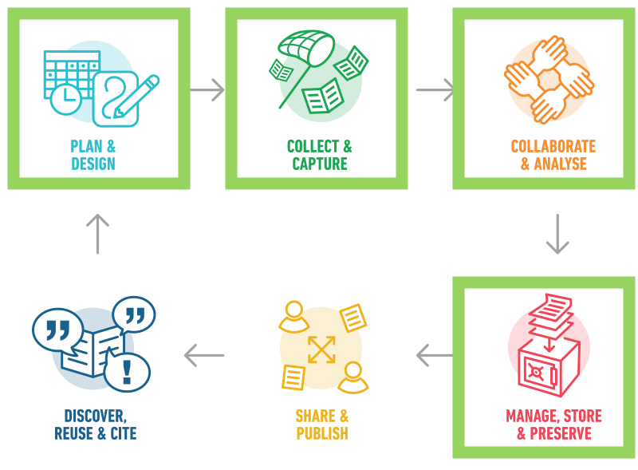
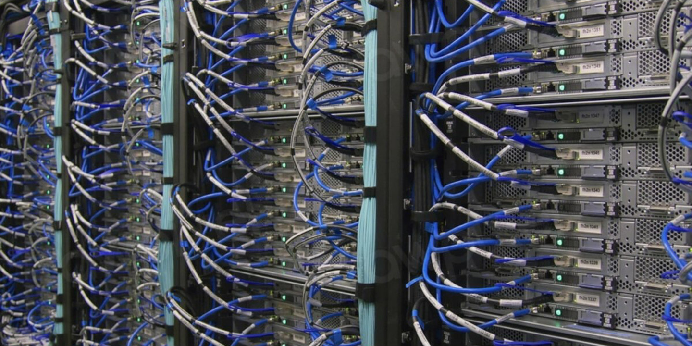
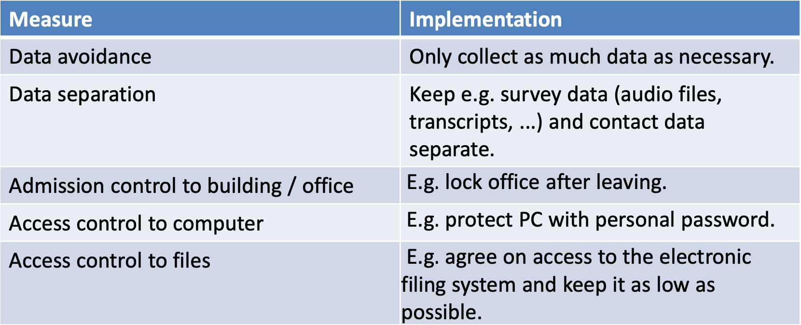

```{css, echo=FALSE} 
@media print { # print out incremental slides; see https://stackoverflow.com/questions/56373198/get-xaringan-incremental-animations-to-print-to-pdf/56374619#56374619
.has-continuation {
display: block !important;
}
}
```

```{r setup, include=FALSE}
# figures formatting setup
options(htmltools.dir.version = FALSE)
library(knitr)
opts_chunk$set(
  prompt = T,
  fig.align="center", #fig.width=6, fig.height=4.5, 
  # out.width="748px", #out.length="520.75px",
  dpi=300, #fig.path='Figs/',
  cache=T, #echo=F, warning=F, message=F
  engine.opts = list(bash = "-l")
)

## Next hook based on this SO answer: https://stackoverflow.com/a/39025054
knit_hooks$set(
  prompt = function(before, options, envir) {
    options(
      prompt = if (options$engine %in% c('sh','bash')) '$ ' else 'R> ',
      continue = if (options$engine %in% c('sh','bash')) '$ ' else '+ '
    )
  })

library(tidyverse)
library(hrbrthemes)
library(fontawesome)
library(RefManageR)

RefManageR::BibOptions(
  check.entries = FALSE,  
  bib.style = "authoryear", 
  cite.style = "authoryear", 
  style = "markdown",
  hyperlink = TRUE, 
  dashed = TRUE)

bib <-  RefManageR::ReadBib("grateful-refs.bib")


```


# Excel-Beispiel

Debugging-Session -> COVID/Excel UK


---
# Was die Leute denken, wie die Arbeit mit Daten aussieht...

<div align="center">

</div>

---
# Wie es wirklich ist...

<div align="center">
<br><br><br>


</div>

--

<h2 style="text-align:center">You have to wear many hats...</h2>

---

# Research Data Management (RDM) Lifecycle

<div align="center">

</div>


---


# Inhaltsverzeichnis

</br></br>
1. [Datenmanagement und ein Datenmanagementplan (DMP)](#dmp)

2. [Schutz](#protecting)

3. [Organisieren, Dokumentieren, Verarbeiten und Speichern](#organizing)
---

# Research Data Management (RDM) Lifecycle

<div align="center">

</div>


---

class: midtext

# Ich bitte um Handzeichen!

### Heben Sie die Hand, wenn Sie:

- den Begriff Datenmanagementplan (DMP) schon einmal gehört haben

--
- definieren können, was ein Datenmanagementplan beinhaltet

--
- schon einmal einen Datenmanagementplan für ein Projekt erstellt haben

--
- Datenerhebungsmethoden für Forschung oder politische Arbeit geplant haben

--
- Strategien zur Gewährleistung der Datenintegrität und -sicherheit umgesetzt haben

--
- mit den FAIR-Prinzipien (Findability, Accessibility, Interoperability und Reuse) vertraut sind

--
- Sie haben Praktiken für offene Daten in Ihre Arbeit integriert

--
- Sie haben Datensätze archiviert oder für den öffentlichen Zugang veröffentlicht

--
- mit Datenschutzbestimmungen und Compliance-Anforderungen vertraut sind

--
- Techniken zum Auffinden und Zugreifen auf relevante Datensätze eingesetzt haben

--
- in Ihren Projekten Datenmanagement-Tools oder -Software eingesetzt haben

--
- Sie haben andere in effektiven Datenverwaltungspraktiken geschult oder angeleitet.

---
class: inverse, center, middle
name: dmp

# Data Management und ein Data Management Plan (DMP)
<html><div style='float:left'></div><hr color='#EB811B' size=1px style="width:1000px; margin:auto;"/></html>


---

# Daten

.pull-left[
<br>
## Was sind Daten?

- Daten sind unkörperliche **Fakten**, **Zeichen** und **Symbole**.

.text-invisible[
- Wir definieren sie oft nach ihrer **Quelle** (*z.B. Verwaltung, Geschichte, Medizin usw.*) und ihren **Formaten** (*z.B. Zahlen, Text, Standbilder, Geodaten, Audio, Video und Software.*) 

- Es wird als Basis unter der *DIKW-Pyramide* betrachtet.
]
]
---

# Daten

.pull-left[
<br>
## Was sind Daten?

- Daten sind unkörperliche **Fakten**, **Zeichen** und **Symbole**.


- Wir definieren sie oft nach ihrer **Quelle** (*z.B. Verwaltung, Geschichte, Medizin usw.*) und ihren **Formaten** (*z.B. Zahlen, Text, Standbilder, Geodaten, Audio, Video und Software.*) 

.text-invisible[
- Sie wird als Grundlage der **Wissenshierarchie** unter der *DIKW-Pyramide* betrachtet.
]
]
---


# Daten

.pull-left[
<br>
## Was sind Daten?

- Daten sind unkörperliche **Fakten**, **Zeichen** und **Symbole**.


- Wir definieren sie oft nach ihrer **Quelle** (*z.B. Verwaltung, Geschichte, Medizin usw.*) und ihren **Formaten** (*z.B. Zahlen, Text, Standbilder, Geodaten, Audio, Video und Software.*) 

- Sie wird als Grundlage der **Wissenshierarchie** unter der *DIKW-Pyramide* betrachtet.
]

.pull-right[
<div align="center">
<br><br>

</div>
]
---

# Daten in der politischen Analyse

Ähnlich wie in der akademischen Forschung können Sie sich als **Politikanalysten auf eine breite Palette von Materialien** stützen, von strukturierten numerischen Datensätzen bis hin zu Interviews, Feldnotizen und Dokumenten, die für ethnografische Feldstudien gesammelt wurden,

--

.pull-left[
<h2 style="text-align:center">Quantitative</h2>
<br>
<div align="center">

</div>

]

.pull-right[
<h2 style="text-align:center">Qualitative</h2>
<br>
<div align="center">

</div>
]

--

<br>
Unabhängig von der *"Art “* werden wir es in der Politik wahrscheinlich weitgehend mit der **Erhebung von Daten über Einzelpersonen** zu tun haben (d. h. i-pink[Forschung am Menschen]).

---
class: midtext


# Persönliche Daten

Alle Daten, die es Ihnen ermöglichen, eine Person zu **identifizieren**, werden als personenbezogene Daten eingestuft. In der Allgemeinen Datenschutzverordnung (DSGVO) sind personenbezogene Daten alle Informationen, die sich auf eine **identifizierte** oder **identifizierbare** natürliche Person, die als „betroffene Person“ bezeichnet wird, beziehen.<sup>1</sup>.

.footnote[<sup>1</sup>Die Datenschutz-Grundverordnung (DSGVO) gilt nur für die Daten von lebenden Personen. Daten, die nicht als personenbezogene Daten gelten, fallen nicht unter die Datenschutzvorschriften, obwohl es dennoch ethische Gründe für den Schutz dieser Informationen geben kann.]
--

.pull-left-wide[
## Sensible personenbezogene Daten

Bestimmte personenbezogene Daten können besonders schützenswert sein, wenn sie Informationen preisgeben, die erhebliche *Risiken* für die *Grundrechte* und *Freiheiten* der betroffenen Person darstellen können. Im Zusammenhang mit der DSGVO können dies sein:

- Ethnische Herkunft;
- Politische Meinungen;
- Religiöse oder philosophische Überzeugungen;
- Gewerkschaftszugehörigkeit;
- Genetische Daten;
- Biometrische Daten;
- Daten über die Gesundheit;
- Daten über das Sexualleben oder die sexuelle Identität einer Person.
]

.pull-right-small[
<div align="center">
<br>

</div>
]

---

# Research Data Management (RDM)

<br><br><br>


.pull-left-small[
<br>

**Research Data Management** ist wie “.i-pink[health care]” für Ihre Daten:
- sie vor Schaden bewahrt,
- macht sie nutzbar und auffindbar.


Dazu gehören Strategien, Prozesse und Maßnahmen zur Erhaltung der Datenqualität, der Interpretierbarkeit von Forschungsergebnissen und der (Wieder-)Verwendbarkeit Ihrer Daten.
]

.pull-right-wider[
<div align="center">
<br><br>

</div>
]


---

# Research Data Management (RDM)

.content-box-gray-wide[
Der .i-pink[Bedarf] **RDM** sorgsam zu überdenken steigt mit .i-pink[sensiblen personenbezogenen Daten] an.
]


.pull-left-small[
<br>

**Research Data Management** ist wie “.i-pink[health care]” für Ihre Daten:
- sie vor Schaden bewahrt,
- macht sie nutzbar und auffindbar.


Dazu gehören Strategien, Prozesse und Maßnahmen zur Erhaltung der Datenqualität, der Interpretierbarkeit von Forschungsergebnissen und der (Wieder-)Verwendbarkeit Ihrer Daten.
]

.pull-right-wider[
<div align="center">
<br><br>

</div>
]

---

# Research Data Management (RDM) Lifecycle

<div align="center">

</div>

---

# Data Management Plan (DMP)

<br><br>

.pull-left[
## Datenmanagementpläne sind ein wichtiges Instrument zur Strukturierung des Datenmanagements Ihres Projekts.

Definiert Strategien, Maßnahmen und Verantwortlichkeiten für:

- die Verarbeitung und Validierung,
- Speicherung und Schutz, 
- Bewahrung und gemeinsame Nutzung

Ihre Daten während des gesamten Datenzyklus.

Immer mehr .i-pink[Finanzierungspartner verlangen diesen].
]

--

.pull-right[
## Bestandteile eines Datenmanagementplans

1. Zusammenfassung der Daten
2. FAIR Daten
    - *Auffindbar*
    - *Zugänglich*
    - *Interoperabel*
    - *Wiederverwendbar*
3. Zuteilung von Ressourcen
4. Sicherheit der Daten
5. Ethische Aspekte
6. *Sonstiges*\*
]

---
class: midtext

# Data Management Plan (DMP) (Fortführung)

<br>

| DMP component | Issues to be addressed |
| -------------- | ---------------------- |
| **1. Data summary** | - State the purpose of the data collection/generation<br>- Explain the relation to the objectives of the project<br>- Specify the types and formats of data generated/collected<br>- Specify if existing data is being re-used (if any)<br>- Specify the origin of the data<br>- State the expected size of the data (if known)<br>- Outline the data utility: to whom will it be useful |
| <b>FAIR data:</b><br>**2.1. Making data findable, including provisions for metadata** | - Outline the discoverability of data (metadata provision)<br>- Outline the identifiability of data and refer to standard identification mechanism. Do you make use of persistent and unique identifiers such as Digital Object Identifiers?<br>- Outline naming conventions used<br>- Outline the approach towards search keywords<br>- Outline the approach for clear versioning<br>- Specify standards for metadata creation (if any). If there are no standards in your discipline describe what type of metadata will be created and how |

`Source`: [H2020 DMP Template](https://ec.europa.eu/research/participants/data/ref/h2020/other/gm/reporting/h2020-tpl-oa-data-mgt-plan-annotated_en.pdf)
---
class: midtext

# Data management plan (DMP) (cont.)

<br><br><br>

| DMP component | Issues to be addressed |
| -------------- | ---------------------- |
| <b>FAIR data:</b><br> **2.2 Making data openly accessible** | - Specify which data will be made openly available? If some data is kept closed provide rationale for doing so<br>- Specify how the data will be made available<br>- Specify what methods or software tools are needed to access the data? Is documentation about the software needed to access the data included? Is it possible to include the relevant software (e.g. in open source code)?<br>- Specify where the data and associated metadata, documentation and code are deposited<br>- Specify how access will be provided in case there are any restrictions |
| <b>FAIR data:</b><br> **2.3. Making data interoperable** | - Assess the interoperability of your data. Specify what data and metadata vocabularies, standards or methodologies you will follow to facilitate interoperability.<br>- Specify whether you will be using standard vocabulary for all data types present in your data set, to allow inter-disciplinary interoperability? If not, will you provide mapping to more commonly used ontologies? |

<br><br><br>
`Source`: [H2020 DMP Template](https://ec.europa.eu/research/participants/data/ref/h2020/other/gm/reporting/h2020-tpl-oa-data-mgt-plan-annotated_en.pdf)

---
class: midtext

# Data management plan (DMP) (cont.)


| DMP Komponente | Zu behandelnde Fragen |
| -------------- | ---------------------- |
| <b>FAIR data:</b><br> **2.4. Verbesserung der Wiederverwendung von Daten (durch Klärung der Lizenzen)** | - Legen Sie fest, wie die Daten lizenziert werden, um die weitestmögliche Wiederverwendung zu ermöglichen<br>- Legen Sie fest, wann die Daten zur Wiederverwendung verfügbar gemacht werden. Falls zutreffend, geben Sie an, warum und für welchen Zeitraum ein Datenembargo erforderlich ist<br>- Legen Sie fest, ob die im Projekt erzeugten und/oder verwendeten Daten von Dritten nutzbar sind, insbesondere nach Ende des Projekts? Wenn die Wiederverwendung einiger Daten eingeschränkt ist, erklären Sie warum<br>- Beschreiben Sie die Prozesse zur Qualitätssicherung der Daten<br>- Legen Sie die Dauer fest, für die die Daten wiederverwendbar bleiben |
| **3. Zuweisung von Ressourcen** | - Schätzen Sie die Kosten für die Umsetzung Ihrer Daten nach FAIR-Prinzipien. Beschreiben Sie, wie Sie diese Kosten decken wollen<br>- Identifizieren Sie klar die Verantwortlichkeiten für das Datenmanagement in Ihrem Projekt<br>- Beschreiben Sie die Kosten und den potenziellen Wert der langfristigen Aufbewahrung |
| **4. Datensicherheit** | - Behandeln Sie Datenwiederherstellung sowie sichere Lagerung und Übertragung sensibler Daten |
| **5. Ethische Aspekte** | - Im Kontext der Ethikprüfung, des ethischen Abschnitts des DoA und der ethischen Lieferungen zu behandeln. Schließen Sie Verweise und verwandte technische Aspekte ein, falls diese nicht von den vorgenannten abgedeckt werden |
| **6. Sonstiges** | - Beziehen Sie sich auf andere nationale/finanzierende/branchenspezifische/abteilungsspezifische Verfahren zum Datenmanagement, die Sie verwenden (falls vorhanden) |


`Source`: [H2020 DMP Template](https://ec.europa.eu/research/participants/data/ref/h2020/other/gm/reporting/h2020-tpl-oa-data-mgt-plan-annotated_en.pdf)

---

class: inverse, center, middle
name: protecting

# Beschützen
<html><div style='float:left'></div><hr color='#EB811B' size=1px style="width:1000px; margin:auto;"/></html>

---

# Datenschutz


.pull-left[
## Forschungsethik
Die moralischen **Prinzipien** und **Handlungen**, die Forschung leiten und gestalten

<b style="color:#1D375B">In der Politikanalyse</b> ist eng mit der Forschungsethik in den Sozialwissenschaften verbunden.
- Ursprünglich ein Modell des 'Patientenschutzes' aus der medizinischen Forschung.
- Heute hat es einen breiteren Anwendungsbereich, einschließlich:
    - Berücksichtigung von <i style="color:#cc0065">Nutzen, Risiken und Schäden</i>
    - <i style="color:#cc0065">für alle Personen</i>, die mit der Forschung in Verbindung stehen und davon betroffen sind
- Weist **Verantwortlichkeiten** den Forschern und Analysten zu (z.B. *rechtlicher Rahmen*).
]

.pull-right[
<div align="center">
<br><br>

</div>

]

---
# Nürnberg Code (1947)

.pull-left[
**Ethische Richtlinien** für die Vorbereitung und Durchführung von medizinischen, psychologischen und anderen Experimenten am Menschen: 


>"Die freiwillige Zustimmung der Versuchsperson ist absolut unerlässlich [...], ohne dass ein Element der Gewalt, des Betrugs, der Täuschung, der Nötigung, der Übervorteilung oder einer anderen Form von Zwang oder Nötigung vorliegt [...], sollte über ausreichende Kenntnisse und ein ausreichendes Verständnis der Elemente des betreffenden Gegenstands verfügen, um sie in die Lage zu versetzen, eine **einsichtige und aufgeklärte Entscheidung** zu treffen.”

]

.pull-right[
<div align="center">
<br>

</div>

]

---

# Überprüfungen der Ethik in der akademischen Forschung

<br><br>
.pull-left[
## Ethikkommission (IRB) und ethische Gremien

- Verwaltungsorgane, die eingerichtet wurden, um die **Rechte und das Wohlergehen** der Forschungsteilnehmer zu schützen
- Oft innerhalb der akademischen Einrichtung angesiedelt
- Überprüft Vorschläge und empfiehlt Änderungen und Verbesserungen
- .i-pink[ Kann unethische Projekte durch Verweigerung der Genehmigung stoppen]
]


.pull-right[
<div align="center">
<br>

</div>

]

---
# Was ist "Datenschutz"?


.pull-left[
## Datenschutz

- Teil des Grundrechts .i-pink[Recht auf Privatsphäre] (oder 'informationelle Freiheit').
- In der Forschung kann es zu Spannungen zwischen den Grundrechten kommen:
    - Freiheit der Forschung vs. Freiheit der persönlichen Information.
- „Privatsphäre ist ein persönlicher Lebenszustand, der durch Abgeschiedenheit von der Öffentlichkeit und damit durch Abwesenheit von deren Kenntnisnahme gekennzeichnet ist“ (Neethling 2005).
- **Kern**:
    - Verhinderung der unerwünschten Offenlegung von persönlichen Informationen oder
    - des Missbrauchs solcher Informationen.
]

.pull-right[
<div align="center">
<br><br>

</div>

]

---

# Hinter Daten befinden sich Individuen...


<div align="center">

</div>


---

# Datenschutz unter der DSGVO

<div align="center">
<br>

</div>

---

# Datenschutz unter der DSGVO

<div align="center">
<br>

</div>

---

# DSGVO

<br>

.pull-left[
## General Data Protection Regulation

- In Kraft seit 25. Mai 2018 (.i-pink[fast auf den Tag genau sechs Jahre] 😎)
    - 99 Artikel und 173 Erwägungsgründe
    - Gilt unmittelbar
    - Soll das Datenschutzrecht EU-weit harmonisieren
    - *aber*, etwa 150 „Öffnungsklauseln“ oder Ausnahmen...

- GDPR (faktisch) integriert in eine Normenhierarchie
]

.pull-right[
<div align="center">
<br><br>

</div>

]


.footnote[<sup>1</sup> Schauen wir uns diesen Artikel an https://www.bbc.com/news/uk-wales-politics-58395974]

---

class: inverse, center, middle
name: organizing

# Organisieren, Dokumentieren, Verarbeiten und Speichern
<html><div style='float:left'></div><hr color='#EB811B' size=1px style="width:1000px; margin:auto;"/></html>

---

# Datenverarbeitung unter GDPR

<div align="center">
<br>

</div>

---

# Datenverarbeitung unter GDPR

<div align="center">
<br>

</div>


---

# Informierte Zustimmung zur Datenverarbeitung

.pull-left[


<br><br><br>
## Art. 4 Abs. 11 GDPR


> "'Einwilligung' der betroffenen Person ist **jede Willensbekundung, die ohne Zwang, für den konkreten Fall, in Kenntnis der Sachlage und unmissverständlich erfolgt** und mit der die betroffene Person durch eine Erklärung oder eine eindeutige bestätigende Handlung zu verstehen gibt, dass sie **mit der Verarbeitung der sie betreffenden personenbezogenen Daten** einverstanden ist;“

]

--

.pull-right[

## Bedingungen für die Zustimmung

- Schriftform nicht mehr erforderlich.
- Bedingungen für die Einwilligung (Artikel 7 GDPR):
    - Nachweispflicht (Abs. 1)
    - Trennungsgebot (Abs. 2)
    - Leichte Widerrufbarkeit zu jeder Zeit (Abs. 3) 
    - Erhöhte Anforderung an die Freiwilligkeit (Abs. 4)
- Verschärfung für Minderjährige unter 14 Jahren (Art. 8 GDPR).
- Wichtig: Erhebung „besonderer Kategorien“ personenbezogener Daten gemäß Artikel 9 DSGVO „verboten“, es sei denn, es gibt eine Rechtsgrundlage.


- **Zentral**: .i-pink[Einwilligung muss dokumentiert werden!]

]

---

# Können wir Daten ohne Einwilligung verarbeiten? (in der Forschung)

.pull-left[
## Dürfen <span style="color:#cc0065">Forscher</span> Daten verarbeiten, die ohne Einwilligung gesammelt wurden?

- .i-pink[Es kommt darauf an...]
- Es könnte notwendig sein, nachträglich eine Einwilligung einzuholen, nachdem die Daten gesammelt wurden.
- Dieser Schritt kann übersprungen werden, wenn "die Bereitstellung solcher Informationen unmöglich ist oder einen unverhältnismäßigen Aufwand bedeuten würde" (Art 14 Abs 5 Lit b).
- Aber das ist keine Standardlösung!
- **Unverhältnismäßig bedeutet wirklich unverhältnismäßig**.

## Einwilligung nachträglich ist eine Interessenabwägung
]


.pull-right[
<div align="center">
<br><br><br>

</div>

]

---
# Die Zustimmung nach dem Vertrag und die Interessenabwägung

## „Interessenabwägung“ - Checkliste: 

- Legitimes Interesse des Forschers?
- Ist die Datenverarbeitung notwendig?
    - Gibt es mildere Mittel, um das Forschungsziel zu erreichen?
- Kann die betroffene Person der Verarbeitung widersprechen?
- Sind diese Daten mit anderen Daten verknüpft (oder verknüpfbar)?
- Wie lange werden die Daten gespeichert?
- Wie viele Personen werden auf die Daten zugreifen?
- Gehören die Forschungsteilnehmer zu einer schutzbedürftigen Gruppe?
- Müssen die Forschungssubjekte mit der Verarbeitung ihrer Daten rechnen?
--

## Überlegen Sie genau: Wenn die Interessen der Versuchspersonen schwerer wiegen als Ihre, ist die Datenverarbeitung unzulässig

---

# Sicherer Datenspeicher

.pull-left[
<br><br>
## Technical and Organizational Measures (TOMs)

- **Die Sicherheit unserer Daten**

> TOMs sollten so konzipiert sein, dass „Datenschutzgrundsätze wie die Datenminimierung wirksam umgesetzt und die erforderlichen Garantien in die Verarbeitung integriert werden, um die Anforderungen dieser Verordnung zu erfüllen und die Rechte der betroffenen Personen zu schützen“. (Art 25 Par 1 GDPR).

]


.pull-right[
<div align="center">
<br>

</div>

]

---

# Beispiele für TOMs

<div align="center">
<br><br>

</div>

---

# Pseudonymisierung und Anonymisierung

.pull-left[
## Pseudonymisierung

**(Art. 4 Abs. 1 Nr. 5 GDPR)**:
> „Verarbeitung personenbezogener Daten in einer Weise, dass die personenbezogenen Daten ohne Hinzuziehung zusätzlicher Informationen nicht mehr einer spezifischen betroffenen Person zugeordnet werden können, sofern diese zusätzlichen Informationen gesondert aufbewahrt werden und technischen und organisatorischen Maßnahmen unterliegen, die gewährleisten, dass die personenbezogenen Daten nicht einer identifizierten oder identifizierbaren natürlichen Person zugewiesen werden;“


## Bei der Pseudonymisierung bleibt die <span style=„color:#cc0065“>Möglichkeit, die wahre Identität festzustellen</span>
]

--

.pull-right[
## Anonymisierung

**(DSGVO Erwägungsgrund 26)**:

> „Informationen, die sich nicht auf eine identifizierte oder identifizierbare natürliche Person beziehen oder auf personenbezogene Daten, die so anonymisiert wurden, dass die betroffene Person nicht oder nicht mehr identifizierbar ist.“

## Mit Anonymisierung gibt es <span style=„color:#cc0065“>keine Möglichkeit, die wahre Identität festzustellen</span>
]

---

# Was ist genug?

- Das ist eine Frage, auf die es **keine klare Antwort** gibt.

--
- Betrachten Sie den **Risiko-basierten Ansatz** der GDPR.

--
- Technische und organisatorische Maßnahmen (TOMs) helfen Ihnen, das Risiko in Schach zu halten.

--
- Wenn Sie mit großen Datensätzen arbeiten, sollten Sie Mittel zur **Statistischen Offenlegungskontrolle** (z. B. k-Anonymität) in Betracht ziehen.

--
- Wenn Sie unsicher sind, wenden Sie sich an einen **Datenmanagement- und Rechtsexperten**!!!

<div align="center">
<br>

</div>


---

# Datensicherheit

.pull-center[
.content-box-gray-wide[
Kennt jemand den Unterschied zwischen .i-pink[Datenschutz] und .i-pink[Datensicherheit]?
]
]

--

<br><br>

.pull-left[
## Datensicherheit ist umfassender und nicht unbedingt personenbezogen.

- Verschlüsselung
- Starke Passwörter
- Zugriffsrechte
- Backups
]

.pull-right[
<div align="center">

</div>
]

---

# Encryption

.pull-left[
## Verschlüsselung erhält die Sicherheit von Daten
- Verwendet einen Algorithmus zur Umwandlung von Informationen
- Benötigt einen „Schlüssel“ zum Entschlüsseln

## Mit Verschlüsselung können
- Daten zu übertragen
- Speichern von Daten (Backups)
- Auf entfernten Datenträgern

## Tools. z.B. 7Zip, Gpg4win, Veracrypt


.footnote[Hier finden Sie einige zusätzliche Informationen zur Verschlüsselung vom [Bundesamt für Sicherheit in der Informationstechnik 🇩🇪](https://www.bsi.bund.de/EN/Themen/Verbraucherinnen-und-Verbraucher/Informationen-und-Empfehlungen/Cyber-Sicherheitsempfehlungen/Daten-sichern-verschluesseln-und-loeschen/Datenverschluesselung/Soft-und-hardwaregestuetzte-Verschluesselung/soft-und-hardwaregestuetzte-verschluesselung_node.html)]
]

.pull-right[
<div align="center">
<br>

</div>
]

---

# Starke Passwörter

.pull-left[
## Ein starkes Passwort hat:
- acht bis fünfzehn Zeichen oder sogar mehr
- eine zufällige Verteilung der Zeichen

## Kombinieren Sie
- Großbuchstaben: A - Z
- Kleinbuchstaben: a - z
- Ziffern: 0-9
- Sonderzeichen: !"#$%&'()*+,-./:, etc.

## Verwenden Sie einen <span style = "color:#cc0065">‘Pass-Satz’</span> anstelle eines Passworts!

.footnote[Hier sind einige zusätzliche Informationen über Passwort-Manager vom [Bundesamt für Sicherheit in der Informationstechnik 🇩🇪](https://www.bsi.bund.de/EN/Themen/Verbraucherinnen-und-Verbraucher/Informationen-und-Empfehlungen/Cyber-Sicherheitsempfehlungen/Accountschutz/Sichere-Passwoerter-erstellen/Passwort-Manager/passwort-manager_node.html)]
]

.pull-right[
<div align="center">
<br>

</div>
]

---
# Sichere Back-ups

.pull-left[
## Risiken:
- Technische Defekte
- Katastrophen
- Diebstahl
- Vergesslichkeit

## Strategien
- Speicherung auf sicheren Servern mit automatischer regelmäßiger Sicherung
- Sicherung wichtiger Dateien in mindestens drei Kopien auf räumlich getrennten Datenträgern
]

--

.pull-right[
## Einrichtung der Datensicherung (3-2-1-Regel)
- Mindestens **3** Kopien einer Datei
- Auf mindestens **2** verschiedenen Medien
- Mindestens **1** davon ist remote

**Testen Sie die Datenwiederherstellung zu Beginn und in regelmäßigen Abständen**

## Schützen Sie Ihre (sensiblen) Daten:
- Hardware (z.B. separater abschließbarer Raum)
- Dateiverschlüsselung
- Passwortsicherheit
- Mindestens zwei Personen sollten Zugang zu Ihren Daten haben

]

.footnote[Hier finden Sie zusätzliche Informationen zur Datensicherung vom [Bundesamt für Sicherheit in der Informationstechnik 🇩🇪](https://www.bsi.bund.de/EN/Themen/Verbraucherinnen-und-Verbraucher/Informationen-und-Empfehlungen/Cyber-Sicherheitsempfehlungen/Daten-sichern-verschluesseln-und-loeschen/Datensicherung-und-Datenverlust/datensicherung-und-datenverlust_node.html)]

---

# Warum ist das für uns wichtig?

## Schauen wir uns ein paar Fälle an

- .b-pink[Was ist passiert?]

- .b-pink[Warum war das ein Problem?]

- .b-pink[Was hätte geschehen sollen?]

[UK Information Commissioner's Office (ICO)](https://ico.org.uk/for-organisations/report-a-breach/personal-data-breach/personal-data-breach-examples/)

---
class: inverse, center, middle
name: questions

# Fragen?
<html><div style='float:left'></div><hr color='#EB811B' size=1px style="width:1000px; margin:auto;"/></html>


