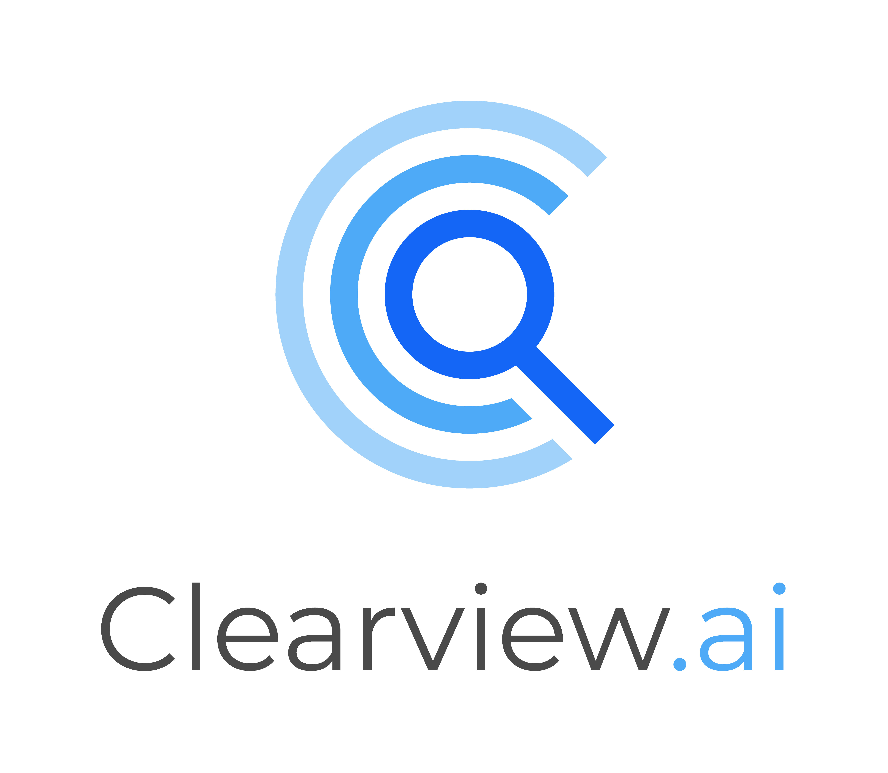
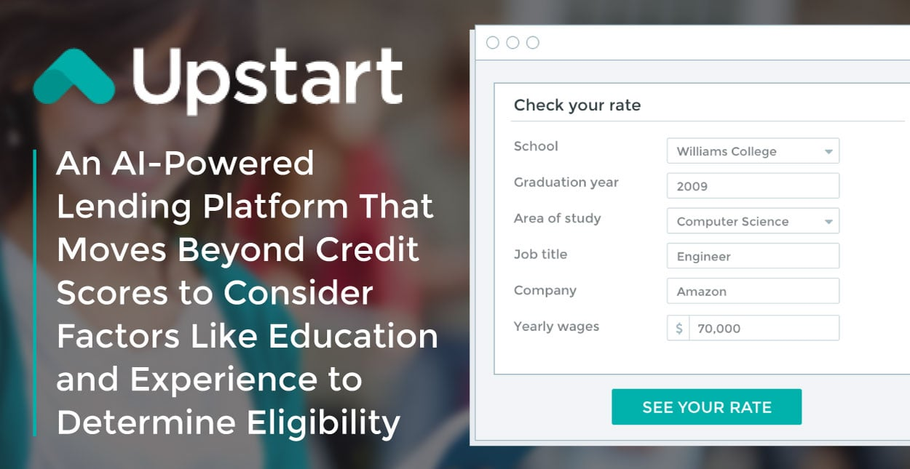
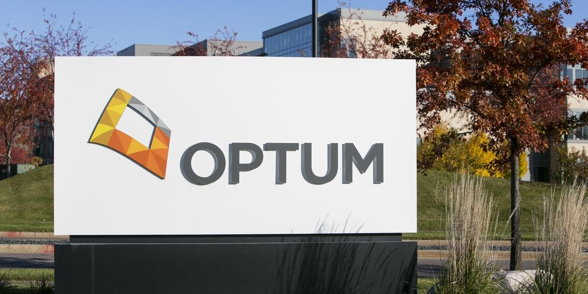
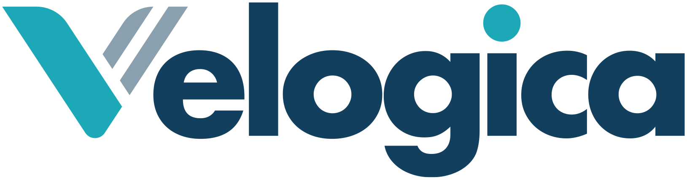
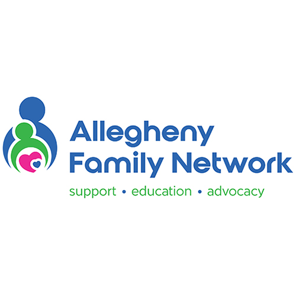
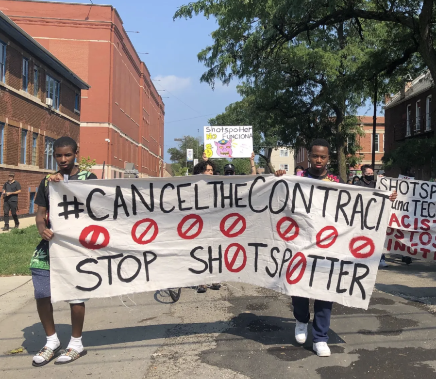

```{css, echo=FALSE} 
@media print { # print out incremental slides; see https://stackoverflow.com/questions/56373198/get-xaringan-incremental-animations-to-print-to-pdf/56374619#56374619
  .has-continuation {
    display: block !important;
  }
}
```

```{r setup, include=FALSE}
# figures formatting setup
options(htmltools.dir.version = FALSE)
library(knitr)
opts_chunk$set(
  prompt = T,
  fig.align="center", #fig.width=6, fig.height=4.5, 
  # out.width="748px", #out.length="520.75px",
  dpi=300, #fig.path='Figs/',
  cache=T, #echo=F, warning=F, message=F
  engine.opts = list(bash = "-l")
  )

## Next hook based on this SO answer: https://stackoverflow.com/a/39025054
knit_hooks$set(
  prompt = function(before, options, envir) {
    options(
      prompt = if (options$engine %in% c('sh','bash')) '$ ' else 'R> ',
      continue = if (options$engine %in% c('sh','bash')) '$ ' else '+ '
      )
})

library(tidyverse)
library(hrbrthemes)
library(fontawesome)
```


# Inhaltsverzeichnis
1. [HireVue](#a)

2. [ClearView.ai](#b)

3. [EAB Navigate](#c)

4. [Upstart Lending Prediction](#d)

5. [Facebook Suicide Prediction](#e)

6. [Optum ImpactPro](#f)

7. [Velogica](#g)

8. [AFST Child Maltreatment](#h)

9. [Epic Blutvergiftung Vorhersage](#i)

10. [Google Kindesmissbrauch Prävention](#j)

11. [Shotspotter](#k)

---
name: a
#HireVue Personalgewinnung
.pull-left[
- Tool für die Personalgewinnung: Video-Personlichkeitstests und Games
- **Behauptung**: HireVue Einstufung kann beruflichen Erfolg vorhersagen
- **Belege**: kein Audit (Prüfung), nach 2020 ein Audit aber Ergebnisse nicht öffentlich
- **Anfechtbarkeit:** Kandidat/innen haben keine Einsicht in die Bewertungskriterien oder Möglichkeit, Entscheidungen anzufechten
- **Training der Modelle**: auf Basis von Bewertungen bereits eingestellter Mitarbeiter/innen, potenzielle Reproduktion bestehender Biases
- BR Recherche: Bücherregale, seltene Vokabeln, und das Tragen einer Brille führen zu besseren Scores [(siehe Harlan/Schnuck, 2021)](https://interaktiv.br.de/ki-bewerbung/en/)

`Source` [Harwell, 2019; ](https://www.washingtonpost.com/technology/2019/10/22/ai-hiring-face-scanning-algorithm-increasingly- decides- whether- you- deserve- job/) [Wang et al., 2023: S. 28](https://predictive-optimization.cs.princeton.edu/)
]

.pull-right[
<div align="center">

</div>
[Bildquelle](https://marketplace.icims.com/en-US/apps/119432/video-interviewing-video-assessment-solution-by-hirevue)
]

---
name: b
# Clearview.ai
.pull-left[
- Tool für Gesichtserkennung beliebiger Personen anhand von Trainingsdaten aus Social Media, Zeitungen, Online-Plattformen, PayPal Transaktionen, etc.
- **Behauptung:** 99,85% Accuracy bei Stichprobe von 12 Millionen Fahndungsfotos [(s. Homepage)](www.clearview.ai)
- **Belege:** Gutes Testergebnis beim US Nationalen Institut für Standards und Technologie
- **Anfechtbarkeit:** Tool ist weder offen zugänglich, noch können Nutzer/innen ihre Fotos entfernen.
- **Training der Modelle:** Web Scraping von Online-Plattformen, Webseiten und Medien ohne Einverständnis der Nutzer/innen
- New York Times Recherche: Staatliche Behörden benutzen Clearview.ai auch während Gerichtsverfahren weiter [(Hill, 2020)](https://www.nytimes.com/2020/01/18/technology/clearview-privacy-facial-recognition.html)

`Source` [Kashmir Hill, 2024](https://www.penguinrandomhouse.com/books/691288/your-face-belongs-to-us-by-kashmir-hill/)
]

.pull-right[
<div align="center">

</div>
[Bildquelle](www.clearview.ai)
]


---
name: c
# EAB Navigate
.pull-left[
- Risiko für Studienabbruch vorhersagen anhand persönlicher Daten, akademischen Leistungen, App-Aktivitäten und Kreditverläufen von Studierenden
- **Behauptung**: Wahrscheinlichkeit des akademischen Erfolgs vorhersagen
- **Belege**: kein Audit (Prüfung), nach 2020 ein Audit aber Ergebnisse nicht öffentlich
- **Anfechtbarkeit:** Studierende wissen nicht, welche Modelle verwendet werden 
- **Training der Modelle**: auf Basis von bereits erfolgreicher Studierenden, Tool drängte insb. schwarze Studierenden aus MINT Fächern

`Source` [Feathers, 2021; ](https://themarkup.org/machine-learning/2021/03/02/major-universities-are-using-race-as-a-high-impact-predictor-of-student-success) [Wang et al., 2023: S. 30](https://predictive- optimization.cs.princeton.edu/)
]

.pull-right[
<div align="center">

</div>
[Bildquelle](https://www.kennesaw.edu/careers/students/al-appointment-scheduling.php)
]
---
name: d
# Upstart Lending Prediction
.pull-left[
- Kreditwürdigkeit vorhersagen basierend auf u.a. Ausbildungshintergrund und früheren Kredithistorien
- **Behauptung**: genauer als traditionelle Kreditbewertungsmodelle und soll „fair“ sein
- **Belege**: CFPB (Verbraucherschutz Finanzbehörde) zog "No Action" Schreiben für Upstart zurück nachdem der Fairness Test der CFPB nicht abgewartet wurde
- **Anfechtbarkeit:** keine Angabe über genutze Modelle
- **Training der Modelle**: nutzt historische Daten von Kreditnehmern, Risiko der Nachbildung existierender Bias und Demografie in der Datenstichprobe

`Source` [Upstart, 2018; ](https://www.upstart.com/blog/upstarts- commitment- to- fair- lending) [Wang et al., 2023: S. 31](https://predictive- optimization.cs.princeton.edu/)
]

.pull-right[
<div align="center">

</div>
[Bildquelle](https://www.badcredit.org/news/upstart-offers-ai-powered-loans-that-move-beyond-credit-scores/)
]
---
name: e
# Facebook Suicide Prediction
.pull-left[
- Selbstmordrisiko vorhersagen mit Nutzerdaten und Interaktionen auf Facebook
- **Behauptung**: Vorhersage von Suizidgefährdung zur Prävention
- **Belege**: keine konkreten Genauigkeitszahlen oder Details veröffentlicht [(s. Facebook Blogpost)](https://engineering.fb.com/2018/02/21/ml-applications/under-the-hood-suicide-prevention-tools-powered-by-ai/)
- **Anfechtbarkeit:** keine Zustimmung durch Nutzer/innen, keine Einsicht welche Daten verwendet wurden
- **Training der Modelle**: insb. Facebook-Kommentare und Meldungen, potenzielle Verzerrungen durch unterschiedliche Nutzergruppen und Sprachbarrieren

`Source` [Murellio et al., 2018; ](https://engineering.fb.com/2018/02/21/ml-applications/under-the-hood-suicide-prevention-tools-powered-by-ai/) [Wang et al., 2023: S. 31](https://predictive- optimization.cs.princeton.edu/)
]

.pull-right[
<div align="center">

</div>
[Bildquelle](https://www.reuters.com/business/media-telecom/google-facebook-pledged-millions-local-news-was-it-enough-2021-06-10/)
]
---
name: f
# Optum ImpactPro
.pull-left[
- Medizinisches Risiko vorhersagen mit früheren Patientendaten mit Optum ImpactPro
- **Behauptung**: Vorhersage ermöglicht präventive Maßnahmen und Reduktion langfristiger Kosten 
- **Belege**: keine Belege für Fairness oder Genauigkeit; ethnischer Bias [(s. Obermeyer, 2019)](https://doi.org/10. 1126/science.aax2342)
- **Anfechtbarkeit:** Patienten können Ergebnisse und Trainingsdaten nicht herausfordern
- **Training der Modelle**: Training anhand historischer Patientendaten, wodurch bestehende Bias erlernt wurden (z.B. schlechtere Gesundheitsversorgung für schwarze Menschen)

`Source` [Optum, 2021; ](https://www.optum.com/content/dam/optum3/optum/en/resources/white-papers/wf4785959-impact-pro-white-paper.pdf)[Obermeyer, 2019; ](https://doi.org/10. 1126/science.aax2342) [Wang et al., 2023: S. 33](https://predictive- optimization.cs.princeton.edu/)
]

.pull-right[
<div align="center">

</div>
[Bildquelle](https://www.modernhealthcare.com/technology/optum-algorithm-used-flag-high-risk-patients-found-have-unintentional-racial-bias)
]
---
name: g
# Velogica
.pull-left[
- Lebensversicherungsrisiken vorhersagen mit historischen Kundendaten mit Velogica
- **Behauptung**: Effiziente und schnelle Risikoeinschätzung zur Berechnung von Prämien
- **Belege**: keine öffentlich zugänglichen Details zur Genauigkeit der Modelle trotz Behauptung einer Validierung
- **Anfechtbarkeit:** keine Transparenz oder Möglichkeit die Entscheidungsfindung zu hinterfragen
- **Training der Modelle**: basiert auf Daten von bereits versicherten Personen, potenziell nicht repräsentativ für untypische oder bisher unterversorgte Gruppen

`Source` [SCOR, 2020; ](https://www.scor.com/en/expert-views/power-predictive-models) [Wang et al., 2023: S. 35](https://predictive- optimization.cs.princeton.edu/)
]

.pull-right[
<div align="center">

</div>
[Bildquelle](https://www.insurtechexpress.com/scor-velogica/)
]
---
name: h
# AFST Child Maltreatment
.pull-left[
- Risiko für Kindesmisshandlung vorhersagen mit dem Allegheny Family Screening Tool (AFST)
- **Behauptung**: präzise Vorhersage, welche Kinder wahrscheinlich misshandelt werden, um Ermittlungen einzuleiten
- **Belege**: hohe Genauigkeit behauptet, später durch Überprüfung auf [Datenlecks](https://proceedings.mlr.press/v81/ chouldechova18a.html) revidiert; keine Details zur kontinuierlichen Überprüfung
- **Anfechtbarkeit:** keine Einsicht in die Funktionsweise des Modells
- **Training der Modelle**: basierend auf vorhandenen Daten öffentlicher Dienste, was zu einer Überrepräsentation von Familien mit öffentliche Unterstützung führt

`Source` [Chouldechova et al., 2018; ](https://proceedings.mlr.press/v81/ chouldechova18a.html) [Wang et al., 2023: S. 26](https://predictive- optimization.cs.princeton.edu/)
]

.pull-right[
<div align="center">

</div>
[Bildquelle](https://paproviders.org/2022-rcpa-conference-together-a-thank-you-to-our-exhibitors/exhibitor-allegheny-family-network-square-icon-500-x-500/)
]
---
name: i
# Epic Blutvergiftung Vorhersage
.pull-left[
- Risiko für Blutvergiftung vorhersagen mit dem Epic Sepsis Tool
- **Behauptung**: KI Vorhersage 6 Stunden vor Klinikpersonal möglich
- **Belege**: keine peer-review Studien, Forscher der University of Michigan zeigten in einer [Validierungsstudie](https://jamanetwork.com/journals/jamainternalmedicine/fullarticle/2781307) 2021 eine tatsächliche Accuracy von nur 63% (etwas besser als Zufall)
- **Anfechtbarkeit:** keine technischen Daten geteilt
- **Training der Modelle**: basierend auf vorhandenen Daten der Firma Epic (mitunter größte US Gesundheitsdatenbank)

`Source` [Wong et al., 2021; ](https://jamanetwork.com/journals/jamainternalmedicine/fullarticle/2781307) [Narayanan/Kapoor, 2024: S. 228](https://http://aisnakeoil.com/)
]

.pull-right[
<div align="center">

</div>
[Bildquelle](https://www.orientsoftware.com/blog/epic-emr-system//)
]
---
name: j
# Google Kindesmissbrauch Prävention
.pull-left[
- Google Photos Kindesmissbrauch Prävention, Sperren von Accounts der Täter
- **Behauptung**: Content Moderation mit KI, Kindesmissbrauch über Google Photos erkennen
- **Belege**: keine Angaben zu Accuracy des Tools
- **Anfechtbarkeit:** Google Nutzer/innen kennen Kriterien nicht oder können Missklassifikation anfechten
- [NYT Recherche:](https://www.nytimes.com/2022/08/21/technology/google-surveillance-toddler-photo.html) Familienvater fotografierte geschwollenen Intimbereich seines Babys für den Hausarzt, Missklassifikation als Kindesmissbrauch und Zugang zu allen Google Services, Google SIM Karte und Google beruflicher Account gesperrt

`Source` [Hill, 2022; ](https://www.nytimes.com/2022/08/21/technology/google-surveillance-toddler-photo.html) [Narayanan/Kapoor, 2024: S. 181, 194](https://http://aisnakeoil.com/)
]

.pull-right[
<div align="center">

</div>
[Bildquelle](www.photos.google.com)
]
---
name: k
# ShotSpotter 
.pull-left[
- Erkennung von Pistolenschüssen an öffentlichen Plätzen und in Gebäuden
- **Behauptung**: KI Identifikation von Schüssen steigert öffentliche Sicherheit und verbessert Evidenz in Ermittlungsverfahren
- **Belege**: keine externe Validierung, Belege für mögliche negative Auswirkungen des ShotSpotter Tools durch Fehlalarme und hohe Kosten, keine Reduktion an Waffenmissbrauch
- **Anfechtbarkeit:** Hersteller SoundThinking lehnte externe Datenanfragen ab, Zivilorganisationen formierten sich gegen ShotSpotter Tool
- **Training der Modelle**: keine Angabe

`Source` [Washington D.C. Police, 2024; ](https://mpdc.dc.gov/publication/shotspotter-data-disclaimer-and-dictionary) [Narayanan/Kapoor, 2024: S. 264f.](https://http://aisnakeoil.com/)
]

.pull-right[
<div align="center">

</div>
[Bildquelle](https://illinoisanswers.org/2023/06/02/chicago-shotspotter-contract-cancel-brandon-johnson/)
]