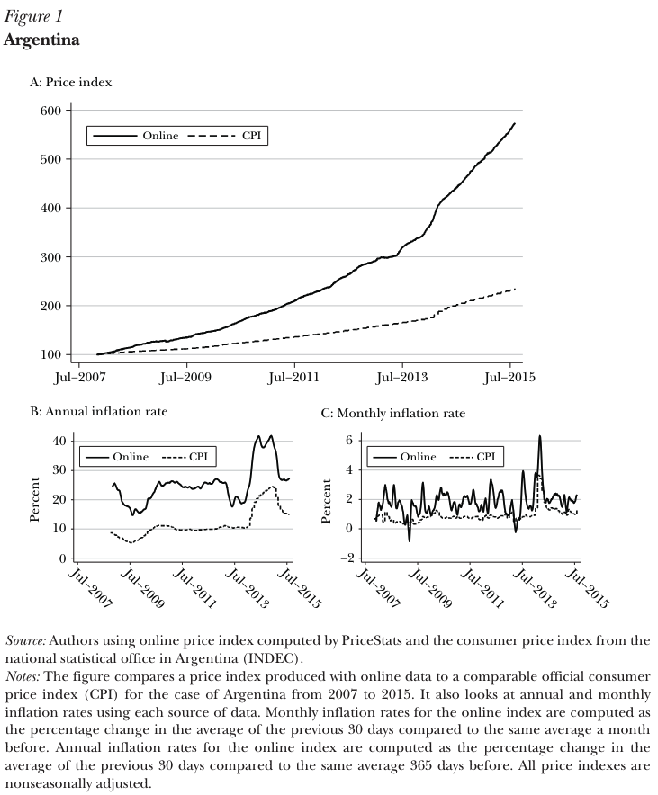
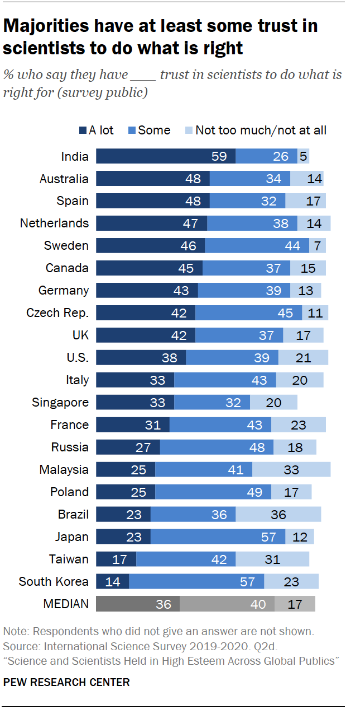
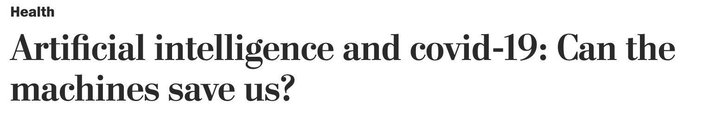
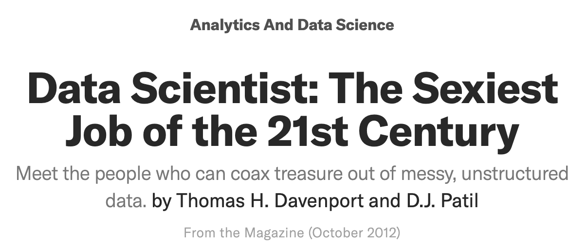
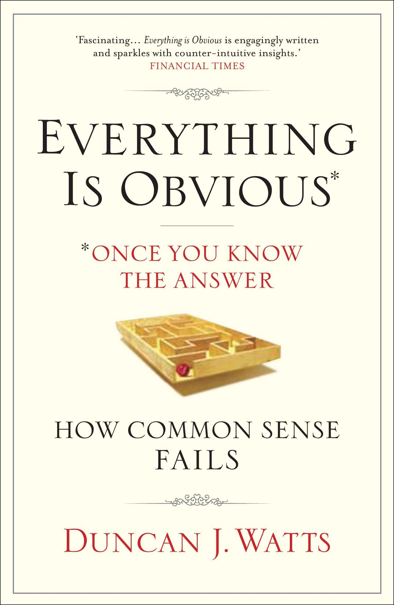
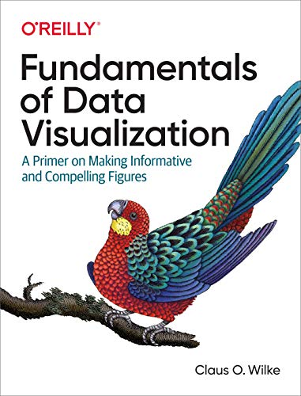
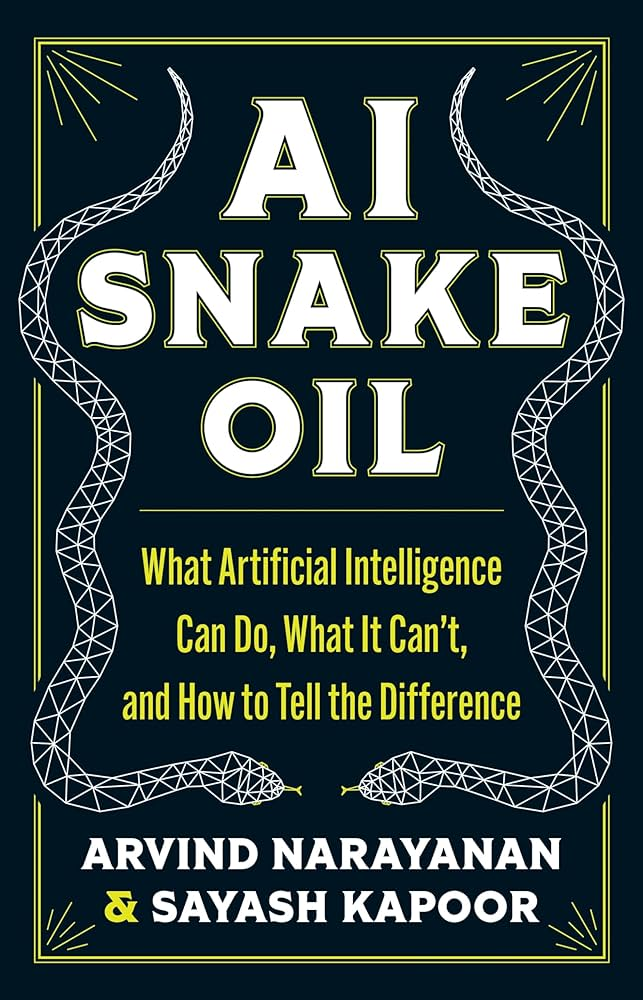
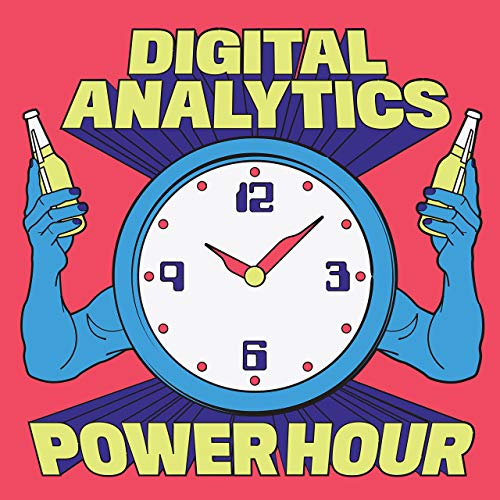

```{css, echo=FALSE} 
@media print { # print out incremental slides; see https://stackoverflow.com/questions/56373198/get-xaringan-incremental-animations-to-print-to-pdf/56374619#56374619
  .has-continuation {
    display: block !important;
  }
}
```

```{r setup, include=FALSE}
# figures formatting setup
options(htmltools.dir.version = FALSE)
library(knitr)
opts_chunk$set(
  prompt = T,
  fig.align="center", #fig.width=6, fig.height=4.5, 
  # out.width="748px", #out.length="520.75px",
  dpi=300, #fig.path='Figs/',
  cache=T, #echo=F, warning=F, message=F
  engine.opts = list(bash = "-l")
  )

## Next hook based on this SO answer: https://stackoverflow.com/a/39025054
knit_hooks$set(
  prompt = function(before, options, envir) {
    options(
      prompt = if (options$engine %in% c('sh','bash')) '$ ' else 'R> ',
      continue = if (options$engine %in% c('sh','bash')) '$ ' else '+ '
      )
})

library(tidyverse)
library(hrbrthemes)
library(fontawesome)
```


# Table of contents

</br></br>

1. [Willkommen!](#welcome)

2. [Was ist Data Science?](#whatisdatascience)

3. [(Data) Science für public policy](#science)

4. [Ziele für diesen Workshop](#goals)


---
class: inverse, center, middle
name: welcome

# Willkommen!
<html><div style='float:left'></div><hr color='#EB811B' size=1px style="width:1000px; margin:auto;"/></html>


---
# Vorstellungen

<br>

### Über Mich

`r fa('address-book')` Ich bin [Simon Munzert](https://simonmunzert.github.io/) [si’mən munsɜrt], oder Simon [saɪmən].

`r fa('envelope')` [munzert@hertie-school.org](mailto:munzert@hertie-school.org)

`r fa('graduation-cap')` Professor für Data Science und Public Policy | Direktor des Data Science Labs

<br>

--

### Über Sie

Wie heißen Sie und was ist Ihre Position?

Welche Erfahrungen haben Sie mit Datenwissenschaft und Statistik gemacht?

Haben Sie in Ihrer Position Berührungspunkte mit quantitativer Evidenz?


---

# Workshop etiquette

.pull-left-wide[
<br>

- Wir haben viel gemeinsam vor. Ich habe eine Menge Material mitgebracht, aber letztlich müssen Sie **signalisieren, wo Ihre Interessen und Bedürfnisse liegen**. Ich bin gerne bereit, Themen zu vertiefen, abzuschweifen oder die Aufmerksamkeit auf andere Themen und Beispiele zu lenken (solange sie sich in meiner Komfortzone befinden).

- Natürlich bin ich alles andere als ein Experte für Ihre individuelle Behörde oder Ihre aktuellen Themen. Für eine fundierte, evidenzbasierte Argumentation in Bezug auf die Politik ist Fachwissen der Schlüssel und ist explizit Teil vieler der datenbasierten Werkzeuge und Methoden, die wir diskutieren werden. Bitte **bringen Sie Ihr eigenes Wissen und Ihre Erfahrung mit**.

- Bitte nutzen Sie die Gelegenheit, **jederzeit Fragen zu stellen**. Einige der Themen könnten Sie aus Ihrer Komfortzone herausführen. Aber es gibt keine schlechten Fragen, also stellen Sie sie bitte.


]

.pull-right-small-center[
<div align="center">
<br><br>

</div>
]


---
class: inverse, center, middle
name: whatisdatascience

# Was ist Data Science?
<html><div style='float:left'></div><hr color='#EB811B' size=1px style="width:1000px; margin:auto;"/></html>

---
# Was ist Data Science?

.pull-left[
## Was ist Data Science?

> "Data Science ist ein interdisziplinäres Wissenschaftsfeld, welches wissenschaftlich fundierte Methoden, Prozesse, Algorithmen und Systeme zur Extraktion von Erkenntnissen, Mustern und Schlüssen sowohl aus strukturierten als auch unstrukturierten Daten ermöglicht." - [Wikipedia](https://de.wikipedia.org/wiki/Data_Science)

> "Data Science ist ein Konzept, das Statistik, Datenanalyse, Informatik und die damit verbundenen Methoden vereint, um aktuelle Phänomene anhand von Daten zu verstehen und zu analysieren." - [Chikio Hayashi](https://www.springer.com/book/9784431702085)

Insgesamt gibt es **keinen Konsens** - es ist schließlich ein Modewort. Wir werden mit der Arbeitsdefinition von Conway fortfahren.
]

.pull-right[
## A working definition

<div align="center"><br>

</div>

`Source` [Drew Conway, 2010](https://drewconway.com/zia/2013/3/26/the-data-science-venn-diagram) (adapted)
]


---
# Arten von datengestützter Forschung und ihre Rolle für die Politik

.pull-left-small2[
## 1. Beschreibung
- Wie ist der Zustand der Welt?
- Was sind die Trends im Laufe der Zeit?
- Was sind die Unterschiede zwischen den Gruppen?

## Der Wert für die Politikgestaltung
- Im Zentrum des **Monitorings**
- „Wie viele Menschen konsumieren Fehlinformationen im Internet?“
- „Wie viele Menschen sind in einem bestimmten Bezirk arbeitslos?“
- „Wie ist die Einkommensverteilung in den verschiedenen Bildungssegmenten der Bevölkerung?“
]

--

.pull-left-small2[
## 2. Erklärung
- Welche Auswirkungen hat eine Maßnahme?
- Ist die Wirkung je nach Gruppe unterschiedlich?
- Was sind die Mechanismen hinter dieser Wirkung?

## Der Wert für die Politikgestaltung
- Im Mittelpunkt der **Evaluation**
- „Hat die Erhöhung des Mindestlohns zu einem Rückgang der Beschäftigung geführt?“
- „Wirkte sich die Kampagne bei verschiedenen Gruppen unterschiedlich auf die Verbreitung von Falschinformationen aus?“
- „Warum hat die Intervention nicht zu den erwarteten Ergebnissen geführt?“
]

--

.pull-left-small2[
## 3. Vorhersage
- Was ist der Weg eines Indikators?
- (Wann) werden zukünftige Ereignisse eintreten?
- Zu welcher Klasse gehört diese Beobachtung höchstwahrscheinlich?


## Der Wert für die Politikgestaltung
- Steht im Mittelpunkt der **Vorhersage**, aber auch der **Zielsetzung** und **Messung**.
- „Wird es Konflikte geben?“
- „Wie viele Menschen werden nächstes Jahr in einem bestimmten Bezirk arbeitslos sein?“
- „Welche Personengruppen werden am ehesten von einer Maßnahme betroffen sein?“
]


---
background-image: url("../pics/vintage-pipeline.jpeg")
background-size: contain
background-color: #000000

# Die Data Science Pipeline


---
# Die Data Science Pipeline

.pull-left[

**Vorbereitung**

- **Problemstellung** Vorhersage, Inferenz, Beschreibung
- **Design** Konzept erstellen, Datenerfassung aufsetzen
- **Datenerhebung** rekrutieren, sammeln, überwachen
]

---
# Die Data Science Pipeline

.pull-left[
**Vorbereitung**

- **Problemstellung** Vorhersage, Inferenz, Beschreibung
- **Design** Konzept erstellen, Datenerfassung aufsetzen
- **Datenerhebung** rekrutieren, sammeln, überwachen

**Datenverarbeitung**
]

.pull-right-center[
<br><br><br>
<div align="center">

</div>

`Source` [H. Wickham, M. Çetinkaya-Rundel, G. Gronemund: R for Data Science](https://r4ds.hadley.nz/)
]

---
# Die Data Science Pipeline

.pull-left[
**Vorbereitung**

- **Problemstellung** Vorhersage, Inferenz, Beschreibung
- **Design** Konzept erstellen, Datenerfassung aufsetzen
- **Datenerhebung** rekrutieren, sammeln, überwachen

**Datenverarbeitung**

   - **Aufbereiten**: importieren, bereinigen, manipulieren
]

.pull-right-center[
<br><br><br>
<div align="center">

</div>

`Source` [H. Wickham, M. Çetinkaya-Rundel, G. Gronemund: R for Data Science](https://r4ds.hadley.nz/)
]


---
# Die Data Science Pipeline

.pull-left[
**Vorbereitung**

- **Problemstellung** Vorhersage, Inferenz, Beschreibung
- **Design** Konzept erstellen, Datenerfassung aufsetzen
- **Datenerhebung** rekrutieren, sammeln, überwachen

**Datenverarbeitung**

   - **Aufbereiten**: importieren, bereinigen, manipulieren
   - **Explorieren**: visualisieren, beschreiben, entdecken
]

.pull-right-center[
<br><br><br>
<div align="center">

</div>

`Source` [H. Wickham, M. Çetinkaya-Rundel, G. Gronemund: R for Data Science](https://r4ds.hadley.nz/)
]


---
# Die Data Science Pipeline

.pull-left[
**Vorbereitung**

- **Problemstellung** Vorhersage, Inferenz, Beschreibung
- **Design** Konzept erstellen, Datenerfassung aufsetzen
- **Datenerhebung** rekrutieren, sammeln, überwachen

**Datenverarbeitung**

   - **Aufbereiten**: importieren, bereinigen, manipulieren
   - **Explorieren**: visualisieren, beschreiben, entdecken
   - **Modellieren**: erstellen, testen, inferieren, vorhersagen
]

.pull-right-center[
<br><br><br>
<div align="center">

</div>

`Source` [H. Wickham, M. Çetinkaya-Rundel, G. Gronemund: R for Data Science](https://r4ds.hadley.nz/)
]


---
# Die Data Science Pipeline

.pull-left[
**Vorbereitung**

- **Problemstellung** Vorhersage, Inferenz, Beschreibung
- **Design** Konzept erstellen, Datenerfassung aufsetzen
- **Datenerhebung** rekrutieren, sammeln, überwachen

**Datenverarbeitung**

   - **Aufbereiten**: importieren, bereinigen, manipulieren
   - **Explorieren**: visualisieren, beschreiben, entdecken
   - **Modellieren**: erstellen, testen, inferieren, vorhersagen

**Verbreitung**

  - **Kommunikation**: an die Öffentlichkeit, Medien, politische Entscheidungsträger
  - **Veröffentlichen**: Zeitschriften/Proceedings, Blogs, Software
  - **Produktivieren**: nutzbar, robust, skalierbar machen
]

.pull-right-center[
<br><br><br>
<div align="center">

</div>

`Source` [H. Wickham, M. Çetinkaya-Rundel, G. Gronemund: R for Data Science](https://r4ds.hadley.nz/)
]


---
# Die Data Science Pipeline

.pull-left[
**Vorbereitung**

- **Problemstellung** Vorhersage, Inferenz, Beschreibung
- **Design** Konzept erstellen, Datenerfassung aufsetzen
- **Datenerhebung** rekrutieren, sammeln, überwachen

**Datenverarbeitung**

   - **Aufbereiten**: importieren, bereinigen, manipulieren
   - **Explorieren**: visualisieren, beschreiben, entdecken
   - **Modellieren**: erstellen, testen, inferieren, vorhersagen

**Verbreitung**

  - **Kommunikation**: an die Öffentlichkeit, Medien, politische Entscheidungsträger
  - **Veröffentlichen**: Zeitschriften/Proceedings, Blogs, Software
  - **Produktivieren**: nutzbar, robust, skalierbar machen

**Meta-Fähigkeit: Programmierung**
]

.pull-right-center[
<br><br><br>
<div align="center">

</div>

`Source` [H. Wickham, M. Çetinkaya-Rundel, G. Gronemund: R for Data Science](https://r4ds.hadley.nz/)
]


---
class: inverse, center, middle
name: science

# (Data) Science für Public Policy

<html><div style='float:left'></div><hr color='#EB811B' size=1px style="width:1000px; margin:auto;"/></html>


---
background-image: url("../pics/pioneer-railway.jpg")
background-size: contain
background-color: #000000

# Einige Beispiele für politikrelevante datenwissenschaftliche Forschung


---
# Das MIT-Milliarden-Preise-Projekt

.pull-left[
<div align="center">

</div>
]

.pull-right[
<div align="center">

</div>
]

<br>
**Siehe auch:** [https://thebillionpricesproject.com/](https://thebillionpricesproject.com/) und [https://www.pricestats.com/](https://www.pricestats.com/)

---
# Das MIT-Milliarden-Preise-Projekt

.pull-left[
<div align="center">

</div>
]

.pull-right[
<div align="center">

</div>
]

<br>
**Siehe auch:** [https://thebillionpricesproject.com/](https://thebillionpricesproject.com/) und [https://www.pricestats.com/](https://www.pricestats.com/)


---
# Der COMPAS-Algorithmus zur Vorhersage der Rückfälligkeit von Straftätern

.pull-left[
## Hintergrund

- Correctional Offender Management Profiling for Alternative Sanctions (COMPAS) ist ein von Northpointe (jetzt Equivant) entwickeltes Entscheidungshilfeinstrument, das von US-Gerichten zur **Bewertung der Rückfallwahrscheinlichkeit** eingesetzt wird.
- Erstellt mehrere Skalen (Risiko der vorzeitigen Entlassung, allgemeine Rückfälligkeit, gewalttätige Rückfälligkeit) auf der Grundlage von Faktoren wie Alter, Vorstrafen und Drogenmissbrauch
- Der Algorithmus ist urheberrechtlich geschützt und seine inneren Abläufe sind nicht öffentlich.

<br><br><br>

`Source` [Leitfaden für Praktiker zum COMPAS Core](https://s3.documentcloud.org/documents/2840784/Practitioner-s-Guide-to-COMPAS-Core.pdf)
]

.pull-right[
<div align="center">


</div>
]


---
# Der COMPAS-Algorithmus zur Vorhersage der Rückfälligkeit von Straftätern

.pull-left[
## Die ProPublica und andere Untersuchungen

- Im Jahr 2016 veröffentlichte ProPublica eine Untersuchung, die zeigte, dass COMPAS **voreingenommen gegenüber Afroamerikanern** war
- **Voreingenommenheit:** Der Algorithmus sagte bei Afroamerikanern mit höherer Wahrscheinlichkeit falsch voraus, dass Angeklagte wieder straffällig werden würden.
- **Genauigkeit:** Nur 20 % der Personen, denen Gewaltverbrechen vorhergesagt wurden, wurden tatsächlich straffällig (in einer späteren Studie wurde der Wert auf 65 % geschätzt, was immer noch schlechter ist als eine Gruppe von Menschen mit wenig Fachwissen)
<br><br><br><br><br>
`Source` [ProPublica 2016](https://www.propublica.org/article/how-we-analyzed-the-compas-recidivism-algorithm)
]

.pull-right[
<div align="center">

</div>
]


---
# Der COMPAS-Algorithmus zur Vorhersage der Rückfälligkeit von Straftätern

.pull-left[
## Die ProPublica und andere Untersuchungen

- Im Jahr 2016 veröffentlichte ProPublica eine Untersuchung, die zeigte, dass COMPAS **voreingenommen gegenüber Afroamerikanern** war
- **Voreingenommenheit:** Der Algorithmus sagte bei Afroamerikanern mit höherer Wahrscheinlichkeit falsch voraus, dass Angeklagte wieder straffällig werden würden.
- **Genauigkeit:** Nur 20 % der Personen, denen Gewaltverbrechen vorhergesagt wurden, wurden tatsächlich straffällig (in einer späteren Studie wurde der Wert auf 65 % geschätzt, was immer noch schlechter ist als eine Gruppe von Menschen mit wenig Fachwissen)

<br><br><br><br>

`Source` [Dressel and Fair, 2018, Science Advances](https://www.science.org/doi/epdf/10.1126/sciadv.aao5580)
]

.pull-right[
<div align="center">


</div>
]


---
# The Meta US 2020 Wahlstudie

.pull-left-center[
<div align="center">

<br>

</div>
]

.pull-right-center[
<div align="center">

<br>

</div>
]

---
# The Meta US 2020 Wahlstudie

.pull-left[
<br><br><br><br><br><br><br><br><br><br><br><br><br><br><br><br>
`Source` [Guess et al. 2023, Science](https://www.science.org/doi/epdf/10.1126/science.abp9364)
]

.pull-right[
<div align="center">

</div>
]


---
# The Meta US 2020 Wahlstudie

.pull-left-small[
<br><br><br><br><br><br><br><br><br><br><br><br><br><br><br><br>
`Source` [Guess et al. 2023, Science](https://www.science.org/doi/epdf/10.1126/science.abp9364)
]

.pull-right-wide[
<div align="center">

</div>
]


---
background-image: url("../pics/eiffel_tower_under_construction_11-950906312.jpg")
background-size: contain
background-color: #000000

# Förderung von guter Data Science für gute Public Policy


---
# Vertrauen in Wissenschaft

.pull-center[
<div align="center">
<br>


</div>
`Quelle` [Pew 2020](https://www.pewresearch.org/science/2020/09/29/science-and-scientists-held-in-high-esteem-across-global-publics/)
]


---
# Vertrauen in Wissenschaft

.pull-center[
<div align="center">
<br>


</div>
`Source` [Cologna et al. 2024](https://osf.io/preprints/osf/6ay7s)
]


---
# Vertrauen in Wissenschaft

.pull-center[
<div align="center">
<br>

</div>
`Quelle` [Cologna et al. 2024](https://osf.io/preprints/osf/6ay7s)
]


---
# Vertrauen in Wissenschaft

.pull-left[
<div align="center">
<br>



</div>
]

.pull-left[
<div align="center">
<br>



</div>
]

---
# Vertrauen in Data Science?

.pull-left[
<div align="center">
<br><br><br>


</div>
]

.pull-left[
<div align="center">
<br><br><br>


</div>
]


---
# Die Replicationskrise

.pull-left-wide2[
### Worum geht es bei der Krise?
- Die Feststellung, dass sich viele wissenschaftliche Studien nur schwer oder gar nicht reproduzieren lassen.
- Reproduzierbarkeit ist ein Eckpfeiler der Wissenschaft als Unternehmen der Wissensgenerierung → schlecht.


### Faktoren, die die Reproduktionskrise anheizen
- Einzelne, isolierte Forscher, die sich auf kleine Stichproben beschränken
- Falsche Anreize in der Wissenschaft
- Keine Vorabregistrierung der zu prüfenden Hypothesen
- Post-hoc-Auswahl der Hypothesen mit den besten P-Werten
- Nur P < .05 erforderlich
- Keine Replikation
- Keine Datenveröffentlichung
<br>
`Quelle` [Ioannidis 2005/PLOS Medicine](10.1371/journal.pmed.0020124)
]

.pull-right-small2[
<div align="center">

</div>
]


---

class: inverse, center, middle
name: goals

# Ziele dieses Workshops
<html><div style='float:left'></div><hr color='#EB811B' size=1px style="width:1000px; margin:auto;"/></html>


---
# Datenbasierte Argumentation für politische Entscheidungen

.pull-left-wide[
## 1. Hartes Nachdenken über Kausalität

- Erarbeiten Sie Erwartungen, die überprüfbare Aussagen zu den Auswirkungen implizieren.
- Bevorzugen Sie Designs, die helfen, kausale Effekte zu isolieren.
- Achten Sie auf **interne Validität**.

## 2. Messen Sie die politischen Optionen und Ergebnisse, über die Sie etwas erfahren möchten

- Finden Sie gute empirische Darstellungen der Konzepte, die Sie interessieren.
- Beobachten und/oder manipulieren Sie klug.
- Achten Sie auf die **Validität der Messung**.

## 3. Ziehen Sie Schlussfolgerungen über die reale Welt

- Verallgemeinern Sie mit Bedacht.
- Übertreiben Sie nicht und interpretieren Sie Ihre Ergebnisse nicht falsch.
- Berücksichtigen Sie Unsicherheiten.
- Achten Sie auf **externe Gültigkeit und statistische Aussagekraft**.
]

.pull-right-small[
<div align="center">
<br><br>

</div>
]


---
# Lernziele für diesen Workshop

<br> 

<style type="text/css">
.tg  {border-collapse:collapse;border-color:#ccc;border-spacing:0;}
.tg td{background-color:#fff;border-color:#ccc;border-style:solid;border-width:1px;color:#333;
  font-family:Arial, sans-serif;font-size:14px;overflow:hidden;padding:10px 5px;word-break:normal;}
.tg th{background-color:#f0f0f0;border-color:#ccc;border-style:solid;border-width:1px;color:#333;
  font-family:Arial, sans-serif;font-size:14px;font-weight:normal;overflow:hidden;padding:10px 5px;word-break:normal;}
.tg .tg-baqh{text-align:center;vertical-align:top}
.tg .tg-if4e{background-color:#f9f9f9;border-color:inherit;font-weight:bold;text-align:left;vertical-align:top}
.tg .tg-c3ow{border-color:inherit;text-align:center;vertical-align:top}
.tg .tg-0lax{text-align:left;vertical-align:top}
.tg .tg-btxf{background-color:#f9f9f9;border-color:inherit;text-align:left;vertical-align:top}
.tg .tg-zwlc{background-color:#f9f9f9;border-color:inherit;font-weight:bold;text-align:center;vertical-align:top}
.tg .tg-fymr{border-color:inherit;font-weight:bold;text-align:left;vertical-align:top}
.tg .tg-abip{background-color:#f9f9f9;border-color:inherit;text-align:center;vertical-align:top}
</style>
<table class="tg">
<thead>
  <tr>
    <th class="tg-0lax"></th>
    <th class="tg-baqh" colspan="6"><span style="font-weight:bold">Data science literacy</span></th>
  </tr>
</thead>
<tbody>
  <tr>
    <td class="tg-btxf"><span style="font-weight:bold">Day</span></td>
    <td class="tg-zwlc">Statistical literacy</td>
    <td class="tg-zwlc">Causal reasoning</td>
    <td class="tg-zwlc">Data literacy</td>
    <td class="tg-zwlc">AI literacy</td>
    <td class="tg-zwlc">Evidence consumption</td>
    <td class="tg-zwlc">Ethical reasoning</td>
  </tr>
  <tr>
    <td class="tg-fymr">1 - Fundamental data and statistical literacy</td>
    <td class="tg-c3ow">✅</td>
    <td class="tg-c3ow">✅</td>
    <td class="tg-c3ow">✅</td>
    <td class="tg-c3ow"></td>
    <td class="tg-c3ow">✅</td>
    <td class="tg-c3ow"></td>
  </tr>
  <tr>
    <td class="tg-if4e">2 - Policy evaluation and impact assessment</td>
    <td class="tg-abip">✅</td>
    <td class="tg-abip">✅</td>
    <td class="tg-abip"></td>
    <td class="tg-abip"></td>
    <td class="tg-abip">✅</td>
    <td class="tg-abip"></td>
  </tr>
  <tr>
    <td class="tg-fymr">3 - AI and big data for policy-making</td>
    <td class="tg-c3ow"></td>
    <td class="tg-c3ow"></td>
    <td class="tg-c3ow">✅</td>
    <td class="tg-c3ow">✅</td>
    <td class="tg-c3ow"></td>
    <td class="tg-c3ow">✅</td>
  </tr>
  <tr>
    <td class="tg-if4e">4 - Informed consumption of evidence</td>
    <td class="tg-abip">✅</td>
    <td class="tg-abip"></td>
    <td class="tg-abip"></td>
    <td class="tg-abip"></td>
    <td class="tg-abip">✅</td>
    <td class="tg-abip"></td>
  </tr>
  <tr>
    <td class="tg-fymr">5 - Data visualization and communication</td>
    <td class="tg-c3ow"></td>
    <td class="tg-c3ow"></td>
    <td class="tg-c3ow">✅</td>
    <td class="tg-c3ow"></td>
    <td class="tg-c3ow">✅</td>
    <td class="tg-c3ow"></td>
  </tr>
  <tr>
    <td class="tg-if4e">6 - Data management and ethics</td>
    <td class="tg-abip"></td>
    <td class="tg-abip"></td>
    <td class="tg-abip">✅</td>
    <td class="tg-abip">✅</td>
    <td class="tg-abip"></td>
    <td class="tg-abip">✅</td>
  </tr>
</tbody>
</table>


---
# Schlechte Evidenz anprangern, wenn man sie sieht

.pull-left-small[

## 1. Lernen Sie, sich nicht täuschen zu lassen von 

- große Daten
- Datenmüll
- "Schrott-Modelle"
- seltsame Beispiele
- Behauptung der Allgemeingültigkeit
- statistische Signifikanz
- unplausibel große Effektgrößen
- hochpräzise Vorhersagen
- überangepasste Modelle (eng.: "overfitted")


## 2. Effektives und effizientes Verarbeiten politikrelevanter Erkenntnisse

## 3. Elemente der Datenwissenschaft auf die Politikgestaltung anwenden
]

.pull-right-wide[
<br>
<div align="center">
 

</br>


</br>


</div>
]


---
# Was wir nicht behandeln werden

.pull-left-small2[
## Programmierung
- Kenntnisse in Python, R, SQL usw. sind für die Datenwissenschaft unerlässlich
- Die Lernkurve ist steil und erfordert viel Übung
- Wir gewähren gerne einen Blick hinter die Kulissen, wenn dies von Interesse ist, und stellen zusätzliche Ressourcen zur Verfügung
<br><br><br>

<div align="center">
 
</div>
]

.pull-left-small2[
## Aktive Modellierung
- Die Entwicklung von Designs und Modellen - erklärend und prädiktiv - erfordert mehr theoretisches und praktisches Wissen, als wir in diesem Workshop abdecken können.
- Die Konzentration auf die Grundsätze der statistischen und kausalen Argumentation sollte ausreichen, um Entwürfe und Modelle kritisch zu beurteilen.
<br><br>

<div align="center">
 
</div>
]

.pull-right-small2[
## Fortgeschrittenes Maschinelles Lernen, NLP
- ML, DL, NLP sind Technologien, die viele der spannendsten Anwendungen der Datenwissenschaft vorantreiben.
- Um zu verstehen, was unter der Haube passiert, ist eine solide Grundlage in Mathematik und Statistik erforderlich.
- Wir werden uns auf die grundlegenden Elemente der ML-basierten Forschung konzentrieren.
<br><br><br>

<div align="center">
 
</div>
]


---
# Weiterführende Literatur

<div align="center">




<br>



</div>


---
# Weiterführende Podcasts

<div align="center">
<br><br><br>


<br>





</div>


---
# Material zum Ausbildungsprogramm

.pull-left[
## Besuchen Sie die Website mit Materialien unter

<div align="center">
<br><br>

</div>
]

.pull-right[
<div align="center">
<br><br><br>

</div>

]


