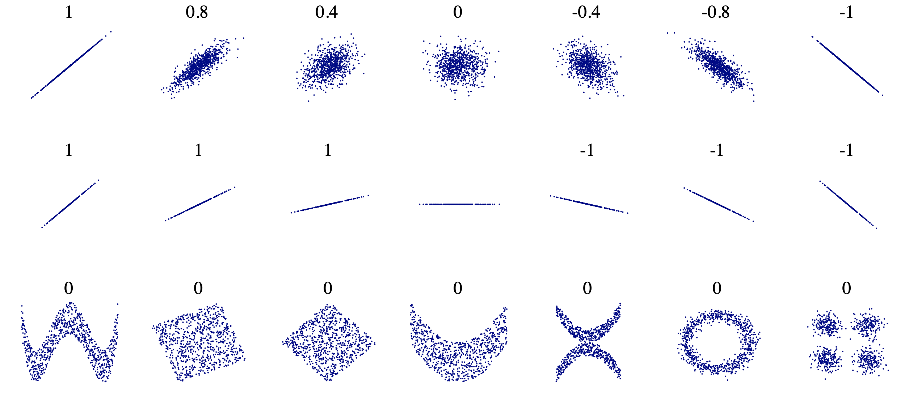

```{css, echo=FALSE} 
@media print { # print out incremental slides; see https://stackoverflow.com/questions/56373198/get-xaringan-incremental-animations-to-print-to-pdf/56374619#56374619
  .has-continuation {
    display: block !important;
  }
}
```

```{r setup, include=FALSE}
# figures formatting setup
options(htmltools.dir.version = FALSE)
library(knitr)
opts_chunk$set(
  prompt = T,
  fig.align="center", #fig.width=6, fig.height=4.5, 
  # out.width="748px", #out.length="520.75px",
  dpi=300, #fig.path='Figs/',
  cache=T, #echo=F, warning=F, message=F
  engine.opts = list(bash = "-l")
  )

## Next hook based on this SO answer: https://stackoverflow.com/a/39025054
knit_hooks$set(
  prompt = function(before, options, envir) {
    options(
      prompt = if (options$engine %in% c('sh','bash')) '$ ' else 'R> ',
      continue = if (options$engine %in% c('sh','bash')) '$ ' else '+ '
      )
})

library(tidyverse)
library(hrbrthemes)
library(fontawesome)
```


# Inhaltsverzeichnis

<br><br>

1. [Schlechte Stichproben: Repräsentativität liegt im Auge des Betrachters](#sampling)

2. [Schlechte Analytik: Signifikanz ist nicht alles, was zählt](#analytics)

3. [Schlechte Schlussfolgerung: Korrelation impliziert keine Kausalität](#inference)

---
class: inverse, center, middle
name: correlation

# Schlechte Stichproben: Repräsentativität liegt im Auge des Betrachters
<html><div style='float:left'></div><hr color='#EB811B' size=1px style="width:1000px; margin:auto;"/></html>


---
# Getäuscht durch „Repräsentativität“

<div align="center">

</div>

`Source` [Robin Andrews, IFLScience](https://www.iflscience.com/editors-blog/survey-finds-most-americans-think-that-they-have-above-average-intelligence/)


---
# Getäuscht durch „Repräsentativität“

<div align="center">

</div>

`Source` [Maxime Schlee, Politico](https://www.politico.eu/article/80-percent-of-eu-citizens-want-to-scrap-daylight-savings-report-summertime-directive/)


---
# Stichproben und Repräsentativität

.pull-left[
## Eine volkstümliche Definition von Repräsentativität

Eine Stichprobe (oder Daten im Allgemeinen) ist „repräsentativ“, wenn **die aus der Stichprobe gezogenen Schlüsse verallgemeinert werden können** für die Grundgesamtheit von Interesse.
]

.pull-right[
## Eine formalere Definition

Eine Stichprobe ist repräsentativ, wenn sie so gezogen wird, dass sie **statistisch nicht von der interessierenden Grundgesamtheit** unterscheidbar ist.
]

<div align="center">

</div>


---
# Das Problem mit dem Begriff „Repräsentativität“

## Warum „Repräsentativität“ ein problematischer Begriff ist

1. Ob eine Stichprobe repräsentativ ist, hängt von Ihrem Interesse ab.
2. Man kann eine Stichprobe nicht a priori als „repräsentativ“ bezeichnen. 
3. Die Beurteilung der Repräsentativität einer Stichprobe erfordert starke Annahmen über Ihr Wissen über die Grundgesamtheit und Ihre Messungen der Merkmale, die „repräsentativ“ sein sollten.

---
# Gesamtfehler der Umfrage

.pull-left[
## Inferenz in der Umfrageforschung

- Etwas über die Verteilung von Merkmalen in einer Grundgesamtheit erfahren
- Sammeln von Informationen aus einer Teilmenge der Grundgesamtheit

## Zwei Arten von Fehlern

- **Messfehler**: was man misst, ist nicht das, was man messen will
- Fehler der **Repräsentation**: Die Gruppe, die Sie beobachten, ist nicht verallgemeinerbar auf die interessierende Population
]

.pull-right[
## Gesamtfehler der Umfrage Framework

<div align="center">
<br>

</div>

`Source` [Groves et al. 2009, Survey Methodology](https://books.google.de/books?hl=de&lr=&id=HXoSpXvo3s4C)
]


---
# Mess- und Stichprobenfehler in freier Wildbahn

.pull-left[
## Überrepräsentation und falsche Angaben in Wahlumfragen

- Die Zahlen aus Umfragen nach der Wahl überschätzen die Wahlbeteiligung oft erheblich. 
- Zwei unterschiedliche Phänomene sind für diese Diskrepanz verantwortlich:
    1. Überrepräsentation der tatsächlichen Wähler
    2. Falsche Angaben zur Wahlbeteiligung durch Nichtwähler unter den Umfrageteilnehmern. 
- Studien zur Validierung der Wahlbeteiligung helfen, das Problem auf individueller Ebene zu identifizieren.
- Eine Verzerrung der Wahlbeteiligung kann sich auch auf Analysen nachgelagerter Variablen (z.B. Wahlverhalten) auswirken.
]

.pull-right[
<div align="center">
<br>

</div>

`Source` [Selb and Munzert 2013, Electoral Studies](https://kops.uni-konstanz.de/server/api/core/bitstreams/e755783d-acee-4592-a666-1562fc912906/content)
]

---
# Schlechte Stichproben: gelernte Lektionen


.pull-left[
## Was bedeutet das für Sie?

- Nehmen Sie die angegebene „Repräsentativität“ nicht für bare Münze.
- Der Stichprobenumfang allein garantiert keine Repräsentativität.
- Lassen Sie sich nicht von „großen Datenmengen“ täuschen (sie sind standardmäßig nicht repräsentativ).
- Lassen Sie sich nicht von „Zufallsstichproben“ täuschen (sie sind standardmäßig nicht repräsentativ).
- Wahrscheinlichkeitsstichproben sind kein Allheilmittel, da Menschen immer noch eine Selbstselektion in/aus Stichproben vornehmen.
- Schlechte Stichproben sind nicht auf Erhebungen beschränkt (denken Sie z.B. an Daten aus sozialen Medien, die Auswahl von Fällen für eine medizinische Studie oder die Auswahl von Ländern für eine politische Studie).
]

.pull-right[
## Suchen Sie stattdessen nach den folgenden Punkten: 

1. **Transparenz** über das Stichprobenverfahren.
2. **Einschätzung** der Repräsentativität der Stichprobe.
3. **Validierung** der Stichprobe anhand externer Benchmarks.
4. **Gesunder Menschenverstand** (ist es sinnvoll, den Repräsentanten anzurufen?)
]


---
# Diskussion

.pull-left[

## Eckpunkte für die Diskussion

1. Zu welchem Zeitpunkt des Politikzyklus könnte welche Art der Konsultation sinnvoll sein?
2. Welche Vor- und Nachteile haben die verschiedenen Konsultationsarten für die Beobachtung und Bewertung?

<div align="center">

</div>

`Source` Policy Planning, Monitoring and Evaluation Handbook, Government of Georgia
]

.pull-right[
<div align="center">

</div>

`Source` Annex 11: Guideline for Public Consultations, Government of Georgia
]


---
class: inverse, center, middle
name: analytics

# Schlechte Analytik: Signifikanz ist nicht alles, was zählt
<html><div style='float:left'></div><hr color='#EB811B' size=1px style="width:1000px; margin:auto;"/></html>


---
# Zurück zu statistischer Signifikanz

.pull-left[
## Statistische Signifikanz in der Praxis
- Konventionell sollten Fehler vom Typ I um jeden Preis vermieden werden.
- Ein Ergebnis gilt als statistisch signifikant, wenn es sehr unwahrscheinlich ist, dass es unter einer wahren Nullhypothese aufgetreten wäre.
- Ein Signifikanzniveau $\alpha$ gibt die Wahrscheinlichkeit eines Fehlers vom Typ I an. Üblicherweise wird es auf 5% festgelegt.
]

--

.pull-right[
## Gewisse Probleme
- Nur weil ein Effekt signifikant ist, heißt das nicht, dass er substanziell bedeutsam (groß) ist.
- Es gibt einen Anreiz für Forscher, statistisch signifikante Ergebnisse zu produzieren $\rightarrow$ "publication bias"
- Statistische Signifikanz ist (auch) eine Funktion der Stichprobengröße. Es ist **trivial, mit großen Daten signifikante Ergebnisse zu erzielen**.
- Leider ist es auch oft **trivial, mit kleinen Daten signifikante Ergebnisse zu erzielen**, wenn man in Bezug auf seine Hypothesen flexibel ist.
]

---
# Lassen Sie sich nicht von übertriebenen Ausdrücken der Signifikanz täuschen.

> „Die folgende Liste stammt aus begutachteten Zeitschriftenartikeln, in denen (a) die Autoren sich selbst den Schwellenwert von 0,05 für die Signifikanz gesetzt haben, (b) diesen Schwellenwert für p nicht erreicht haben und (c) ihn so beschrieben haben, dass er interessanter erscheint.“ [Matthew Hankins, Probable Error](https://goo.gl/iUGz7a)
<br>

> *(knapp) nicht statistisch signifikant (p=0,052), ein kaum nachweisbarer statistisch signifikanter Unterschied (p=0,073), ein grenzwertig signifikanter Trend (p=0,09), ein gewisser Trend zur Signifikanz (p=0,08), eine klare Tendenz zur Signifikanz (p=0,052), ein klarer Trend (p<0. 09), ein klarer, starker Trend (p=0,09), ..., sehr knapp an der Grenze der statistischen Signifikanz (p=0,051), sehr knapp an der Signifikanz vorbei (p<0,06), sehr knapp signifikant (p=0,0656), sehr knapp nicht signifikant (p=0,10), sehr knapp signifikant (p<0,1), 
praktisch signifikant (p=0,059), schwach signifikant (p>0,10), abgeschwächt signifikant (p=0,06), schwach nicht signifikant (p=0,07), schwach signifikant (p=0,11), schwach statistisch signifikant (p=0,0557), nahezu signifikant (p=0,11)*

---
# Daten-Fishing und p-Hacking

.pull-left-wide2[
## Das Problem

Die Dominanz der statistischen Signifikanz als Entscheidungskriterium bei wissenschaftlichen Veröffentlichungen macht die p-Werte zu einem wichtigen Zielkriterium bei der statistischen Analyse. Kleine p-Werte werden häufiger berichtet, als man erwarten würde!

## Die Symptome

- **Daten-Fishing**: Testen vieler Hypothesen bis zur Signifikanz
- **p-Hacking**: Optimieren der Analyse (z.B. Hinzufügen/Entfernen von Kontrollen, Transformieren von Variablen, Ändern von Modellen) bis zur Signifikanz
- **HARKing**: **H**ypothesizing **a**fter the **r**esults are **k**nown (Hypothesenbildung nachdem die Ergebnisse bekannt sind) 
## Das Gegenmittel?

Sonderausgabe in [The American Statistician, 2019](https://www.tandfonline.com/toc/utas20/73/sup1): *"Statistical Inference in the 21st Century: A World Beyond p < 0.05"*
]

.pull-right-small2[
<div align="center">
<div class=font50><b>Figure:</b> Distribution of reported p-values (within [.001–.15]).</div>
<br>
</div>

> "Der Datensatz besteht aus über 135'000 Datensätzen. Die Daten wurden mittels computergestützter Suche aus (...) fünf Journals of Experimental Psychology im Zeitraum von Januar 1996 bis März 2008 gewonnen." 

`Source` [Krawczyk, M., 2015, PLOS ONE](https://journals.plos.org/plosone/article?id=10.1371/journal.pone.0127872)
]


---
# Daten-Fishing and p-Hacking: Übung

.pull-left[
## Übung
- Schau dir [https://projects.fivethirtyeight.com/p-hacking/](https://projects.fivethirtyeight.com/p-hacking/) an.
- Verbringen Sie fünf Minuten damit, sich zu wissenschaftlichem Ruhm zu hacken
- Mehr Hintergrundinformationen [hier](https://fivethirtyeight.com/features/science-isnt-broken).

]

.pull-right[
<br>
<div align="center">

</div>
]


---
# Die Folgen der Vorregistrierung

.pull-left[
## Die Idee
- Vorregistrierung bedeutet, dass Sie Ihre Studie (Hypothesen, Methoden, Analysen) registrieren (z.B. indem Sie sie online stellen), bevor sie durchgeführt wird
- In den letzten Jahren hat sich die Forschungspraxis stark verändert; siehe das [Open Science Framework (OSF) Registry](https://osf.io/registries/osf/new) und das [American Economic Association (AEA) RCT Registry](https://docs.socialscienceregistry.org/)
## Warum das wichtig ist

> "17 von 30 Studien (57\%), die vor dem Jahr 2000 veröffentlicht wurden, zeigten einen signifikanten Nutzen der Intervention für das primäre Ergebnis im Vergleich zu nur 2 der 25 (8\%) Studien, die nach 2000 veröffentlicht wurden." (siehe Grafik)
]

.pull-right-center[
<div class=font50><b>Figure:</b> Relatives Risiko, einen Nutzen oder Schaden der Behandlung zu zeigen, nach Jahr der Veröffentlichung für große NHLBI-Studien zu Arzneimitteln und Nahrungsergänzungsmitteln.</div><br>

<div align="center">

</div>

`Source` [Kaplan et al. 2015; PLOS ONE](https://journals.plos.org/plosone/article?id=10.1371/journal.pone.0132382)
]


---
# Teststärke (statistical power)
.pull-left[
## Das Konzept
- Wir sind daran gewöhnt, uns vor falsch-positiven Ergebnissen (Signifikanztests!) zu schützen, aber auch falsch-negative Ergebnisse können schaden - insb., wenn die Durchführung einer Studie sehr kostspielig war
- Die statistische Aussagekraft ist die **Wahrscheinlichkeit, die Nullhypothese korrekt zurückzuweisen, wenn sie falsch ist**.
- Die Fähigkeit, Signal und Rauschen zu unterscheiden, wobei das Signal der interessierende Behandlungseffekt ist
- P(„Es gibt einen Effekt und ich sehe ihn“): Aussagekraft = 1 - Fehler vom Typ II
- Je höher die statistische Aussagekraft eines Experiments ist, desto geringer ist die Wahrscheinlichkeit eines Fehlers vom Typ II.
]

.pull-right[
<br>
<div align="center">

</div>
]

---
# Teststärke (statistical power)

.pull-left-wide2[
## Motivation
- Ist Ihre Stichprobe groß genug, um einen Effekt einer bestimmten Größe aufzudecken? Führen Sie eine Power-Analyse durch (idealerweise vor der Datenerhebung)!
- Bei der [Power-Analyse](https://egap.org/resource/10-things-to-know-about-statistical-power/) wird die Wahrscheinlichkeit ermittelt, mit der ein Effekt einer bestimmten Größe bei einem bestimmten Stichprobenumfang entdeckt wird.
- Wenn Sie es sich leisten können, passen Sie den Stichprobenumfang und/oder das Design auf der Grundlage Ihrer Power-Berechnungen an

## Berechnung
- Mehrere Teststärke-Formeln für verschiedene Versuchs- (und Beobachtungs-) Designs
- Die Formeln können umgestellt werden, um z.B. $N$ zu bestimmen.
- Es gibt viele handelsübliche Potenzrechner, z. B. [hier](https://egap.shinyapps.io/power-app/) (Erläuterung [hier](https://www.povertyactionlab.org/sites/default/files/research-resources/ExerciseC_PowerCalc_Participants.pdf))
- In der Praxis erfordert die Durchführung von Teststärke-Analysen mehr oder weniger starke Annahmen über die Effektgröße 
]

.pull-right-small2[
## Formeln

Teststärkeberechnung für zwei Gruppen Differenz-im-Mittelwert-Test mit gleichen Varianzen und Gruppengrößen:

$\text{power} = \Phi(\frac{|\mu_{t}-\mu_{c}|\sqrt{N}}{2\sigma}-\Phi^{-1}(1-\frac{\alpha}{2}))$

- $\Phi$ ist die CDF der Normalverteilung $\rightarrow$ Teststärke unter der Annahme, dass sie der Normalverteilung folgt
- $\mu_{t,c}$ ist das durchschnittliche Ergebnis in der Behandlungs-/Kontrollgruppe $\rightarrow$ Effekt
- $\sigma$ ist die Standardabweichung der Ergebnisse $\rightarrow$ Störanfälligkeit
- $\alpha$ ist das gewählte Signifikanzniveau, häufig 0,05 nach Konvention
- $N$ ist die Gesamtzahl der Probanden
]

---
# Teststärke Analyse: Beispiel

.pull-left[
## Beispiel
- Sie möchten einen Anstieg der Wahlbeteiligung um 5 % aufgrund einer neuen Kampagne feststellen
- Sie haben eine Stichprobe von 500 Wählern
- Gehen Sie von einer Standardabweichung der Wahlbeteiligung von 20% aus.
- Nehmen Sie ein Signifikanzniveau von 0,05 an.
- Wie hoch ist die Aussagekraft Ihrer Studie?
- Verwenden Sie z.B. [EGAP-Rechner](https://egap.shinyapps.io/power-app/)

## Berechnung
- $\mu_{t}-\mu_{c} = 0.05$
- $\sigma = 0.2$
- $N = 500$
- $\alpha = 0.05$
- Power = ?
]

.pull-right[
## Probability density function (PDF) vs. Cumulative density function (CDF)
<br>
<div align="center">

</div>
]


---
# Schlechte Analytik: gelernte Lektionen

.pull-left-wide[
## Checkliste

- **Prüfen Sie die Evidenz.** Ist sie wirklich statistisch signifikant?
- **Betrachten Sie die Theorie und die Evidenz.** Ist sie plausibel?
- **Schauen Sie sich das Design an.** Können Sie irgendwelche größeren Fehler entdecken?
- **Betrachten Sie die Effektgröße.** Ist sie aussagekräftig? Ist sie zu gut, um wahr zu sein?
- **Schauen Sie sich die Stichprobengröße an.** Ist sie angemessen groß? Ist die Studie gut getestet?
- **Prüfen Sie, ob die Studie vorregistriert wurde.** Erkennen Sie Ad-hoc-Hypothesen.
- **Vertrauen Sie keiner einzelnen Studie.** Achten Sie auf Meta-Analysen!
]

.pull-right-small[
<br>
<div align="center">

</div>
]


---

class: inverse, center, middle
name: inference

# Schlechte Inferenz: Korrelation impliziert keine Kausalität
<html><div style='float:left'></div><hr color='#EB811B' size=1px style="width:1000px; margin:auto;"/></html>

---
# Ein Klassiker

<div align="center">
<br>

</div>

`Source` [XKCD 552](https://xkcd.com/552/)


---
class: exercise, center

# Übung

<br><br>

# Raten Sie die Korrelationen!

<div align="center">

</div>


---
class: exercise, center

# Übung

<br><br>

# Raten Sie die Korrelationen!

<div align="center">

</div>


---
class: exercise, center

# Übung

<br><br>

# Raten Sie die Korrelationen!

<div align="center">

</div>

---
class: exercise, center

# Übung

<br><br>

# Raten Sie die Korrelationen!

<div align="center">

</div>

---
class: exercise, center

# Übung

<br><br>

# Raten Sie die Korrelationen!

<div align="center">

</div>

---
class: exercise, center

# Übung

<br><br>

# Raten Sie die Korrelationen!

<div align="center">

</div>


---
class: exercise, center

# Übung

<br><br>

# Raten Sie die Korrelationen!

<div align="center">

</div>

---
# Korrelationen besser erraten

## Siehe http://guessthecorrelation.com/

<br>
<div align="center">


</div>


---
# Die Mathematik der Korrelation, erklärt

.pull-left[
## Der Pearson-Korrelationskoeffizient

- Misst die **Stärke und Richtung** einer **linearen Beziehung** zwischen zwei Variablen
- Der Bereich reicht von -1 bis 1
- Formel zur Berechnung:
$r_{xy} = \frac{\text{covariation of X and Y}}{\text{separate variation of X and Y}} = \frac{Cov(x, y)}{s_x s_y} = \sum_i \frac{(x_i - \bar{x})(y_i - \bar{y})}{s_x s_y}$
 ]
 

.pull-right[
## Pearson's r ist...
- positiv, wenn die Variablen A und B gemeinsam steigen
- negativ, wenn A[B] steigt und B[A] sinkt
- 1, wenn A und B gemeinsam steigen
-1, wenn A steigt und B sinkt
- 0, wenn A und B nicht kovariieren
]

<div align="center">

</div>


---
# Korrelation bedeutet nicht gleich Kausalität

.pull-left[
## Korrelation

Zwei Variablen sind **korreliert**, wenn die Kenntnis des Wertes der einen Variablen Aufschluss über den wahrscheinlichen Wert der anderen gibt.

## Kausalität

Zwei Ereignisse sind **kausal miteinander verbunden**, wenn das Auftreten des einen Ereignisses eine Folge des Auftretens des anderen ist.

## Der kausale Trugschluss

Zwei Variablen, die miteinander korreliert sind, stehen nicht notwendigerweise in einer Ursache-Wirkungs-Beziehung.

- cum hoc ergo propter hoc („damit, also deswegen“)
- post hoc ergo propter hoc („nach diesem, also wegen diesem“)
]

.pull-right[

]


---
# Scheinkorrelationen

<div align="center">

</div>

`Source` [Tyler Vigen, http://tylervigen.com/spurious-correlations](http://tylervigen.com/spurious-correlations)

---
# Scheinkorrelationen

<div align="center">

</div>

`Source` [Tyler Vigen, http://tylervigen.com/spurious-correlations](http://tylervigen.com/spurious-correlations)


---
# Scheinkorrelationen

<div align="center">

</div>

`Source` [Tyler Vigen, http://tylervigen.com/spurious-correlations](http://tylervigen.com/spurious-correlations)


---
# Was bedeutet es also, wenn die Variablen A und B korreliert sind?
## Einige mögliche Erklärungen

- A verursacht B (direkte Kausalität)
- B verursacht A (umgekehrte Kausalität)
- A und B sind Folgen einer gemeinsamen Ursache (Confounding)
- A verursacht C, das B verursacht (Mediation)
- A und B verursachen beide C, das bedingt wird (collider bias)
- Es gibt keinen Zusammenhang zwischen A und B, die empirische Korrelation ist ein Zufall (Scheinkorelation)

## Wie kann man zwischen diesen unterscheiden?

- **Experimentelle Designs** (randomisierte kontrollierte Studien)
- **Natürliche Experimente** (Quasi-Experimente)
- **Observationsdaten** (sorgfältige Analyse von Störfaktoren und Kollisionen)
- **Gesunder Menschenverstand** (ist es sinnvoll, dass A Ursache für B ist?)
- **Rivalisierende Erklärungen** (können wir andere Erklärungen ausschließen?)


---
# Schlechte Inferenz: gelernte Lektionen

.pull-left[
## Was bedeutet das für Sie?

- Lassen Sie sich nicht von **hoher Korrelation oder großer Effektgröße** täuschen.
- Lassen Sie sich nicht von der **statistischen Signifikanz** täuschen.
- Lassen Sie sich nicht von **großer erklärter Varianz (R-Quadrat)** täuschen. 
]

.pull-right[
## Stellen Sie sich stattdessen die folgenden Fragen:

1. Ist es wirklich sinnvoll, dass A Ursache für B ist?
2. Gibt es Beweise, die andere Erklärungen ausschließen?
3. Stützen sich die Beweise auf einen sauberen Versuchsplan?
4. Beruhen die Beweise auf einem natürlichen Experiment mit einer überzeugenden Geschichte?
5. Wenn es keine (Quasi-)Experimente gibt, beruht der Nachweis auf einer sorgfältigen Analyse von Beobachtungsdaten, wobei plausible Störfaktoren und Kollider berücksichtigt werden?
]


