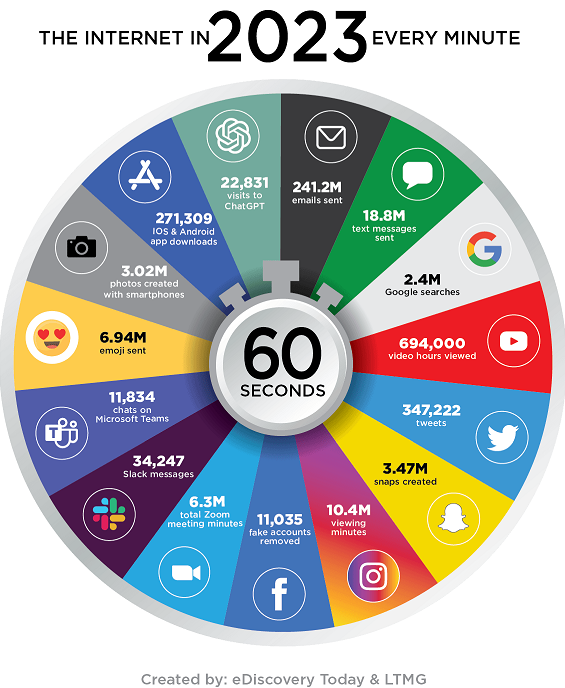
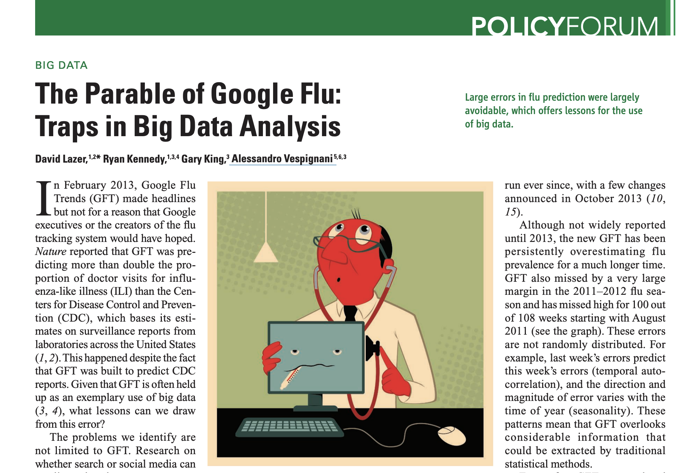

```{css, echo=FALSE} 
@media print { # print out incremental slides; see https://stackoverflow.com/questions/56373198/get-xaringan-incremental-animations-to-print-to-pdf/56374619#56374619
  .has-continuation {
    display: block !important;
  }
}
```

```{r setup, include=FALSE}
# figures formatting setup
options(htmltools.dir.version = FALSE)
library(knitr)
opts_chunk$set(
  prompt = T,
  fig.align="center", #fig.width=6, fig.height=4.5, 
  # out.width="748px", #out.length="520.75px",
  dpi=300, #fig.path='Figs/',
  cache=T, #echo=F, warning=F, message=F
  engine.opts = list(bash = "-l")
  )

## Next hook based on this SO answer: https://stackoverflow.com/a/39025054
knit_hooks$set(
  prompt = function(before, options, envir) {
    options(
      prompt = if (options$engine %in% c('sh','bash')) '$ ' else 'R> ',
      continue = if (options$engine %in% c('sh','bash')) '$ ' else '+ '
      )
})

library(tidyverse)
library(hrbrthemes)
library(fontawesome)
```


# Inhaltsverzeichnis

<br><br>
1. [Was ist Big Data?](#whatisbigdata)

2. [Das Big-Data-Paradoxon](#bigdataparadox)

3. [Garbage in, garbage out](#garbageingarbageout)

4. [Chancen von Big Data für das Gemeinwohl](#opportunities)


---
class: inverse, center, middle
name: whatisbigdata

# Was ist Big Data?
<html><div style='float:left'></div><hr color='#EB811B' size=1px style="width:1000px; margin:auto;"/></html>


---
# Was ist Big Data?

<div align="center">

</div>


---
# Massive Datenmengen um uns herum <sup>1</sup>

.pull-left-wide2[
<div align="center">

</div>

`Source` Reinsel et al., 2017, ["Data Age 2025"](https://www.seagate.com/files/www-content/our-story/trends/files/Seagate-WP-DataAge2025-March-2017.pdf)

.footnote[<div class="font80"><sup>1</sup>Nehmen Sie diese Zahlen nicht zu ernst. Sie sind sehr schwer zu messen, und die Zahlen, die Sie online finden, weichen manchmal um ein Vielfaches voneinander ab. Außerdem sind sie ein schwankendes Maß.</div>]
]

.pull-right-small2[

<div align="center">

</div>

`Source` [eDiscoveryToday, LTMG](https://ediscoverytoday.com/2023/04/20/2023-internet-minute-infographic-by-ediscovery-today-and-ltmg-ediscovery-trends/
)
]


---
# Das Zeitalter von Big Data - Big Trends

<br><br>

1. Ausbreitung von **vom Menschen erzeugten Daten** in großem Umfang, insbesondere im digitalen Bereich

2.  Verwendung von **neuen Datentypen**: Text, Video, digitale Spuren

3.  **Rechen- und Speicherkosten** sind drastisch gesunken

4.  Mainstreaming von **maschinellem Lernen** und **KI**-Technologien

5. (begrenzte) **Demokratisierung des Zugangs** zu großen Datenbeständen

6.  **Einführung von Berechnungsmethoden** in vielen Disziplinen

7.  **Verlagerung der Forschungsavantgarde** von der akademischen Welt zur Industrie


---
class: inverse, center, middle
name: bigdataparadox

# Das Big Data Paradox
<html><div style='float:left'></div><hr color='#EB811B' size=1px style="width:1000px; margin:auto;"/></html>


---
# Ein frühes Big Data Disaster

<div align="center">

</div>

---
# Wahlumfrage 1936 der Zeitschrift Literary Digest 

.pull-left[
## Hintergrund

- Die Wochenzeitschrift *Literary Digest* hatte die Ergebnisse aller Präsidentschaftswahlen zwischen 1920 und 1932 anhand von Umfragen korrekt vorhergesagt.
- Ihre Umfrage von 1936 unter 10 Millionen Wählern ergab, dass der republikanische Kandidat Alfred Landon der überwältigende Sieger sein würde.

## Nachwehen

- Die Umfrage war eine Katastrophe: Landon verlor erdrutschartig gegen Franklin D. Roosevelt, der 46 von 48 Bundesstaaten für sich entschied und 60,8% der Wählerstimmen erhielt.
- Das Ergebnis wurde von George Gallup mit einer Stichprobe von 50.000 Personen richtig vorhergesagt.
- Die Zeitschrift ging 1938 in Konkurs.
]

.pull-right[
<br>
<div align="center">

</div>
]


---
# Wahlumfrage 1936 der Zeitschrift Literary Digest

<div align="center">

</div>

---
# Wahlumfrage 1936 der Zeitschrift Literary Digest

.pull-left[
## Anatomie eines Debakels

1. **Stichprobenrahmen**: (1) eigene Leser, (2) registrierte Autobesitzer, (3) registrierte Telefonnutzer
2. **Datenerhebung**: Jeder bekam einen Musterstimmzettel zugeschickt und wurde gebeten, den markierten Stimmzettel zurückzugeben
3. **Rücklaufquote**: 2,4 Mio. von 10 Mio.

**Auswahlverzerrung** als Folge von **Erfassungsgrad** und **Non-Response-Verzerrung**: Überrepräsentation von wohlhabenderen Personen mit einer Präferenz für Landon

<br><br><br><br><br>
`Source` [Peverill Squire, 1988, Public Opinion Quarterly](https://www.jstor.org/stable/2749114)
]

.pull-right[
<div align="center">


</div>
]

---
# Nehmen Sie Umfragen mit einer Prise Skepsis

<div align="center">
<br><br><br><br>

</div>


---
# Ein modernes Big Data Umfrage-Desaster
 
.pull-left[
<div align="center">

</div>
]

.pull-right[
<div align="center"><br><br>

</div>
]


---
# Ein modernes Big Data Umfrage-Desaster

.pull-left-wide[
<div align="center"><br><br><br>

</div>
]

.pull-right-small[
<div align="center"><br><br>

</div>
]


---
# Das Big Data Paradox

.pull-left[
> „Wenn verzerrte Stichproben groß sind, sind sie doppelt irreführend: Sie erzeugen Konfidenzintervalle mit falschen Zentren und erheblich unterschätzten Breiten. Dies ist das **Big-Data-Paradox**: Je größer die Daten sind, desto sicherer täuschen wir uns selbst, wenn wir die Verzerrungen bei der Datenerhebung nicht berücksichtigen.“

<div align="right">Bradley et al. (2021), <i>Nature</i></div>

> „Die 'Größe' solcher Big Data (für Rückschlüsse auf die Population) sollte an der relativen Größe f = n/N der Stichprobe zur Population gemessen werden, nicht an der absoluten Größe n der Stichprobe.

<div align="right">Xiao-Li Meng (2018), <i>The Annals of Applied Statistics</i></div>

]

--

.pull-right[
## Korrektur endlicher Grundgesamtheiten zur Rettung?

- Die Intuition sagt uns, dass die Wahrscheinlichkeit eines Fehlers geringer sein sollte, wenn der Stichprobenumfang im Verhältnis zum Umfang der Grundgesamtheit groß ist.
- Das stimmt auch, aber der Zugewinn ist relativ langsam.
- Der endliche Populationskorrekturfaktor für den Standardfehler einer interessierenden Größe ist zum Beispiel gegeben durch $\sqrt{\frac{N-n}{N-1}}$. 

## Beispiel

- Wir führen eine Umfrage bei 100k Personen in einer Bevölkerung von 3,7 Mio. durch.
- Für $N=3.7m$ und $n=100k$ ist dies $\sqrt{0.973}$.
]

---
class: inverse, center, middle
name: garbageingarbageout

# Garbage in, Garbage out
<html><div style='float:left'></div><hr color='#EB811B' size=1px style="width:1000px; margin:auto;"/></html>


---
# Garbage in, Garbage out

.pull-left[
## Das GIGO Prinzip
- Die Qualität der Informationen, die aus einem Modell herauskommen (z.B. Vorhersagen), kann nicht besser sein als die Qualität der Informationen, die hineinkamen.
- Dieser Grundsatz ist vor allem im Zusammenhang mit Big Data von Bedeutung, wo die Datenqualität oft schlecht ist.
- Dies gilt insbesondere für das maschinelle Lernen, bei dem die Modelle sehr komplex und undurchsichtig sein können.
]

.pull-right[
<div align="center"><br><br>

</div>
]


---
# Google Grippe-Trends - der große Fehlschlag

<div align="center">

</div>

`Source` Ginsberg et al., 2009, [Nature](https://www.nature.com/articles/nature07634)

---
# Google Grippe-Trends - der große Fehlschlag

<div align="center">
<br>

</div>


---
# Google Grippe-Trends - der große Fehlschlag


.pull-left-wide2[
<div align="center">

</div>

`Source` Lazer et al., 2014, [Science](https://science.sciencemag.org/content/343/6176/1203)

]

.pull-right-small2[
<div align="center"><br>

</div>
]


---
# Erkennen von Straftaten mit Gesichtsbildern

<div align="center">

</div>


---
# Erkennen von Straftaten mit Gesichtsbildern

<div align="center">

</div>


---
# Erkennen von Straftaten mit Gesichtsbildern

<div align="center"><br>


</div>


---
# Garbage in, Garbage out: gelernte Lektionen

.pull-left[
1. **Messung** und **Auswahlfragen** sind bei der Big-Data-Analyse nach wie vor entscheidend

2. Trauen Sie **Messungen** nicht, die nicht **richtig validiert** wurden

3. Achten Sie darauf, was in ein Modell einfließt (der **Input**: Fälle, Variablen/Merkmale)

4. Achten Sie auf eine angemessene **Out-of-Sample-Validierung** von Modellen

5. Vorsicht bei **unkritischer Nutzung von Online-/Sozialen Medien** als Datenquelle
]

.pull-right-center[
<div align="center">

</div>
`Source` XKCD, [2295](https://xkcd.com/2295/), (explained [here](https://www.explainxkcd.com/wiki/index.php/2295:_Garbage_Math))
]


---
class: inverse, center, middle
name: opportunities

# Chancen von Big Data für das Gemeinwohl
<html><div style='float:left'></div><hr color='#EB811B' size=1px style="width:1000px; margin:auto;"/></html>


---
# Das Zeitalter von Big Data - das Zeitalter der Dystopie?

.pull-left[
<div align="center"><br><br>


</div>
]

.pull-right[
<div align="center">


</div>
]


---
# KI für eine individualisierte Gesundheitsversorgung

<div align="center"><br><br>


</div>

`More information` [Google Deepmind](https://deepmind.google/discover/blog/we-are-very-excited-to-announce-the-launch-of-deepmind-health/), [Data breach](https://www.bbc.com/news/technology-58761324)

---
# KI für eine individualisierte Gesundheitsversorgung

<div align="center">

</div>


---
# Klimawandel KI

.pull-left-small-center[
<div align="center"><br><br><br><br><br>

</div>

`Source` [Climate Change AI](https://www.climatechange.ai/)
]

.pull-right-wide-center[
<div align="center"><br><br><br><br>


</div>
]


---
# Klimawandel KI
<div align="center">


</div>

`Source` [Geraedts et al., 2024](https://iopscience.iop.org/article/10.1088/2515-7620/ad11ab/pdf)


---
# LLMs für effizientere Verwaltung?

<div align="center">


</div>


