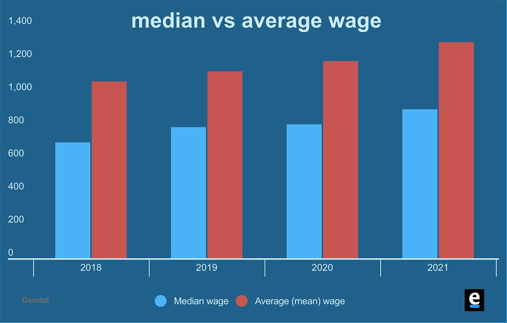
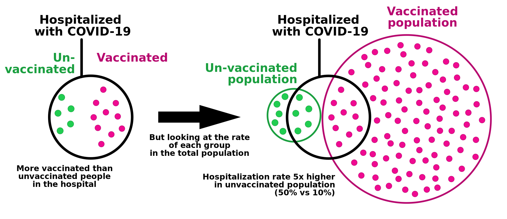
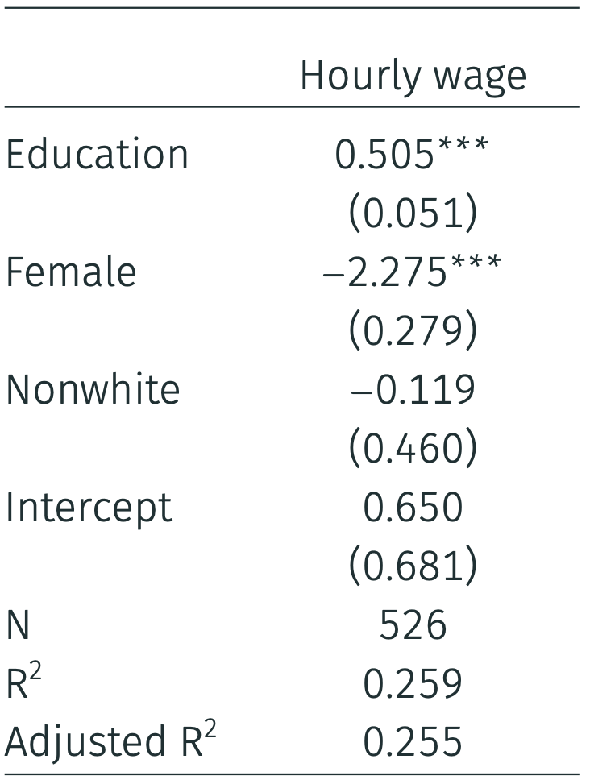
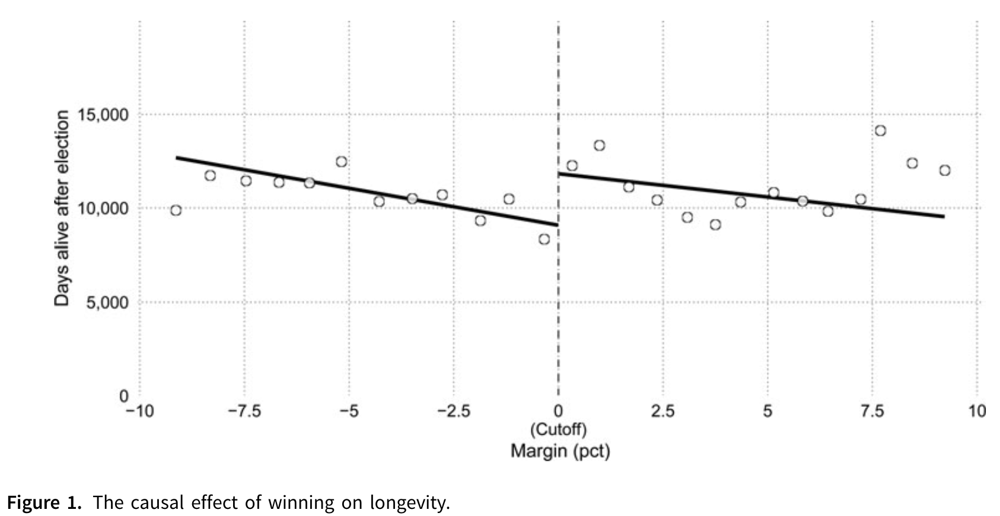

```{css, echo=FALSE} 
@media print { # print out incremental slides; see https://stackoverflow.com/questions/56373198/get-xaringan-incremental-animations-to-print-to-pdf/56374619#56374619
  .has-continuation {
    display: block !important;
  }
}
```

```{r setup, include=FALSE}
# figures formatting setup
options(htmltools.dir.version = FALSE)
library(knitr)
opts_chunk$set(
  prompt = T,
  fig.align="center", #fig.width=6, fig.height=4.5, 
  # out.width="748px", #out.length="520.75px",
  dpi=300, #fig.path='Figs/',
  cache=T, #echo=F, warning=F, message=F
  engine.opts = list(bash = "-l")
  )

## Next hook based on this SO answer: https://stackoverflow.com/a/39025054
knit_hooks$set(
  prompt = function(before, options, envir) {
    options(
      prompt = if (options$engine %in% c('sh','bash')) '$ ' else 'R> ',
      continue = if (options$engine %in% c('sh','bash')) '$ ' else '+ '
      )
})

library(tidyverse)
library(hrbrthemes)
library(fontawesome)
```


# Inhaltsverzeichnis

<br><br>

1. [Deskriptive Statistik verstehen](#descriptives)

2. [Wahrscheinlichkeit verstehen](#probability)

3. [Statistische Effekte verstehen](#effects)

4. [Statistische Signifikanz verstehen](#significance)

---
class: inverse, center, middle
name: descriptives

# Deskriptiven Statistik verstehen
<html><div style='float:left'></div><hr color='#EB811B' size=1px style="width:1000px; margin:auto;"/></html>


---
# Deskriptive vs. Inferenzstatistik

.pull-left[
## Descriptive Statistik
- Zusammenfassen und Beschreiben von Merkmalen einer Stichprobe oder Population
- Kann numerisch und visuell kommuniziert werden
- Unterschiedliche Skalen (Messniveaus) erfordern unterschiedliche deskriptive Statistiken
- Eine gute Beschreibung kann schwierig sein, wenn die Datenerfassung oder Messung komplex ist.
]

.pull-right[
## Inferenzstatistik
- Schlussfolgerungen über eine Grundgesamtheit auf der Grundlage einer Stichprobe
- Es können Rückschlüsse auf Mittelwerte, Proportionen, Beziehungen usw. gezogen werden
- Kann numerisch und visuell kommuniziert werden
- Gute Beschreibung ist die Grundlage für gute Schlussfolgerungen
]

---
# Deskriptive vs. Inferenzstatistik

<div align="center">

</div>


---
# Maße für zentrale Tendenz


.pull-left[
## Drei populäre Maße für zentrale Tendenz

- **(Arithmetischer) Mittelwert**: Der **Durchschnitt** aller Werte in einem Datensatz
- **Median**: Der **mittlere** Wert eines Datensatzes
- **Modus**: Der **häufigste** Wert in einem Datensatz

Warum „zentrale Tendenz“? Beschreibt die Tendenz von quantitativen Daten, sich um einen zentralen Wert zu gruppieren.

## Probieren Sie es aus

Ermitteln Sie den Modus, den Median und den Mittelwert der folgenden Werte:

8, 2, 4, 2, 18, 6, 2
]

--

.pull-right[
## Welches Maß ist zu verwenden?

- **Mittelwert**: Empfindlich für Outlier, aber mit einer intuitiven Bedeutung
- **Median**: Robust gegenüber Outliern, aber etwas weniger intuitiv
- **Modus**: Nützlich für kategoriale Daten, kann aber bei kontinuierlichen Daten irreführend sein

## Verzerrte Verteilungen
<div align="center">

</div>
]

---
# Maße für zentrale Tendenz: Beispiele

.pull-left-center[
<br>
<div align="center">

(Measured in Lari)
</div>

`Source` [eurasianet, 2022](https://eurasianet.org/alternative-statistics-show-grimmer-reality-of-georgians-incomes)
]

.pull-right-center[
<div align="center">

</div>

`Source` [Lisa Muth, Datawrapper](https://blog.datawrapper.de/weekly-chart-income/)
]


---
# Streuungsmaß

.pull-left[
## Warum brauchen wir Streuungsmaße?
- Die zentrale Tendenz allein ist nicht aussagekräftig
- „Wie weit sind unsere Daten gestreut/ausgedehnt?“

## Drei gängige Streuungsmaße

- **Bereich**: Die Differenz zwischen dem höchsten und dem niedrigsten Wert in einem Datensatz
- **Varianz**: Der Durchschnitt der quadrierten Differenzen vom Mittelwert
- **Standardabweichung**: Die Quadratwurzel aus der Varianz

Formel zur Berechnung der Varianz: $\frac{\sum_{i=1}^{n} (x_i - \bar{x})^2}{n-1}$

Siehe [hier](https://seeing-theory.brown.edu/basic-probability/index.html#section3) für interaktive Intuition.
]

.pull-right[
## Warum ist das so wichtig?

- Die meisten Menschen sind in der Tat nicht „durchschnittlich“. Variation kann eine Quelle für Einblicke in die zugrunde liegenden Prozesse sein
- Schlüsselmaß für nachgelagerte Statistiken, z.B. der Standardfehler als Schätzung der Stichprobenvariabilität (Unsicherheit einer Schätzung)

<div align="center">

</div>
]


---
# Puzzle 1

.pull-left[
## Wie können alle der folgenden Punkte wahr sein?<sup>1</sup>

1. 80 % der 100 prominentesten georgischen TikTokers sind männlich.
2. Weibliche georgische TikToker haben im Durchschnitt 500 Follower, männliche nur 300. 
3. Es gibt ungefähr gleich viele männliche und weibliche georgische TikTokers.
.footnote[<sup>1</sup>"„Wahr“ im Sinne von ‚theoretisch wahr‘. Die Zahlen sind alle erfunden.]
]

.pull-right[
<div align="center">

</div>
]


---
# Puzzle 2

.pull-left-small[
## How can all of the following be true?<sup>1</sup>

1. At a Georgian university, the acceptance rate to each of four departments is higher for females than for males.
2. Aggregated over the departments, the acceptance rate is higher for males.
## Wie können alle der folgenden Punkte wahr sein?<sup>1</sup>

1. An einer georgischen Universität ist die Zulassungsquote in jedem der vier Fachbereiche für Frauen höher als für Männer.
2. Über alle Fachbereiche hinweg ist die Zulassungsquote bei den Männern höher.
.footnote[<sup>1</sup>Gleicher Hinweis wie im vorherigen Beispiel.]
]

.pull-right-wide[
<br>
<div align="center">

</div>
]


---
# Simpsons Paradoxon

.pull-left[
## Paradox erklärt

- Einige Abteilungen (C+D) waren wettbewerbsfähiger als andere, und dort bewarben sich mehr Frauen.
- Die allgemeinen Zulassungsquoten und die Zulassungsquoten innerhalb eines Fachbereichs haben unterschiedliche Ausgangspunkte!
- Es handelt sich nicht wirklich um ein „Paradoxon“, sondern um ein verwirrendes Problem: Wenn wir die gruppierende Variable anpassen/kontrollieren, ändert sich die Beziehung zwischen den Variablen.

## Das Phänomen, verallgemeinert

- Ein Trend erscheint in verschiedenen Datengruppen, verschwindet aber oder kehrt sich um, wenn diese Gruppen kombiniert werden.
- Dies kann auch bei Korrelationen auftreten (positive vs. negative Korrelation innerhalb vs. zwischen Gruppen).
]

.pull-right[
## Relevanz für die Politikgestaltung

- Analyse von Mustern auf verschiedenen Ebenen (z.B. Region vs. Bund, Schulen vs. Schulbezirke)
- Wenn gruppeninterne Muster nicht berücksichtigt werden, könnten die politischen Schlussfolgerungen irreführend sein.

<div align="center">

</div>

`Source` [Wikipedia, "Simpson's paradox"](https://en.wikipedia.org/wiki/Simpson%27s_paradox)
]


---
class: inverse, center, middle
name: probability

# Wahrscheinlichkeit verstehen
<html><div style='float:left'></div><hr color='#EB811B' size=1px style="width:1000px; margin:auto;"/></html>


---
# Wahrscheinlichkeiten

.pull-left[
## Was sind Wahrscheinlichkeiten?<sup>1</sup>

- Wahrscheinlichkeiten quantifizieren die Möglichkeit eines Ereignisses
- Wahrscheinlichkeiten liegen zwischen 0 und 1 (oder 0 und 100%)
- Wahrscheinlichkeiten können verbal oder numerisch kommuniziert werden

## Relevanz von Wahrscheinlichkeiten für politische Entscheidungen

Wahrscheinlichkeiten sind ...
- ... das Kernstück der Risikobewertung und Entscheidungsfindung
- ... werden zur Quantifizierung von Unsicherheit verwendet
- ... zur Bewertung der Wirksamkeit von Maßnahmen

.footnote[<sup>1</sup>See [hier](https://bookdown.org/kevin_davisross/probsim-book) für eine gute Einführung in die Wahrscheinlichkeitsrechnung und Simulation.]
]

--

.pull-right[
<div align="center">


</div>
]


---
# Marginale, bedingte und gemeinsame Wahrscheinlichkeiten

.pull-left[
## Marginalwahrscheinlichkeit
- Die Wahrscheinlichkeit des Eintretens eines Ereignisses: $p(A)$
- Unbedingte Wahrscheinlichkeit ist nicht von einem anderen Ereignis abhängig
- 🎲 Beispiel: $p(\text{Würfeln einer 5}) = 1/6$

## Bedingte Wahrscheinlichkeit
- Die Wahrscheinlichkeit, dass das Ereignis A eintritt, wenn das Ereignis B eintritt: $p(A|B)$
- Wichtig: Die Randwahrscheinlichkeit von B spielt hier keine Rolle!
- 🎲 Beispiel: $p(\text{Würfeln einer 5|Würferln einer ungeraden Zahl}) = 1/3$
]

.pull-right[
## Gemeinsame Wahrscheinlichkeit
- Die Wahrscheinlichkeit, dass Ereignis A und Ereignis B eintreten: $p(\text{A und B}) = p(A ∩ B)$
- 🎲 Beispiel: $p(\text{Würfeln einer 5 und einer geraden Zahl}) = 0$

<div align="center">

</div>
]


---
# Bedingte Wahrscheinlichkeiten


<div align="center">

</div>

`Source` [Victor Powell, setosa.io](https://setosa.io/conditional/) (Siehe zur interaktiven Simulation)


---
# Puzzle

.pull-left[
## Wie können alle der folgenden Punkte wahr sein?

1. Ein Impfstoff ist hochwirksam beim Schutz gegen eine Krankheit.
2. Die meisten Menschen, die die Krankheit bekommen, sind geimpft worden.
]

.pull-right[
<br>
<div align="center">

</div>
`Source` [Hakan Nural, Unsplash](https://www.fiercehealthcare.com/payers/health-plans-prepare-cover-covid-19-vaccine-tests)
]

---
# Puzzle

.pull-left[
## Wie können alle der folgenden Punkte wahr sein?

1. Ein Impfstoff schützt hochwirksam vor einer Krankheit.
2. Die meisten Menschen, die die Krankheit bekommen, sind geimpft worden.

## Irrtum der Basisrate

- Dies ist ein klassischer Fall des „Base Rate Fallacy“ oder „Prosecutor's fallacy“.
- Wenn die Impfrate P(geimpft) in der Bevölkerung hoch ist, besteht für geimpfte Personen einfach eine viel größere Chance, ins Krankenhaus zu kommen, als für ungeimpfte Personen.
]

.pull-right[
<br>
<div align="center">

</div>
`Source` [Hakan Nural, Unsplash](https://www.fiercehealthcare.com/payers/health-plans-prepare-cover-covid-19-vaccine-tests)
]

---
# Das Irrtum der Basisrate illustriert

<div align="center">

</div>
`Source` [Marc Rumilly](https://twitter.com/MarcRummy/status/1464178903224889345) 

---
# Relevanz der Irrtum der Basisrate für die Politik


.pull-left[
## Politik für Ereignisse mit geringer Wahrscheinlichkeit

- Politikmaßnahmen sind darauf ausgerichtet, Ereignisse mit geringer Wahrscheinlichkeit zu verhindern, die extrem kostspielig sind, wenn sie eintreten.
- Beispiele: Terroranschläge, Krieg, Naturkatastrophen
- Die Vorhersage solcher Ereignisse ist von Natur aus schwierig.
- KI-gestützte Erkennungssysteme versprechen jedoch hohe Erkennungsraten. Aber selbst bei einer sehr hohen Genauigkeit kann die Anzahl der falsch-positiven Meldungen prohibitiv hoch sein.

## Leitfaden

- Berücksichtigen Sie bei der Interpretation von Wahrscheinlichkeiten immer die **Basisrate**.
- Seien Sie vorsichtig, wenn Sie **bedingte Wahrscheinlichkeiten** ohne Berücksichtigung der Basisrate interpretieren
]

--

.pull-right[
## Beispiel: [Terrorist Identifikation](https://en.wikipedia.org/wiki/Base_rate_fallacy)
- In einer Stadt mit 1 Mio. Einwohnern gibt es 100 Terroristen und 999.900 Nicht-Terroristen: $p(\text{Terrorist}) = 0,0001$
- Überwachungssystem auf der Grundlage von Gesichtserkennungssoftware mit zwei Fehlerquoten von 1%:
  1. Falsch-negativ-Rate: $p(\text{kein Alarm}|\text{Terrorist}) = 0,01$
    1. Falsch-positiv-Rate: $p(\text{Alarm}|\text{kein Terrorist}) = 0.01$

**Was bedeutet das, wenn wir einen Alarm erhalten?**<sup>1</sup>
  $p(\text{Terrorist}|\text{Alarm})=\frac{p(\text{Alarm}|\text{Terrorist})p(\text{Terrorist})}{p(\text{Alarm})}$ $=\frac{0.99 * 0.0001}{0.01} = 0.01$

.footnote[<div class="font50"><sup>1</sup>Getting $p(\text{Alarm}) = p(\text{Alarm}|\text{Terrorist})*p(\text{Terrorist})$ $+ p(\text{Alarm}|\text{Nicht-Terrorist})*p(\text{Nicht-Terrorist})$ $=$
  $p(\text{Terrorist}|\text{Alarm})$ $= 0.99*0.0001 + 0.01*0.9999 = 0.01$</div>]

]


---
#  Kommunikation von Wahrscheinlichkeiten mit verbalen Ausdrücken

.pull-left-wide2[
<div align="center">
<br>

</div>
`Source` [Willems et al. 2020](https://doi.org/10.22323/2.19020203)
]

.pull-right-small2[
<div align="center">

</div>
]

---
# Was bedeutet die Wahrscheinlichkeit für verschiedene Berufe?

.pull-left[
<div align="center">
<br>


</div>
]

.pull-right[
<div align="center">


</div>
]

`Source` [Ben Orlin](https://mathwithbaddrawings.com/2015/09/23/what-does-probability-mean-in-your-profession/)


---
class: inverse, center, middle
name: effects

# Statischte Effekte verstehen
<html><div style='float:left'></div><hr color='#EB811B' size=1px style="width:1000px; margin:auto;"/></html>


---
# Statischte Effekte and Effektgrößen

.pull-left[
## Was sind statistische Effekte?
- Statistische Effekte quantifizieren einen Unterschied oder eine Beziehung zwischen Variablen.


## Beispielfragen zu Effekten
- Wie groß ist der marginale Effekt von Bildung auf das Einkommen?
- Wie stark steigt die Wahrscheinlichkeit, wählen zu gehen, mit dem Alter?

## Statistischer Effekt $\neq$ kausaler Effekt!
- Bei statistischen Effekten geht es um statistische Beziehungen zwischen Variablen, nicht um kausale Beziehungen. 
- Nur weil Ihr Modell Ihnen beispielsweise sagt, dass ein zusätzliches Einkommen von 100 $ pro Monat mit einem zusätzlichen Jahr Bildung verbunden ist, würden Sie nicht zu dem Schluss kommen, dass das Einkommen die Bildung kausal erhöht.
]

--

.pull-right[
## Effektgrößen
- Effektgrößen sind quantitative Maße für die **Stärke einer Beziehung**.
- Effektgrößen drücken das Ausmaß eines Unterschieds oder einer Beziehung auf standardisierte Weise aus.

## Beispiele
- Ein (nicht standardisierter oder standardisierter) **Gruppenmittelwertunterschied**
- Der **Korrelationskoeffizient** ist eine Effektgröße für die Beziehung zwischen zwei kontinuierlichen Variablen (siehe später!), z.B. $r = 0,1$ $\rightarrow$ schwach, $r = 0,5$ $\rightarrow$ mittel, $r = 0,9$ $\rightarrow$ stark
- Der **Regressionskoeffizient** drückt die vorhergesagte marginale Änderung eines Ergebnisses im Verhältnis zu einer Einheitsänderung des Prädiktors aus (möglicherweise in Abhängigkeit von anderen Kovariaten)
]


---
# Beispiel: Regressionseffekt

<div align="center">

</div>


---
# Einige Hinweise zur Verwendung von Effektgrößen

.pull-left[
## Einige Fragen, die Sie sich stellen sollten

1. Was bedeutet die Effektgröße **substanziell**? Was bedeutet z.B. ein „Effekt von 0,87“?
]

.pull-right[
<div align="center">

</div>
]


---
# Einige Hinweise zur Verwendung von Effektgrößen

.pull-left[
## Einige Fragen, die Sie sich stellen sollten

1. Was bedeutet die Effektgröße **substanziell**? Was bedeutet z.B. ein „Effekt von 0,87“?

2. Ist die Effektgröße **plausibel**? Wie steht sie im Vergleich zu Ihrer Intuition und anderen Effekten in der Literatur?
]

.pull-right[
<div align="center">


</div>
]


---
# Einige Hinweise zur Verwendung von Effektgrößen

.pull-left[
## Einige Fragen, die Sie sich stellen sollten

1. Was bedeutet die Effektgröße **substanziell**? Was bedeutet z.B. ein „Effekt von 0,87“?

2. Ist die Effektgröße **plausibel**? Wie steht sie im Vergleich zu Ihrer Intuition und anderen Effekten in der Literatur?

3. Wie **präzise** wird der Effekt geschätzt?
]

.pull-right[
]


---
class: inverse, center, middle
name: significance

# Statistische Signifikanz verstehen
<html><div style='float:left'></div><hr color='#EB811B' size=1px style="width:1000px; margin:auto;"/></html>

---
# "Statistische Signifikanz" überall

.pull-left-vwide[
<div align="center">

</div>
]

.pull-right-vsmall[
<div align="center">

</div>

<br><br><br><br><br><br><br>

`Source` [Wansink et al.](https://pubmed.ncbi.nlm.nih.gov/22846502/), [Retraction Watch](https://retractionwatch.com/2018/09/20/beleaguered-food-marketing-researcher-brian-wansink-announces-his-retirement-from-cornell/)
]


---
# "Statistische Signifikanz" überall

<div align="center">


</div>


---
# Statistische Fehlertypen

.pull-left-wide[
## Beispiel statistischer Fehler, bei denen es um Leben und Tod geht

Sie sind Rettungssanitäter und nähern sich dem Ort eines Autounfalls. Ein Opfer liegt regungslos auf der Straße und Sie müssen einschätzen, ob das Opfer tot oder lebendig ist, und das Opfer entsprechend behandeln. Ausgehend von diesen Informationen, **welcher Fehler führt zum größten Fehlschlag?**

## Hypothesen

- **Nullhypothese**: Das Opfer ist am Leben.
- **Alternative Hypothese**: Das Opfer ist nicht am Leben.

<br><br><br><br>
`Source` [jeffalltogether, StackExchange.com](https://stats.stackexchange.com/questions/211736/type-i-error-and-type-ii-error-trade-off)
]

.pull-right-small[
<br>
<div align="center">

</div>
]


---
# Statistische Fehlertypen

## Hypothesen

- **Nullhypothese**: Das Opfer ist am Leben.
- **Alternative Hypothese**: Das Opfer ist nicht am Leben.

--

## Fehlertypen

- **Typ-I-Fehler**: Sie weisen die Null zurück, obwohl die Null tatsächlich wahr ist („falsch positiv“).
- **Typ II-Fehler**: Sie verwerfen die Null nicht, wenn die Null tatsächlich falsch ist. („falsch negativ“)

--

## Kosten

- **Typ I-Fehler**: Sie erklären das Opfer für tot, obwohl es in Wirklichkeit noch lebt. Sie erhalten keinen Krankenwagen, der sie zur lebensrettenden medizinischen Behandlung ins Krankenhaus bringt. $\rightarrow$ **Extrem kostspieliger Fehler**
- **Typ II-Fehler**: Sie erklären das Opfer für lebendig, obwohl es in Wirklichkeit tot ist. Sie schicken eine tote Person fälschlicherweise mit einem Krankenwagen ins Krankenhaus $\rightarrow$ **Nicht so kostspieliger Fehler**

---
# Fehlertypen illustriert

<div align="center">

</div>

---
# Fehlertypen im Hypothesentesten

<div align="center">

</div>

---
# Fehlertypen im Hypothesentesten

<div align="center">

</div>


---
# Bewertung der statistischen Signifikanz

.pull-left[
## Statistische Signifikanz vs. praktische Signifikanz
- Sie sind nicht dasselbe.
- Bei der statistischen Signifikanz geht es um die Wahrscheinlichkeit der Beobachtung der Daten unter Berücksichtigung der Nullhypothese. 
- Bei der praktischen Signifikanz geht es um die Bedeutung des Ergebnisses in der realen Welt.

## Vom Hypothesentest zur statistischen Signifikanz

**Der dreistufige Ansatz:**
1. Formulierung von Null- und Alternativhypothesen.
2. Berechnen Sie eine Teststatistik. Zum Beispiel die Effektgröße in einer Regression geteilt durch den Standardfehler.
3. Vergleichen Sie die Teststatistik mit einem kritischen Wert; berechnen Sie einen p-Wert.
]

--

.pull-right[
## Der p-Wert

- Der p-Wert ist die Wahrscheinlichkeit, dass ein Ergebnis beobachtet wird, das mindestens so extrem ist wie das beobachtete Ergebnis, wenn die Nullhypothese wahr wäre.
- Der p-Wert wird mit einem Schwellenwert (z.B. 0,05) verglichen, um zu entscheiden, ob die Nullhypothese verworfen werden soll.
- Wichtig ist, dass der p-Wert nicht die Wahrscheinlichkeit angibt, dass die Nullhypothese wahr oder falsch ist!

<div align="center">

</div>
]


---
# Statistische Signifikanz im Auge behalten

.pull-left[
<div align="center">

</div>
]

.pull-right[
<div align="center">

</div>
]

---
# Statistische Signifikanz im Auge behalten

<div align="center">

</div>


---
# Kontroversen um statistische Signifikanz<sup>1</sup>

.footnote[<sup>1</sup>See also [here](https://bookdown.org/kevin_davisross/probsim-book) for a nice primer to this controversy.]

.pull-left[
<div align="center">

</div>

## Sechs Prinzipien

<div class=font80>
<ol>
<li>p-Werte können angeben, wie unvereinbar die Daten mit einem bestimmten statistischen Modell sind.</li>
<li>p-Werte messen nicht die Wahrscheinlichkeit, dass die untersuchte Hypothese wahr ist, oder die Wahrscheinlichkeit, dass die Daten allein durch Zufall entstanden sind.</li>
<li>Wissenschaftliche Schlussfolgerungen und geschäftliche oder politische Entscheidungen sollten nicht nur darauf beruhen, ob ein p-Wert einen bestimmten Schwellenwert überschreitet.</li>
<li>Eine korrekte Schlussfolgerung erfordert eine vollständige Berichterstattung und Transparenz.</li>
<li>Ein p-Wert sagt nichts über die Größe eines Effekts oder die Bedeutung eines Ergebnisses aus.</li>
<li>Ein p-Wert an sich ist kein guter Maßstab für die Evidenz eines Modells oder einer Hypothese.</li>
</ol>
</div>
]

.pull-right[
<div align="center">

</div>
]


---
# Statistiken verwenden: gelernte Lektionen

.pull-left[
## Lügen, verdammte Lügen und Statistiken

- Politische Debatten drehen sich fast zwangsläufig auch um Statistiken
- Strategischer Anreiz, Beweise zu seinen Gunsten zu beeinflussen
- Statistische Fallstricke: Nicht alles, was logisch klingt, ist statistisch fundiert 
- Ein grundlegendes Verständnis der grundlegenden Konzepte der Statistik ist der Schlüssel zu einem kritischen Verbraucher statistischer Informationen
- Einige populäre Irrtümer und Fehler treten immer wieder auf - lernen Sie, sie zu erkennen!
]

.pull-right[
<div align="center">
<br>


</div>
]


